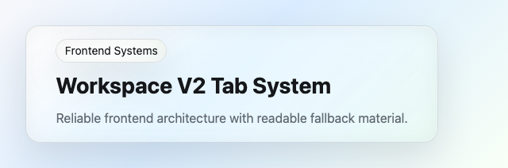

# @clean99/liquid-glass

Beautiful, accessible Liquid Glass components for React with real SVG/CSS
refraction and production-ready fallbacks. Open Source. Open Code.

`@clean99/liquid-glass` gives React apps a package-backed Liquid Glass material
system: component APIs, design tokens, accessibility contracts, Storybook
evidence, browser fallbacks, and shadcn-style Registry metadata. Enhanced
refraction is powered by `@hashintel/refractive`; readable foreground content
stays outside the displacement layer.



## Documentation

Start with [the documentation index](docs/index.md).

- [Installation](docs/installation.md)
- [Components](docs/components/index.md)
- [Component map](docs/components/map.md)
- [Design principles and modes](docs/design-principles.md)
- [Browser Support](docs/browser-support.md)
- [Accessibility](docs/accessibility.md)
- [Visual documentation](docs/visual-documentation.md)
- [shadcn-style Registry](docs/shadcn-registry.md)
- [Testing](docs/testing.md)
- [Release evidence dashboard](docs/release-evidence.md)
- [Governance scorecard](docs/governance-scorecard.md)
- [Progress checkpoints](docs/progress-checkpoints.md)
- [Adoption guide](docs/adoption-guide.md)
- [AI/agent index](llms.txt)

## Status

- npm: prepared for public release, but not published to npm yet.
- Storybook Pages: the workflow exists; the public site goes live only after
  GitHub Pages is enabled with GitHub Actions as the source.
- Registry: files are committed and validated, but consumer install commands
  require the npm package to exist first.
- Kube parity: `pnpm test:kube-reference` and
  `pnpm test:kube-reference:strict` are release-candidate gates.
  `pnpm test:kube-reference:exact` is separate; exact 1:1 parity is not claimed.

## Install

The package is not published yet. After the first npm release:

```sh
pnpm add @clean99/liquid-glass
```

Then import the CSS once:

```tsx
import "@clean99/liquid-glass/styles.css";
```

## Usage

```tsx
"use client";

import { LiquidButton, LiquidCard, LiquidProvider } from "@clean99/liquid-glass";
import "@clean99/liquid-glass/styles.css";

export function Example() {
  return (
    <LiquidProvider defaultMode="auto" maxEnhancedSurfaces={6}>
      <LiquidCard>
        <h2>Frontend Systems</h2>
        <p>Reliable UI architecture with readable Liquid Glass fallbacks.</p>
        <LiquidButton>Read Writing</LiquidButton>
      </LiquidCard>
    </LiquidProvider>
  );
}
```

## Quality

The release gate is `pnpm verify`. Local development usually starts with:

```sh
pnpm format
pnpm lint
pnpm typecheck
pnpm test:docs
pnpm test:release-readiness
pnpm test:unit
```

Release, visual, accessibility, registry, governance, and Kube evidence are
documented in [Testing](docs/testing.md) and
[Release evidence](docs/release-evidence.md).

## Contributing

Please read [CONTRIBUTING.md](CONTRIBUTING.md),
[SECURITY.md](SECURITY.md), [SUPPORT.md](SUPPORT.md), and
[ROADMAP.md](ROADMAP.md).

## License and Attribution

MIT. See [LICENSE](LICENSE) and [ATTRIBUTIONS.md](ATTRIBUTIONS.md).
