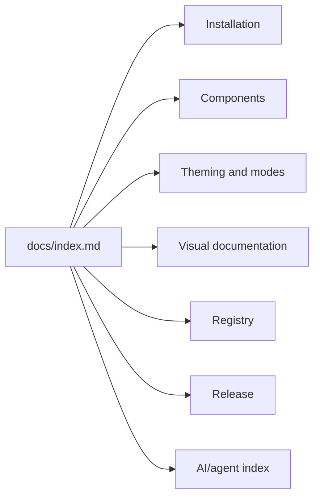

# @clean99/liquid-glass

Beautiful, accessible Liquid Glass components for React that you can customize,
extend, and build on. Open Source. Open Code. Real SVG/CSS refraction with
production-ready fallbacks.

`@clean99/liquid-glass` is a React UI library for Apple-inspired Liquid Glass
interfaces on the web. The refraction engine is delegated to
`@hashintel/refractive`; this project owns the component API, accessibility
contract, design tokens, fallback strategy, shadcn-style Registry metadata,
Storybook documentation, and release gates.

This is not generic glassmorphism. The library treats Liquid Glass as a material
system: readable foreground content, capped enhanced surfaces, reduced-motion
and reduced-transparency support, browser-specific fallback behavior, and Kube
reference parity checks.

## Project Status

- GitHub repository: `https://github.com/clean99/liquid-glass`
- npm package: prepared for public release, but not published to npm yet; it is
  not published yet.
- Storybook Pages: workflow is present; the public site goes live after GitHub
  Pages is enabled with GitHub Actions as the source.
- Kube visual parity: `pnpm test:kube-reference` and
  `pnpm test:kube-reference:strict` are release-candidate gates.
  `pnpm test:kube-reference:exact` is tracked separately; exact 1:1 parity is
  not claimed yet.

## Start Here

- [Documentation index](docs/index.md)
- [AI/agent documentation index](llms.txt)
- [Adoption guide](docs/adoption-guide.md)
- [Installation](docs/installation.md)
- [API overview](docs/api-overview.md)
- [Component inventory](docs/component-inventory.md)
- [Design principles](docs/design-principles.md)
- [Browser Support](docs/browser-support.md)
- [Visual documentation](docs/visual-documentation.md)
- [Testing strategy](docs/testing.md)
- [shadcn-style Registry](docs/shadcn-registry.md)
- [Open-source governance](docs/open-source-governance.md)
- [Governance scorecard](docs/governance-scorecard.md)
- [UI library benchmark](docs/ui-library-benchmark.md)
- [Release checklist](docs/open-source-release.md)
- [ROADMAP.md](ROADMAP.md)
- [Support](SUPPORT.md)
- [Security policy](SECURITY.md)

## Installation

The package is not published to npm yet. After the first public npm release, the
install command will be:

```sh
pnpm add @clean99/liquid-glass
```

`react` and `react-dom` are peer dependencies:

```sh
pnpm add react react-dom
```

## Quick Start

```tsx
"use client";

import { LiquidButton, LiquidCard, LiquidProvider } from "@clean99/liquid-glass";
import "@clean99/liquid-glass/styles.css";

export function Example() {
  return (
    <LiquidProvider defaultMode="auto" maxEnhancedSurfaces={6}>
      <LiquidCard>
        <h2>Frontend Systems</h2>
        <p>Reliable UI architecture with readable Liquid Glass fallbacks.</p>
        <LiquidButton>Read Writing</LiquidButton>
      </LiquidCard>
    </LiquidProvider>
  );
}
```

## Documentation

The documentation is organized like a public UI library docs site: start with
the overview, install the package, choose a mode, inspect the component
inventory, then use the registry and release checklist only when the package is
ready for public distribution.



Primary docs:

- `docs/index.md`: UI library documentation entry point.
- `llms.txt`: concise machine-readable map for AI assistants, doc crawlers, and
  maintainer automation.
- `docs/adoption-guide.md`: who should adopt now, who should wait, and what
  proof is required before production use.
- `docs/api-overview.md`: public API shape, modes, provider behavior, and
  component groups.
- `docs/component-inventory.md`: implemented and planned component inventory.
- `docs/visual-documentation.md`: Storybook Pages, light and dark states,
  reduced motion, high contrast, mobile, and Kube reference evidence.
- `docs/testing.md`: local and CI validation strategy.
- `docs/open-source-release.md`: release, Pages, npm, and rollback checklist.

## Components

The implemented surface is tracked in `docs/component-inventory.json` and
rendered in [Component inventory](docs/component-inventory.md). Coverage against
the shadcn/ui-style baseline is tracked in `docs/shadcn-parity.json`.

Core groups:

- Foundations: `LiquidProvider`, `LiquidSurface`, `FallbackGlassSurface`,
  `LiquidButton`, `LiquidCard`, `LiquidTypography`.
- Forms: input, field, textarea, checkbox, switch, slider, select, combobox,
  date picker, calendar, and OTP input.
- Navigation: nav, link, breadcrumb, menubar, pagination, tabs, sidebar, and
  command primitives.
- Overlays: dialog, alert dialog, drawer, sheet, popover, hover card, tooltip,
  dropdown menu, and context menu.
- Data and feedback: table, data table, chart, progress, badge, alert, toast,
  empty, skeleton, spinner, carousel, and resizable panels.
- Kube-aligned primitives: lens, search box, switch, slider, and music player
  reference states.

## Browser Support

Enhanced SVG/CSS refraction is conservative by default. Chrome and Chromium can
use enhanced mode when capability checks pass. Safari, iOS Safari, Firefox,
reduced transparency, and high contrast are first-class fallback or solid mode
targets.

## Accessibility

Interactive components use native controls or well-known ARIA patterns. Dialogs,
menus, tabs, accordions, form fields, toasts, data tables, charts, carousel,
calendar, and sidebar behavior are tested with unit, component, Storybook, and
`@axe-core/playwright` checks. Foreground text stays outside the displacement
layer so refraction does not distort readable content.

## Performance

Enhanced mode is guarded by runtime capability checks. `maxEnhancedSurfaces`
limits expensive surfaces, mobile enhanced mode is disabled by default, dense
content stays in fallback or solid material, and CSS is exported separately for
tree-shakable package use.

## shadcn-style Registry

The repository includes a root `registry.json`, a flat `liquid-glass.json`, a
package-local `registry/liquid-glass.json`, and generated entries under
`registry/components/`.

After the first npm release, registry examples can be installed with:

```sh
npx shadcn@latest add https://raw.githubusercontent.com/clean99/liquid-glass/main/liquid-glass.json
```

Registry items depend on `@clean99/liquid-glass`, so this is a post-npm-publish
consumer path, not proof that the package has already been published.

## Quality Gates

Use the small loop while developing:

```sh
pnpm format
pnpm lint
pnpm typecheck
pnpm test:docs
pnpm test:release-readiness
pnpm test:unit
```

Additional project gates:

```sh
pnpm test:inventory
pnpm test:component-coverage
pnpm test:registry
pnpm test:governance
pnpm test:research
pnpm test:shadcn-parity
pnpm test:visual-docs
pnpm test:e2e
pnpm test:a11y
pnpm test:storybook
pnpm test:kube-reference
pnpm test:kube-reference:strict
pnpm test:kube-reference:exact
pnpm build
pnpm test:package
pnpm verify
```

`pnpm verify` is the release gate. It runs `pnpm run ci`, package validation,
visual checks, Kube strict comparison, and `pnpm pack --dry-run`.

## Release

The package uses Changesets. npm publishing requires an `NPM_TOKEN` repository
secret, `NPM_CONFIG_PROVENANCE=true`, `id-token: write`, and
`publishConfig.access` pinned to `public`. Do not claim npm publish, GitHub Pages
deployment, or exact Kube parity until the corresponding run has succeeded.

## License and Attribution

MIT. See `LICENSE` and `ATTRIBUTIONS.md`.
