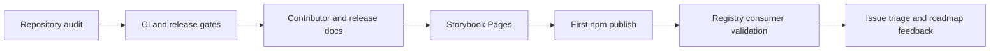

# Roadmap

This roadmap tracks project maturity, not marketing promises. The package is
pre-1.0 and not published to npm yet.

## Status Model

| Area                   | Status                        | Release meaning                                                                              |
| ---------------------- | ----------------------------- | -------------------------------------------------------------------------------------------- |
| Core package build     | Ready                         | `pnpm build` and `pnpm test:package` verify ESM, CJS, types, and CSS exports.                |
| Accessibility baseline | Ready                         | Storybook axe gates fail on critical or serious violations.                                  |
| shadcn-style registry  | Ready for publish             | Registry files are generated and validated, but consumer install depends on npm publication. |
| Storybook Pages        | Blocked by repository setting | Workflow exists; GitHub Pages must use GitHub Actions as the source.                         |
| npm release            | Not published                 | Requires final review, `NPM_TOKEN`, and a successful release workflow.                       |
| Kube exact parity      | Not complete                  | `pnpm test:kube-reference:exact` is the final 1:1 target and is not a release claim yet.     |

## Governance Roadmap

## Near Term

1. Keep README, installation, registry, and release docs honest about npm status.
2. Enable GitHub Pages with GitHub Actions as the source and add the Pages URL to the repository homepage after the first successful deployment.
3. Protect `main` after CI is green and require `ci` plus `visual` for merges.
4. Add `NPM_TOKEN` only when the package is ready to publish.
5. Run `pnpm verify` before any version PR or release workflow.

## After First Publish

1. Validate a clean consumer install with `pnpm add @clean99/liquid-glass`.
2. Validate shadcn registry install URLs from `main`.
3. Add the npm package URL to README and GitHub About.
4. Publish release notes from Changesets and update `CHANGELOG.md`.

## Later

1. Tighten Kube parity thresholds until `pnpm test:kube-reference:exact` passes.
2. Add more docs diagrams where they explain real workflows: release, registry, and browser fallback decisions.
3. Track browser platform support for enhanced refraction without weakening fallback behavior.
