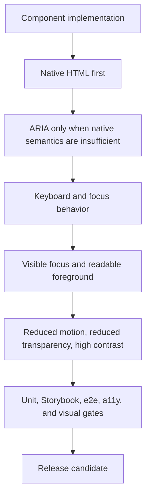

# Accessibility

`@clean99/liquid-glass` treats accessibility as part of the component contract,
not a styling afterthought. Liquid Glass effects must never make controls harder
to identify, read, focus, operate, or describe to assistive technology.

This is not a WCAG certification claim. It is the repository contract for what
must be true before the package can be described as an accessible React UI
library.

## Reference Model

| Reference                          | Pattern to match                                                     | Local decision                                                                       |
| ---------------------------------- | -------------------------------------------------------------------- | ------------------------------------------------------------------------------------ |
| shadcn/ui                          | Positions its components as accessible and source-readable.          | Keep component markup inspectable and document the limits of package readiness.      |
| Radix UI Primitives                | Documents WAI-ARIA-oriented primitive behavior and keyboard support. | Prefer native semantics first, then ARIA patterns when a custom widget needs them.   |
| Chakra UI and Ark UI               | Emphasize keyboard, focus, ARIA, and screen reader behavior.         | Keep component behavior testable outside the visual material layer.                  |
| WAI-ARIA Authoring Practices Guide | Defines expected behavior for common composite widgets.              | Use APG-style semantics for tabs, menus, dialogs, accordions, comboboxes, and grids. |

No third-party source or documentation is copied into this repository. References
are recorded in `ATTRIBUTIONS.md` and `docs/reference-provenance.json`.

## Contract



The contract is:

- Interactive controls use native elements when possible: `button`, `input`,
  `textarea`, `select`, `nav`, `a`, and semantic headings are preferred over
  generic elements with ARIA roles.
- Composite widgets keep predictable keyboard paths. Tabs, accordions, command,
  combobox, date picker, calendar, menus, dialog, drawer, sheet, carousel, data
  table, sidebar, and resizable panels must preserve their documented focus and
  keyboard behavior.
- Focus must be visible in enhanced, fallback, solid, and off modes.
- Foreground text and controls stay outside the displacement layer. SVG/CSS
  refraction can affect the material surface, not the readable content.
- Reduced motion, reduced transparency, high contrast, mobile fallback, and
  unsupported browser behavior are first-class accessibility paths.
- Decorative media and optical fixtures use `aria-hidden` or empty alt text.
  Meaningful controls and media need labels.
- Toasts, alerts, dialogs, popovers, menus, sheets, drawers, and command
  interfaces must expose state and relationships through labels, roles,
  `aria-expanded`, `aria-controls`, `aria-describedby`, or native equivalents.

## Component Evidence

| Surface           | Accessibility expectation                                                                  | Evidence                                                                 |
| ----------------- | ------------------------------------------------------------------------------------------ | ------------------------------------------------------------------------ |
| Foundations       | Button, card, typography, badge, progress, and alerts keep native or semantic meaning.     | `tests/components.test.tsx`, Storybook state metadata, `pnpm test:a11y`. |
| Forms             | Labels, descriptions, invalid state, disabled state, and keyboard entry are preserved.     | Field, input, OTP, checkbox, switch, slider, select, combobox stories.   |
| Navigation        | Landmarks, current page, tabs, pagination, command, and sidebar expose focus and state.    | Unit tests, Storybook focus stories, `pnpm test:e2e`.                    |
| Overlays          | Dialog, drawer, sheet, popover, tooltip, menus, and context menus keep focus boundaries.   | Overlay stories, behavior tests, axe scan.                               |
| Data and feedback | Tables, charts, progress, alerts, toasts, empty, skeleton, and spinner remain describable. | Component tests, Storybook examples, visual-state coverage.              |
| Liquid reference  | Lens, search box, switch, slider, and music player demos avoid fake interaction evidence.  | Kube reference tests and strict browser comparison.                      |

## Gates

Run the normal development gate before review:

```sh
pnpm format
pnpm lint
pnpm typecheck
pnpm test:docs
pnpm test:release-readiness
pnpm test:unit
```

Accessibility-specific evidence:

```sh
pnpm test:a11y
pnpm test:e2e
pnpm test:components
pnpm test:visual-docs
pnpm test:kube-reference:strict
```

`pnpm test:a11y` builds static Storybook, opens representative stories in
Chromium, runs `@axe-core/playwright`, writes
`test-results/a11y/storybook-a11y-summary.json`, and fails on any `critical` or
`serious` violation.

`pnpm test:e2e` covers real browser behavior that static axe scans cannot prove:
focus, hover, active press, draggable lens behavior, animation state, and
Storybook interaction contracts.

`pnpm test:visual-docs` verifies that every implemented component has visual
state coverage including accessibility, environment, material mode, and layout
profiles.

`pnpm test:kube-reference:strict` is visual-material evidence for the Kube
reference states. It is not an accessibility certification. It is not exact 1:1
parity.

## What The Gates Do Not Prove

- They do not prove WCAG 2.2 AA certification.
- They do not prove a complete screen reader and browser matrix.
- They do not prove that every downstream app using the package remains
  accessible after custom styling.
- They do not prove `pnpm test:kube-reference:exact`; exact visual parity is a
  separate target.

## Release Rules

Before any public release claim:

- `pnpm test:a11y` must pass on `main`.
- `pnpm test:e2e` must pass on `main`.
- `pnpm test:visual-docs` must pass on `main`.
- `pnpm test:release-readiness` must still require this document.
- Storybook Pages must build successfully before the README points users to a
  public docs site.
- npm install and shadcn registry install commands must stay documented as
  post-publish paths until the package is actually published.
