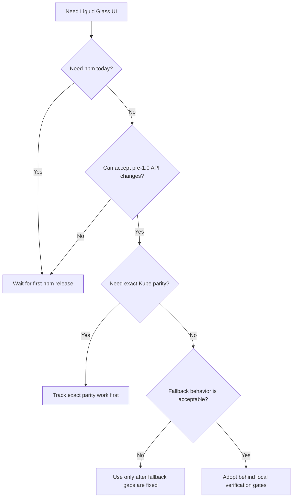

# Adoption Guide

Use this guide to decide whether `@clean99/liquid-glass` belongs in a product,
prototype, design system, or research branch today.

The project follows the useful public shape of shadcn/ui, Radix UI, Chakra UI,
and HeroUI: clear first screen, accessible components, inspectable examples,
tested release gates, registry metadata, and honest launch status. It does not
copy their source, prose, screenshots, or component implementations.

## Current Adoption Status

| Area             | Status                       | What it means                                                                                                                       |
| ---------------- | ---------------------------- | ----------------------------------------------------------------------------------------------------------------------------------- |
| npm package      | Not published yet            | Do not use npm install or registry commands as live consumer proof yet.                                                             |
| React support    | React 19 peer dependency     | Apps should already be on a React 19-compatible stack.                                                                              |
| Browser strategy | Enhanced plus fallback modes | Chromium can use SVG/CSS refraction; Safari, Firefox, high contrast, and reduced transparency must stay readable through fallbacks. |
| Docs site        | Storybook workflow exists    | Public Pages needs repository settings before the docs URL is a user-facing site.                                                   |
| Registry         | shadcn-style files exist     | Registry use becomes a real consumer path only after npm publish.                                                                   |
| Kube parity      | Strict gate passes           | Exact 1:1 Kube parity remains open until `pnpm test:kube-reference:exact` passes.                                                   |

## Decision Flow



## Good Fits

- Product prototypes that need Apple-inspired Liquid Glass without hiding text
  inside distortion layers.
- Internal design system exploration where `enhanced`, `fallback`, `solid`, and
  `off` modes can be reviewed side by side.
- React 19 applications that can run the local verification gate before adopting
  a pre-1.0 package.
- Teams that want shadcn-style registry metadata after npm publication, but also
  want package exports and typed React components.

## Poor Fits

- Production apps that require a published npm package today.
- Teams that need exact pixel parity with the Kube reference immediately.
- Browser targets where fallback or solid mode is not acceptable.
- Apps that cannot afford SVG filter and backdrop-filter feature detection.
- Projects that want copied third-party Liquid Glass source instead of a
  provenance-tracked implementation.

## Integration Paths

| Path                        | Use when             | Required proof                                                                  |
| --------------------------- | -------------------- | ------------------------------------------------------------------------------- |
| Package import              | After npm publish    | Published package with provenance and `pnpm test:package` passing.              |
| shadcn-style registry       | After npm publish    | Registry files pass `pnpm test:registry` and import the published package.      |
| Local repository evaluation | Before npm publish   | `pnpm verify` passes locally and the app accepts pre-1.0 churn.                 |
| Visual reference work       | During parity tuning | `pnpm test:kube-reference:strict` passes; exact claims wait for the exact gate. |

## What To Inspect First

| Question                            | Evidence                                                            |
| ----------------------------------- | ------------------------------------------------------------------- |
| What components exist?              | `docs/component-inventory.md` and generated registry entries.       |
| How does the API work?              | `docs/api-overview.md` and Storybook stories.                       |
| What happens outside Chromium?      | `docs/browser-support.md` and fallback visual snapshots.            |
| Is accessibility treated as a gate? | `pnpm test:a11y`, issue templates, and component tests.             |
| Can the release be trusted?         | `docs/open-source-release.md`, Changesets, CI, and package dry run. |
| Are references attributed?          | `ATTRIBUTIONS.md` and `docs/reference-provenance.json`.             |
| Is visual parity honest?            | `docs/kube-parity-gate.md`; strict and exact gates are separate.    |

## Local Verification Before Adoption

Run the same small gate contributors use:

```sh
pnpm format
pnpm lint
pnpm typecheck
pnpm test:docs
pnpm test:release-readiness
pnpm test:unit
```

Run the broader release-style gate before treating a branch as adoption-ready:

```sh
pnpm test:governance
pnpm test:registry
pnpm test:shadcn-parity
pnpm test:visual-docs
pnpm test:a11y
pnpm test:e2e
pnpm test:storybook
pnpm test:kube-reference:strict
pnpm verify
```

Do not replace these with screenshots. Screenshots are evidence only when they
come from the documented visual and Kube gates.

## Benchmark Lessons Applied

| Reference | Useful public pattern                                  | Local adoption rule                                                       |
| --------- | ------------------------------------------------------ | ------------------------------------------------------------------------- |
| shadcn/ui | Docs-first adoption and registry distribution          | Registry docs stay package-backed and post-npm-publish.                   |
| Radix UI  | Accessibility-first primitives for design systems      | Semantics and fallback behavior are release properties, not polish.       |
| Chakra UI | Fast product integration with clear contribution paths | Keep install, browser, support, and release docs separate and scannable.  |
| HeroUI    | Production-ready component library positioning         | Keep a broad component inventory, Storybook examples, and package checks. |

## Launch Blockers

This project should not be presented as generally adopted until these are true:

1. GitHub Pages is enabled and the Storybook Pages run deploys a public docs URL.
2. The first npm release is published with provenance.
3. README and package homepage point to the public docs URL after Pages exists.
4. Branch protection requires CI and Visual Regression.
5. Registry install examples are treated as live consumer commands only after npm publish.
6. Exact Kube parity is claimed only after `pnpm test:kube-reference:exact` passes.
