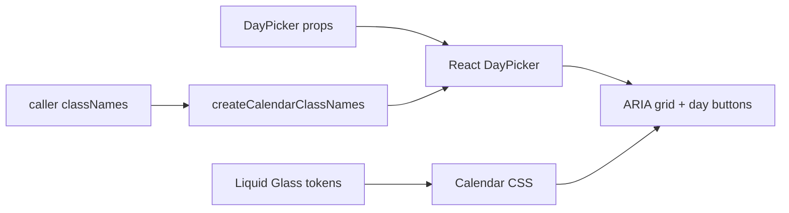

# LiquidCalendar Architecture

`LiquidCalendar` is the date-grid primitive for date pickers, scheduling forms, and docs examples.
It intentionally wraps React DayPicker instead of implementing calendar math in this package.

## Engine Choice

React DayPicker owns:

- month generation
- localized labels
- keyboard focus targets
- single, multiple, and range selection state
- disabled/outside/today modifiers
- ARIA grid and day button semantics

`@clean99/liquid-glass` owns:

- a stable design-system class name map
- Liquid Glass material styling for the calendar shell
- readable day cells and selected states
- docs, Storybook coverage, and tests

Calendar math is full of edge cases: locale week starts, fixed weeks, outside days, range
boundaries, disabled intervals, time zones, and localized screen-reader strings. Rewriting that
would be bad engineering. The component library should compose a proven date-grid engine and make
the material system consistent.

## Data Flow



## API Shape

`LiquidCalendar` exposes DayPicker's props directly:

```tsx
<LiquidCalendar
  aria-label="Release calendar"
  defaultMonth={new Date(2026, 5, 1)}
  mode="single"
  selected={selected}
  onSelect={setSelected}
/>
```

This keeps the date-grid primitive boring and composable. The future `LiquidDatePicker` should be
a composition of `LiquidPopover`, `LiquidButton`, and `LiquidCalendar`, not a second calendar
engine.

## Liquid Glass Rule

The calendar shell can use fallback material. Individual day cells are normal readable controls.
Enhanced refraction is not created for every date cell because that would be expensive and would
make selected/focus states harder to read.

## Accessibility

- DayPicker renders a labelled `grid` for each month.
- Day cells expose `role="gridcell"` and selected state.
- Interactive dates are native buttons with localized labels.
- Previous/next month controls are native buttons.
- Focus-visible scales and deepens the material without hard white/black outlines.

## Testing

- `tests/calendar.test.ts` verifies stable class-name merging and deterministic captions.
- `tests/components.test.tsx` verifies the public component renders the DayPicker grid, selected
  date, and Liquid class contract.
- Storybook covers single selection, range selection, and multi-month dark mode.
