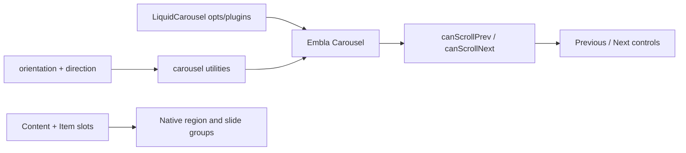

# LiquidCarousel Architecture

`LiquidCarousel` is the media navigation primitive for product showcases, docs examples, and blog
rails. It follows the shadcn/ui carousel composition model while keeping Liquid Glass as a material
layer, not a scroll physics engine.

## Engine Choice

The component uses Embla Carousel for drag physics, snapping, looping, resize behavior, and API
events. Reimplementing those mechanics inside this package would add edge cases around pointer
capture, inertial motion, RTL, vertical orientation, and browser resize observers.

`@clean99/liquid-glass` owns:

- the typed React composition API
- orientation and direction mapping
- keyboard navigation contract
- accessible region, slide, and control semantics
- Liquid Glass styling for the frame and controls

## Data Flow



## Composition Model

The public API mirrors the source-readable shadcn pattern:

```tsx
<LiquidCarousel aria-label="Selected work" opts={{ align: "start" }}>
  <LiquidCarouselContent>
    <LiquidCarouselItem>...</LiquidCarouselItem>
  </LiquidCarouselContent>
  <LiquidCarouselPrevious />
  <LiquidCarouselNext />
</LiquidCarousel>
```

The root component owns the Embla instance and exposes it through `setApi` / `onApiChange`.
Content and item components stay simple slots. Controls are native buttons through
`LiquidIconButton`.

## Liquid Glass Rule

Slides are usually content-heavy, so they should not receive enhanced refraction by default. The
carousel frame and controls can use fallback material; callers can place sparse `LiquidCard`
surfaces inside slides when the content remains readable.

## Accessibility

- Root renders a labelled `region` with `aria-roledescription="carousel"`.
- Slides render `role="group"` with `aria-roledescription="slide"`.
- Previous and next controls are native buttons with readable labels.
- Arrow keys scroll according to orientation and writing direction.
- Disabled controls use native disabled state when no scroll target is available.

## Testing

- `tests/carousel.test.ts` covers orientation, direction, and keyboard mapping without React.
- `tests/components.test.tsx` covers region semantics, slide semantics, and control rendering.
- Storybook covers horizontal, vertical, light, dark, and blog-realistic examples.
