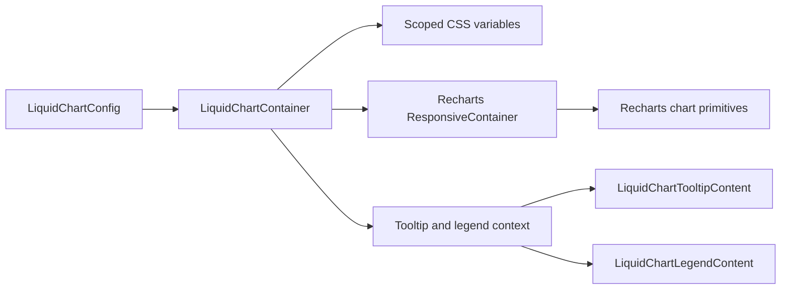

# LiquidChart Architecture

`LiquidChart` follows the shadcn/ui chart pattern: the library does not replace the chart engine. It wraps Recharts with a small design-system contract for series configuration, CSS color variables, tooltip content, legend content, and Liquid Glass surface styling.

## Design Decision

Recharts owns chart layout, scales, axes, pointer interaction, and accessibility-layer SVG output. `@clean99/liquid-glass` owns:

- `LiquidChartConfig` as the stable data contract for series label, color, theme color, and optional icon.
- Scoped `--color-*` CSS variables generated per chart instance.
- `LiquidChartTooltipContent` and `LiquidChartLegendContent` so foreground text remains clear and outside enhanced refraction.
- A container that supplies sensible initial dimensions for SSR, static docs, Storybook, and tests.

## Data Flow

## Why Recharts

Charting is an engine problem, not a glass problem. Recharts already provides composable primitives, accessible SVG charts, and the current shadcn/ui chart API target. Reimplementing scales, axes, and pointer state inside this library would add technical debt without improving Liquid Glass fidelity.

## Liquid Glass Rule

Chart plot areas and dense data labels stay readable. Liquid material is applied to tooltips, legends, and surrounding panels only. The chart itself uses CSS variables from `LiquidChartConfig`, not enhanced refraction per mark.

## Test Contract

- `tests/chart.test.ts` verifies config-to-CSS and payload key resolution without Recharts.
- `tests/components.test.tsx` verifies the public component API, tooltip output, legend output, and scoped `data-chart` contract.
- Storybook stories verify light mode, dark mode, and standalone tooltip/legend examples.
