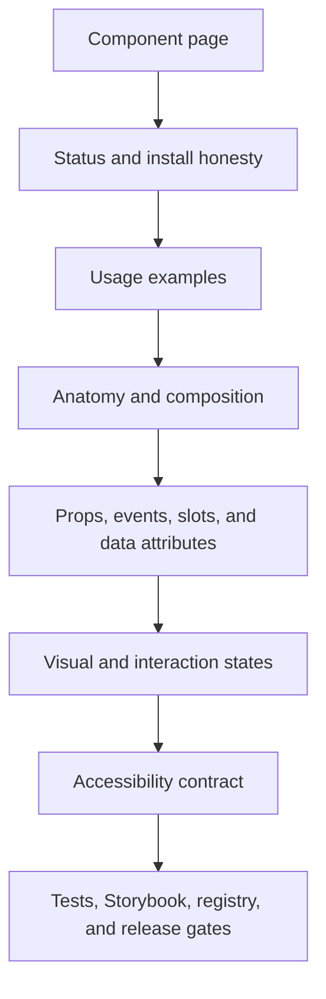
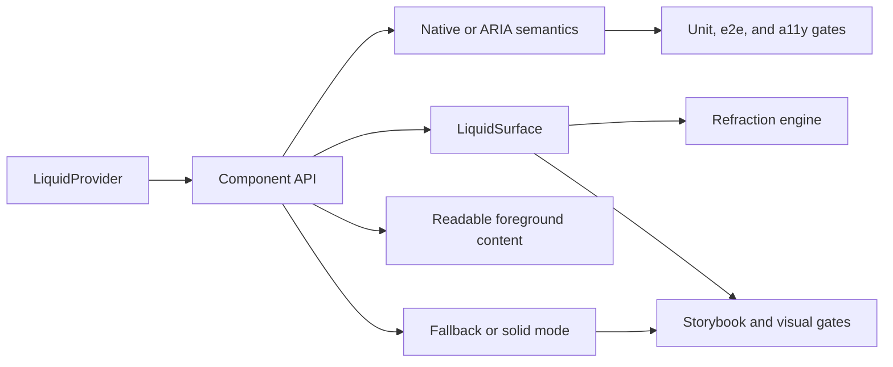

# Component Documentation Contract

Mainstream UI libraries make each component page answer the same questions:
what it is, how to install it, how to use it, which states exist, what API is
stable, and what accessibility behavior is guaranteed. This project needs that
same shape even while the public Storybook Pages site and npm release are still
blocked by repository settings and publishing.

No third-party prose, examples, screenshots, or source code are copied here. The
structure is benchmarked against shadcn/ui, Radix UI, Chakra UI, and HeroUI, and
the references are tracked in `ATTRIBUTIONS.md` and
`docs/reference-provenance.json`.

## Page Flow



Every implemented public component should be documented through this flow. A
component can use Storybook as the visual page, Markdown as the written page, or
both, but the same facts must be present somewhere linked from
`docs/component-inventory.md`.

`docs/components/map.md` is the stopgap directory for implemented components
that do not yet have full written pages. It must stay inventory-backed: each row
points to the public export, source file, Storybook evidence, visual profile,
registry item, and written page status. Do not maintain a separate component
status list by hand.

## Required Page Sections

| Section                    | Required content                                                                                  | Evidence source                                                                |
| -------------------------- | ------------------------------------------------------------------------------------------------- | ------------------------------------------------------------------------------ |
| Status                     | Implemented, planned, or research; npm and registry commands stay marked post-publish until live. | `docs/component-inventory.json`, `docs/shadcn-parity.json`.                    |
| Install                    | Package CSS import, peer dependencies, and registry path only after npm publish.                  | `docs/installation.md`, `docs/shadcn-registry.md`, release checklist.          |
| Basic usage                | One minimal example using the package API, not copied vendor code.                                | Storybook story or docs snippet owned by this repository.                      |
| Anatomy                    | Parts, slots, provider dependencies, and where foreground content avoids the refraction layer.    | Component source, `docs/optics-architecture.md`, component architecture notes. |
| API                        | Props, callbacks, controlled/uncontrolled behavior, exports, and forwarded refs where relevant.   | `src/index.ts`, component source, `docs/api-overview.md`.                      |
| Visual states              | Light, dark, focus-visible, hover, pressed, disabled, loading, invalid, selected, and mobile.     | `docs/visual-state-coverage.json`, Storybook `parameters.visualState`.         |
| Accessibility              | Native semantics first; APG-style patterns for composites; keyboard, focus, labels, descriptions. | `docs/accessibility.md`, component tests, `pnpm test:a11y`, `pnpm test:e2e`.   |
| Browser and fallback modes | Enhanced, fallback, solid, off, reduced motion, reduced transparency, and high contrast behavior. | `docs/browser-support.md`, Storybook stories, visual docs gate.                |
| Registry and distribution  | Generated registry item name, package-backed shim, and no duplicated implementation.              | `registry/components/*.json`, `pnpm test:registry`.                            |
| Verification               | Exact commands that prove the page claims.                                                        | `pnpm test:unit`, `pnpm test:visual-docs`, `pnpm test:release-readiness`.      |

## Anatomy Model



The data structure is deliberately simple:

- component identity lives in `docs/component-inventory.json`;
- visual state evidence lives in `docs/visual-state-coverage.json`;
- registry distribution is generated from the inventory;
- API facts come from public exports and source files;
- release claims are proven by scripts, not by prose.

Adding a separate hand-maintained status table for the same facts is a bug. It
will drift. Update the inventory or coverage data first, then regenerate or
rewrite the docs that read from it.

## Component Page Template

Use this shape for Markdown docs or Storybook docs pages:

```md
# LiquidButton

One sentence about the component's job.

## Status

- Implemented status from `docs/component-inventory.json`.
- Registry item path, if generated.
- npm availability caveat until the package is published.

## Usage

Small owned example.

## Anatomy

Parts, slots, provider dependency, and refraction boundary.

## API

Props, events, refs, and controlled state.

## Accessibility

Keyboard path, labels, focus behavior, and APG/native pattern.

## Visual States

State profile from `docs/visual-state-coverage.json`.

## Verification

Commands and Storybook evidence that prove the page.
```

## Release Rules

Do not publish or merge a component documentation page that:

- claims npm install or shadcn registry install before npm publish succeeds;
- describes exact Kube parity before `pnpm test:kube-reference:exact` passes;
- documents a component as implemented without inventory, source, Storybook,
  registry, and component-test evidence;
- adds a new third-party reference without updating attribution or provenance;
- lists accessibility behavior that is not covered by the accessibility
  contract, component tests, e2e tests, or Storybook axe gate.

## Current Gaps

| Gap                                      | Risk                                                                                                                         | Next action                                                                           |
| ---------------------------------------- | ---------------------------------------------------------------------------------------------------------------------------- | ------------------------------------------------------------------------------------- |
| Per-component written pages can drift    | Users can scan every implemented component in `docs/components/map.md`, and every implemented component now has a full page. | Keep `pnpm test:docs` enforcing one page per implemented inventory row.               |
| Public Storybook deploy is still skipped | Visual docs are build-proven but not publicly browseable.                                                                    | Enable GitHub Pages with GitHub Actions as the source.                                |
| npm package is not published             | Registry examples remain inspectable but not live installs.                                                                  | Publish with provenance only after `pnpm verify` and release workflow are configured. |
| Exact Kube parity is not complete        | Reference docs must not claim 1:1 visual equivalence.                                                                        | Keep strict and exact parity language separate until exact passes.                    |
