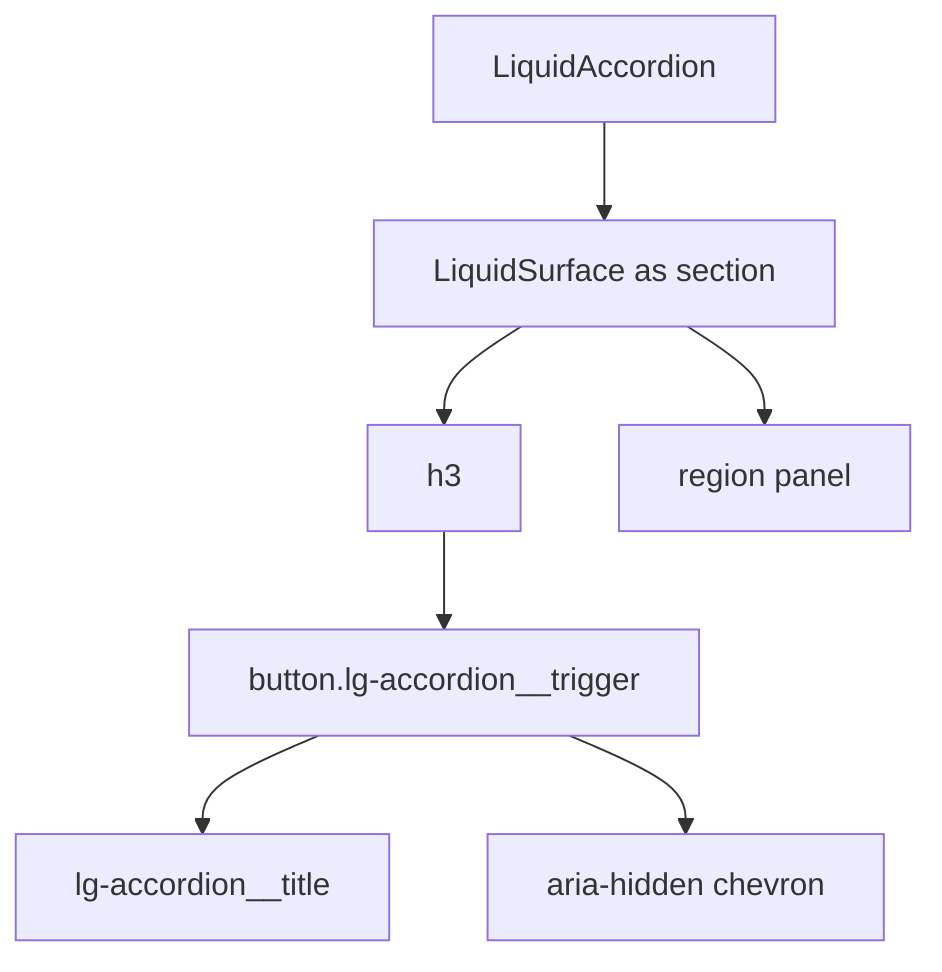

# LiquidAccordion

`LiquidAccordion` is the disclosure primitive for showing one or more stacked
sections without moving users away from the current page.

## Status

- Inventory: `accordion`, implemented
- Export: `LiquidAccordion`
- Source: `src/components/LiquidAccordion.tsx`
- Story: `stories/LiquidAccordion.stories.tsx`
- Registry item: `registry/components/liquid-accordion.json`
- npm package: not published to npm yet.

## Usage

```tsx
import { LiquidAccordion } from "@clean99/liquid-glass";

const items = [
  {
    title: "Performance",
    value: "performance",
    content: "Enhanced mode is capped and fallback mode keeps layout stable."
  },
  {
    title: "Accessibility",
    value: "accessibility",
    content: "Triggers are native buttons with aria-expanded."
  }
];

export function Example() {
  return <LiquidAccordion defaultValue="performance" items={items} />;
}
```

Multiple panels:

```tsx
<LiquidAccordion defaultValue={["performance"]} items={items} type="multiple" />
```

## Anatomy



## API

| Prop               | Type                     | Default        | Notes                                                              |
| ------------------ | ------------------------ | -------------- | ------------------------------------------------------------------ |
| `items`            | `LiquidAccordionItem[]`  | required       | Each item owns `title`, `value`, optional `disabled`, and content. |
| `type`             | `"single" \| "multiple"` | `single`       | Multiple mode stores an array of open values.                      |
| `value`            | `string \| string[]`     | none           | Controlled open value.                                             |
| `defaultValue`     | `string \| string[]`     | `""`           | Initial uncontrolled value.                                        |
| `onValueChange`    | callback                 | none           | Receives a string in single mode or string array in multiple mode. |
| `collapsible`      | `boolean`                | mode-dependent | Single mode can opt into closing the active item.                  |
| `surfaceProps`     | surface props            | none           | Customizes item surfaces without changing semantics.               |
| `itemClassName`    | `string`                 | none           | Added to each item surface.                                        |
| `contentClassName` | `string`                 | none           | Added to each panel.                                               |

## Visual States

Storybook covers light, dark, enhanced, fallback, solid, multiple open,
disabled, focus-visible, long text, mobile-sized layout, and reduced-motion
representations. The disclosure profile in
`docs/visual-state-coverage.json` expects default, expanded, collapsed,
disabled, focus-visible, and long-content review states.

## Accessibility

Each trigger is a native button with `aria-controls` and `aria-expanded`. Open
content is exposed as a `role="region"` panel labelled by its trigger.
ArrowDown, ArrowUp, Home, and End move focus across enabled triggers. Disabled
items are disabled buttons and are skipped by keyboard focus movement.

## Registry

The generated registry item is `registry/components/liquid-accordion.json`.
Registry consumer commands remain post-npm-publish paths until the package is
actually published.

## Verification

- `tests/components.test.tsx` checks single mode, multiple mode, disabled items,
  and arrow-key focus movement.
- `stories/LiquidAccordion.stories.tsx` carries `parameters.visualState`.
- `registry/components/liquid-accordion.json` is generated from inventory.
- `pnpm test:unit`
- `pnpm test:visual-docs`
- `pnpm test:registry`
