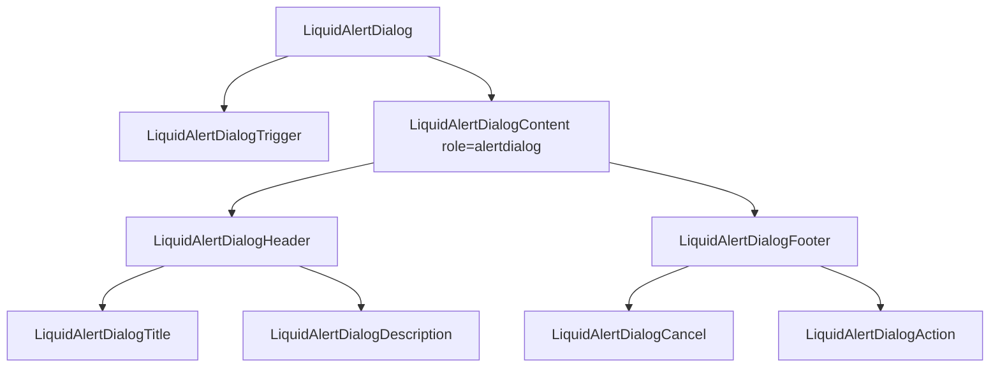

# LiquidAlertDialog

`LiquidAlertDialog` is the destructive or confirmation dialog wrapper. It uses
the shared dialog primitive while forcing alert-dialog semantics and disabling
backdrop click close by default.

## Status

- Inventory: `alert-dialog`, implemented
- Exports: `LiquidAlertDialog`, `LiquidAlertDialogTrigger`,
  `LiquidAlertDialogContent`, `LiquidAlertDialogHeader`,
  `LiquidAlertDialogFooter`, `LiquidAlertDialogTitle`,
  `LiquidAlertDialogDescription`, `LiquidAlertDialogCancel`,
  `LiquidAlertDialogAction`
- Source: `src/components/LiquidAlertDialog.tsx`
- Shared primitive: `src/components/LiquidDialog.tsx`
- Story: `stories/LiquidOverlay.stories.tsx`
- Registry item: `registry/components/liquid-alert-dialog.json`
- npm package: not published to npm yet.

## Usage

```tsx
import {
  LiquidAlertDialog,
  LiquidAlertDialogAction,
  LiquidAlertDialogCancel,
  LiquidAlertDialogContent,
  LiquidAlertDialogDescription,
  LiquidAlertDialogFooter,
  LiquidAlertDialogHeader,
  LiquidAlertDialogTitle,
  LiquidAlertDialogTrigger
} from "@clean99/liquid-glass";

export function DeleteSnapshot() {
  return (
    <LiquidAlertDialog>
      <LiquidAlertDialogTrigger>Delete snapshot</LiquidAlertDialogTrigger>
      <LiquidAlertDialogContent>
        <LiquidAlertDialogHeader>
          <LiquidAlertDialogTitle>Delete visual baseline?</LiquidAlertDialogTitle>
          <LiquidAlertDialogDescription>
            This removes the saved baseline for the next review.
          </LiquidAlertDialogDescription>
        </LiquidAlertDialogHeader>
        <LiquidAlertDialogFooter>
          <LiquidAlertDialogCancel>Cancel</LiquidAlertDialogCancel>
          <LiquidAlertDialogAction>Delete</LiquidAlertDialogAction>
        </LiquidAlertDialogFooter>
      </LiquidAlertDialogContent>
    </LiquidAlertDialog>
  );
}
```

## Anatomy



## API

Alert dialog types mirror the dialog primitive types:
`LiquidAlertDialogProps`, `LiquidAlertDialogTriggerProps`,
`LiquidAlertDialogContentProps`, `LiquidAlertDialogHeaderProps`,
`LiquidAlertDialogFooterProps`, `LiquidAlertDialogTitleProps`,
`LiquidAlertDialogDescriptionProps`, `LiquidAlertDialogCancelProps`, and
`LiquidAlertDialogActionProps`.

| Export                             | Purpose                                                                     |
| ---------------------------------- | --------------------------------------------------------------------------- |
| `LiquidAlertDialogContent`         | Forces `role="alertdialog"` and defaults `closeOnBackdropClick` to `false`. |
| `LiquidAlertDialogCancel`          | Close control for the safe path.                                            |
| `LiquidAlertDialogAction`          | Close control styled for the confirming action.                             |
| Header, footer, title, description | Shared dialog structure and accessible naming.                              |

## Visual States

The overlay profile covers closed, open, focus movement, escape close,
backdrop behavior, fallback, and light/dark review states.

## Accessibility

Content renders as a native `dialog` with `role="alertdialog"`.
`LiquidAlertDialogTitle` and `LiquidAlertDialogDescription` provide the
accessible name and description through the shared dialog wiring. Backdrop
click close is off by default so destructive confirmations require an explicit
choice.

## Registry

The generated registry item is `registry/components/liquid-alert-dialog.json`.
Registry consumer commands remain post-npm-publish paths until the package is
actually published.

## Verification

- `tests/components.test.tsx` covers dialog behavior through shared primitives.
- `stories/LiquidOverlay.stories.tsx` carries `parameters.visualState`.
- `registry/components/liquid-alert-dialog.json` is generated from inventory.
- `pnpm test:unit`
- `pnpm test:a11y`
- `pnpm test:registry`
