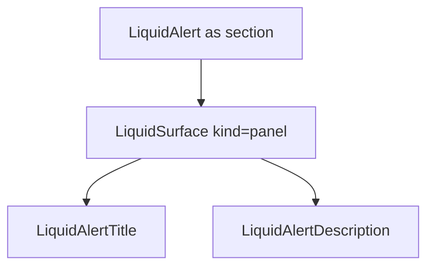

# LiquidAlert

`LiquidAlert` is the inline feedback surface for status, note, warning, and
error messaging. It keeps the readable content layer separate from the liquid
material surface.

## Status

- Inventory: `alert`, implemented
- Exports: `LiquidAlert`, `LiquidAlertTitle`, `LiquidAlertDescription`
- Source: `src/components/LiquidAlert.tsx`
- Story: `stories/LiquidFoundation.stories.tsx`
- Registry item: `registry/components/liquid-alert.json`
- npm package: not published to npm yet.

## Usage

```tsx
import { LiquidAlert, LiquidAlertDescription, LiquidAlertTitle } from "@clean99/liquid-glass";

export function ReleaseNotice() {
  return (
    <LiquidAlert variant="success" role="status">
      <LiquidAlertTitle>Release checks passed</LiquidAlertTitle>
      <LiquidAlertDescription>
        The package is ready for manual release review.
      </LiquidAlertDescription>
    </LiquidAlert>
  );
}
```

## Anatomy



## API

`LiquidAlertProps` omits `as`, `children`, `kind`, and `role` from
`LiquidSurfaceProps` so the component can preserve alert semantics.

| Prop        | Type                         | Default   | Notes                                      |
| ----------- | ---------------------------- | --------- | ------------------------------------------ |
| `variant`   | `LiquidAlertVariant`         | `default` | Sets `data-variant` for material styling.  |
| `role`      | `alert`, `status`, or `note` | `status`  | Use `alert` only for urgent announcements. |
| `radius`    | `LiquidRadius`               | `lg`      | Passed to the panel surface.               |
| `intensity` | `LiquidIntensity`            | `subtle`  | Keeps inline feedback quieter by default.  |

`LiquidAlertTitleProps` accepts heading tags from `h2` through `h6`.
`LiquidAlertDescriptionProps` is paragraph HTML attributes.

## Visual States

The feedback profile covers default, info, success, warning, danger, dark,
fallback, and reduced-transparency review states.

## Accessibility

The default role is `role="status"` for non-disruptive updates. Use
`role="alert"` only when the message should interrupt assistive technology.
The title should be a real heading level that fits the surrounding page.

## Registry

The generated registry item is `registry/components/liquid-alert.json`.
Registry consumer commands remain post-npm-publish paths until the package is
actually published.

## Verification

- `tests/components.test.tsx` covers foundation component rendering.
- `stories/LiquidFoundation.stories.tsx` carries `parameters.visualState`.
- `registry/components/liquid-alert.json` is generated from inventory.
- `pnpm test:unit`
- `pnpm test:visual-docs`
- `pnpm test:registry`
