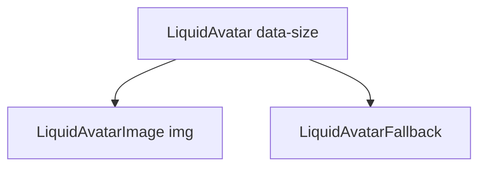

# LiquidAvatar

`LiquidAvatar` displays a user or entity image with a fallback label. It is a
small media primitive, not a button or profile menu by itself.

## Status

- Inventory: `avatar`, implemented
- Exports: `LiquidAvatar`, `LiquidAvatarImage`, `LiquidAvatarFallback`
- Source: `src/components/LiquidAvatar.tsx`
- Story: `stories/LiquidFoundation.stories.tsx`
- Registry item: `registry/components/liquid-avatar.json`
- npm package: not published to npm yet.

## Usage

```tsx
import { LiquidAvatar, LiquidAvatarFallback, LiquidAvatarImage } from "@clean99/liquid-glass";

export function MaintainerAvatar() {
  return (
    <LiquidAvatar size="md">
      <LiquidAvatarImage alt="Kai Huang" src="/avatars/kai.png" />
      <LiquidAvatarFallback>KH</LiquidAvatarFallback>
    </LiquidAvatar>
  );
}
```

## Anatomy



## API

| Export                 | Type source                           | Purpose                             |
| ---------------------- | ------------------------------------- | ----------------------------------- |
| `LiquidAvatar`         | `LiquidAvatarProps`                   | Root `span` with `size` metadata.   |
| `LiquidAvatarImage`    | `ImgHTMLAttributes<HTMLImageElement>` | Native image slot.                  |
| `LiquidAvatarFallback` | `LiquidAvatarFallbackProps`           | Text fallback when image is absent. |

`LiquidAvatarProps` supports `size?: "sm" | "md" | "lg"` and normal span
attributes.

## Visual States

The media profile covers image, fallback, small, medium, large, light, dark,
and fallback material review states.

## Accessibility

The image must carry useful `alt` text when the avatar identifies a person or
object. Use empty `alt=""` only when adjacent text already names the entity.
Fallback initials should not be the only accessible name for a critical action.

## Registry

The generated registry item is `registry/components/liquid-avatar.json`.
Registry consumer commands remain post-npm-publish paths until the package is
actually published.

## Verification

- `tests/components.test.tsx` covers foundation component rendering.
- `stories/LiquidFoundation.stories.tsx` carries `parameters.visualState`.
- `registry/components/liquid-avatar.json` is generated from inventory.
- `pnpm test:unit`
- `pnpm test:visual-docs`
- `pnpm test:registry`
