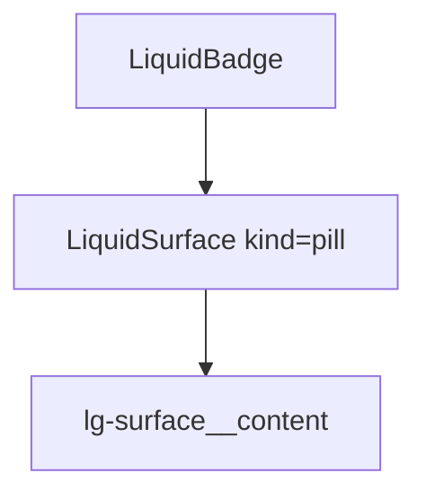

# LiquidBadge

`LiquidBadge` is the compact status and metadata label. It delegates material
rendering to `LiquidSurface` and defaults to a subtle pill.

## Status

- Inventory: `badge`, implemented
- Export: `LiquidBadge`
- Source: `src/components/LiquidBadge.tsx`
- Story: `stories/LiquidFoundation.stories.tsx`
- Registry item: `registry/components/liquid-badge.json`
- npm package: not published to npm yet.

## Usage

```tsx
import { LiquidBadge } from "@clean99/liquid-glass";

export function StatusBadges() {
  return (
    <div>
      <LiquidBadge>Default</LiquidBadge>
      <LiquidBadge variant="success">A11y</LiquidBadge>
      <LiquidBadge variant="warning">Fallback</LiquidBadge>
    </div>
  );
}
```

## Anatomy



## API

`LiquidBadgeProps` extends `LiquidSurfaceProps` without `kind`, and
`LiquidBadgeVariant` is `default`, `accent`, `success`, `warning`, or `danger`.

| Prop        | Type                       | Default    | Notes                                              |
| ----------- | -------------------------- | ---------- | -------------------------------------------------- |
| `variant`   | `LiquidBadgeVariant`       | `default`  | Sets `data-variant`.                               |
| `as`        | `LiquidSurfaceProps["as"]` | `span`     | Keep non-interactive badges as spans.              |
| `fallback`  | `LiquidFallbackMode`       | `material` | Keeps labels readable without enhanced refraction. |
| `radius`    | `LiquidRadius`             | `pill`     | Badge shape.                                       |
| `intensity` | `LiquidIntensity`          | `subtle`   | Quiet by default.                                  |

## Visual States

The display profile covers default, accent, success, warning, danger, light,
dark, fallback, and high-contrast review states.

## Accessibility

Badges are labels, not buttons. If a badge opens a filter or menu, use a real
interactive component and put the badge inside it.

## Registry

The generated registry item is `registry/components/liquid-badge.json`.
Registry consumer commands remain post-npm-publish paths until the package is
actually published.

## Verification

- `tests/components.test.tsx` covers foundation component rendering.
- `stories/LiquidFoundation.stories.tsx` carries `parameters.visualState`.
- `registry/components/liquid-badge.json` is generated from inventory.
- `pnpm test:unit`
- `pnpm test:visual-docs`
- `pnpm test:registry`
