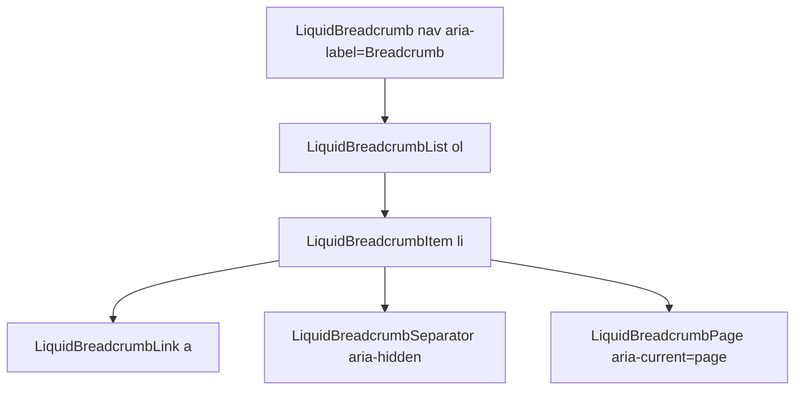

# LiquidBreadcrumb

`LiquidBreadcrumb` is the navigation trail primitive. It renders native
navigation, ordered-list, link, current-page, and separator elements.

## Status

- Inventory: `breadcrumb`, implemented
- Exports: `LiquidBreadcrumb`, `LiquidBreadcrumbList`,
  `LiquidBreadcrumbItem`, `LiquidBreadcrumbLink`, `LiquidBreadcrumbPage`,
  `LiquidBreadcrumbSeparator`
- Source: `src/components/LiquidBreadcrumb.tsx`
- Story: `stories/LiquidFoundation.stories.tsx`
- Registry item: `registry/components/liquid-breadcrumb.json`
- npm package: not published to npm yet.

## Usage

```tsx
import {
  LiquidBreadcrumb,
  LiquidBreadcrumbItem,
  LiquidBreadcrumbLink,
  LiquidBreadcrumbList,
  LiquidBreadcrumbPage,
  LiquidBreadcrumbSeparator
} from "@clean99/liquid-glass";

export function DocsBreadcrumb() {
  return (
    <LiquidBreadcrumb>
      <LiquidBreadcrumbList>
        <LiquidBreadcrumbItem>
          <LiquidBreadcrumbLink href="/">Home</LiquidBreadcrumbLink>
          <LiquidBreadcrumbSeparator />
        </LiquidBreadcrumbItem>
        <LiquidBreadcrumbItem>
          <LiquidBreadcrumbPage>Components</LiquidBreadcrumbPage>
        </LiquidBreadcrumbItem>
      </LiquidBreadcrumbList>
    </LiquidBreadcrumb>
  );
}
```

## Anatomy



## API

| Export                      | Native element | Notes                                          |
| --------------------------- | -------------- | ---------------------------------------------- |
| `LiquidBreadcrumb`          | `nav`          | Defaults `aria-label="Breadcrumb"`.            |
| `LiquidBreadcrumbList`      | `ol`           | Ordered trail container.                       |
| `LiquidBreadcrumbItem`      | `li`           | Wraps each trail entry.                        |
| `LiquidBreadcrumbLink`      | `a`            | Navigable ancestor page.                       |
| `LiquidBreadcrumbPage`      | `span`         | Sets `aria-current="page"`.                    |
| `LiquidBreadcrumbSeparator` | `span`         | Defaults to `/` and sets `aria-hidden="true"`. |

## Visual States

The navigation profile covers default, current page, separators, overflow
pressure, dark, fallback, and high-contrast review states.

## Accessibility

The root is a named navigation region. The current page must use
`aria-current="page"` through `LiquidBreadcrumbPage`. Separators are hidden
from assistive technology.

## Registry

The generated registry item is `registry/components/liquid-breadcrumb.json`.
Registry consumer commands remain post-npm-publish paths until the package is
actually published.

## Verification

- `tests/components.test.tsx` covers foundation component rendering.
- `stories/LiquidFoundation.stories.tsx` carries `parameters.visualState`.
- `registry/components/liquid-breadcrumb.json` is generated from inventory.
- `pnpm test:unit`
- `pnpm test:visual-docs`
- `pnpm test:registry`
