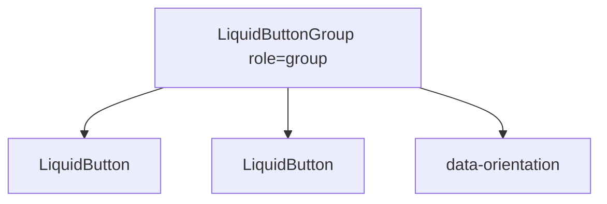

# LiquidButtonGroup

`LiquidButtonGroup` groups related button actions without changing the buttons
themselves. It is a layout and semantics wrapper, not a selection primitive.

## Status

- Inventory: `button-group`, implemented
- Export: `LiquidButtonGroup`
- Source: `src/components/LiquidButtonGroup.tsx`
- Story: `stories/LiquidFoundation.stories.tsx`
- Registry item: `registry/components/liquid-button-group.json`
- npm package: not published to npm yet.

## Usage

```tsx
import { LiquidButton, LiquidButtonGroup } from "@clean99/liquid-glass";

export function ReviewActions() {
  return (
    <LiquidButtonGroup aria-label="Review actions">
      <LiquidButton>Approve</LiquidButton>
      <LiquidButton variant="secondary">Request changes</LiquidButton>
    </LiquidButtonGroup>
  );
}
```

## Anatomy



## API

`LiquidButtonGroupProps` extends `HTMLAttributes<HTMLDivElement>`. The wrapper
defaults to `role="group"`.

| Prop          | Type                           | Default      | Notes                                 |
| ------------- | ------------------------------ | ------------ | ------------------------------------- |
| `orientation` | `"horizontal"` or `"vertical"` | `horizontal` | Sets `data-orientation` for layout.   |
| `role`        | HTML role                      | `group`      | Override only with a better semantic. |

## Visual States

The control profile covers horizontal, vertical, dense action groups, dark,
fallback, and high-contrast review states.

## Accessibility

Give grouped actions an accessible name with `aria-label` or
`aria-labelledby`. Use `LiquidSegmentedControl` when only one option should be
selected.

## Registry

The generated registry item is
`registry/components/liquid-button-group.json`. Registry consumer commands
remain post-npm-publish paths until the package is actually published.

## Verification

- `tests/components.test.tsx` covers foundation component rendering.
- `stories/LiquidFoundation.stories.tsx` carries `parameters.visualState`.
- `registry/components/liquid-button-group.json` is generated from inventory.
- `pnpm test:unit`
- `pnpm test:visual-docs`
- `pnpm test:registry`
