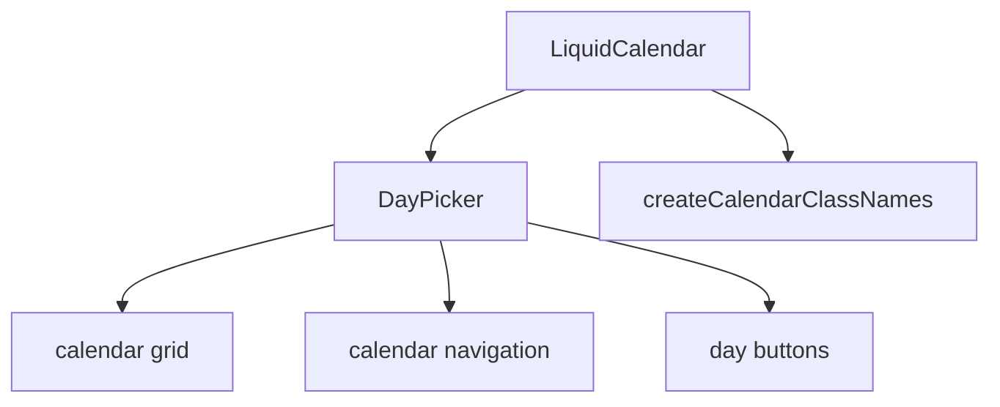

# LiquidCalendar

`LiquidCalendar` is the date-grid primitive backed by `react-day-picker`. It
provides Liquid Glass class names and defaults while preserving DayPicker's
selection and keyboard behavior.

## Status

- Inventory: `calendar`, implemented
- Export: `LiquidCalendar`
- Source: `src/components/LiquidCalendar.tsx`
- Utility: `src/utils/calendar.ts`
- Story: `stories/LiquidCalendar.stories.tsx`
- Registry item: `registry/components/liquid-calendar.json`
- npm package: not published to npm yet.

## Usage

```tsx
import { useState } from "react";
import { LiquidCalendar } from "@clean99/liquid-glass";

export function ReleaseCalendar() {
  const [selected, setSelected] = useState<Date | undefined>();

  return <LiquidCalendar mode="single" onSelect={setSelected} selected={selected} />;
}
```

## Anatomy



## API

`LiquidCalendarProps` is `DayPickerProps`.

| Prop              | Default   | Notes                                      |
| ----------------- | --------- | ------------------------------------------ |
| `fixedWeeks`      | `true`    | Keeps the calendar height stable.          |
| `navLayout`       | `after`   | Keeps navigation after the month caption.  |
| `showOutsideDays` | `true`    | Shows neighboring month days by default.   |
| `classNames`      | generated | Merged through `createCalendarClassNames`. |

All DayPicker selection props, including `mode`, `selected`, and `onSelect`,
pass through unchanged.

## Visual States

The date-time profile covers single selection, range pressure through
DatePicker, outside days, disabled days, today, navigation, dark, fallback, and
mobile review states.

## Accessibility

Keyboard and grid semantics come from `react-day-picker`. Keep labels and
selection mode aligned with the surrounding form. For a text input plus
calendar popover, use `LiquidDatePicker`.

## Registry

The generated registry item is `registry/components/liquid-calendar.json`.
Registry consumer commands remain post-npm-publish paths until the package is
actually published.

## Verification

- `tests/components.test.tsx` covers calendar rendering and class-name wiring.
- `stories/LiquidCalendar.stories.tsx` carries `parameters.visualState`.
- `registry/components/liquid-calendar.json` is generated from inventory.
- `pnpm test:unit`
- `pnpm test:visual-docs`
- `pnpm test:registry`
