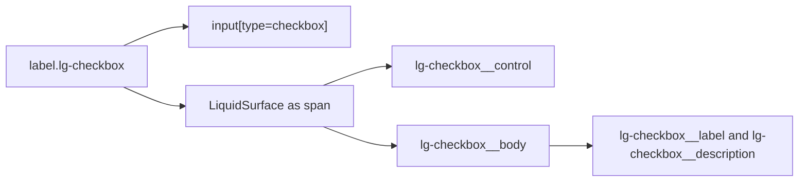

# LiquidCheckbox

`LiquidCheckbox` is the native checkbox primitive wrapped in a Liquid Glass
label surface.

## Status

- Inventory: `checkbox`, implemented
- Export: `LiquidCheckbox`
- Source: `src/components/LiquidCheckbox.tsx`
- Story: `stories/LiquidFoundation.stories.tsx`
- Registry item: `registry/components/liquid-checkbox.json`
- npm package: not published to npm yet.

## Usage

```tsx
import { LiquidCheckbox } from "@clean99/liquid-glass";

export function ReleaseOption() {
  return (
    <LiquidCheckbox description="Included in release notes.">Publish changelog</LiquidCheckbox>
  );
}
```

## Anatomy



The native input owns checked state and form behavior. The surface is visual and
keeps label text outside the displacement layer.

## API

`LiquidCheckboxProps` extends native checkbox input props except `children` and
`type`.

| Prop           | Type          | Default | Notes                                                   |
| -------------- | ------------- | ------- | ------------------------------------------------------- |
| `children`     | `ReactNode`   | none    | Visible label content inside the clickable label.       |
| `description`  | `ReactNode`   | none    | Optional secondary text.                                |
| `disabled`     | `boolean`     | false   | Disables the native input and marks the label disabled. |
| `surfaceProps` | surface props | none    | Customizes the visual checkbox surface.                 |

## Visual States

Storybook covers checkbox examples in the foundation component set and dense
dark/fallback contexts. The control profile in
`docs/visual-state-coverage.json` expects default, hover, focus-visible,
pressed, disabled, and selected states where applicable.

## Accessibility

The root is a native `<label>`, so clicking the visible label toggles the hidden
native checkbox. Use `children` for the accessible name. Description text is
visible helper copy; add explicit `aria-describedby` yourself if a screen reader
relationship is required by a product form.

## Registry

The generated registry item is `registry/components/liquid-checkbox.json`.
Registry consumer commands remain post-npm-publish paths until the package is
actually published.

## Verification

- `tests/components.test.tsx` checks native checkbox semantics, label click, and
  description rendering.
- `stories/LiquidFoundation.stories.tsx` carries `parameters.visualState`.
- `registry/components/liquid-checkbox.json` is generated from inventory.
- `pnpm test:unit`
- `pnpm test:visual-docs`
- `pnpm test:registry`
