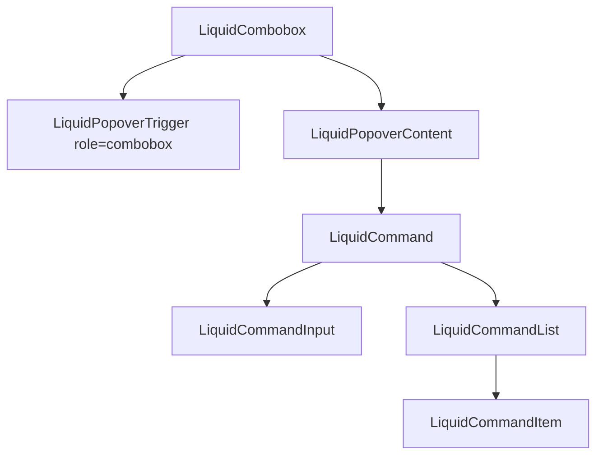

# LiquidCombobox

`LiquidCombobox` combines a Liquid button trigger, popover, and command list to
select one value from searchable options.

## Status

- Inventory: `combobox`, implemented
- Export: `LiquidCombobox`
- Source: `src/components/LiquidCombobox.tsx`
- Story: `stories/LiquidCommand.stories.tsx`
- Registry item: `registry/components/liquid-combobox.json`
- npm package: not published to npm yet.

## Usage

```tsx
import { LiquidCombobox } from "@clean99/liquid-glass";

const options = [
  { label: "Writing", value: "writing" },
  { label: "Projects", value: "projects", keywords: ["work"] }
];

export function SectionPicker() {
  return (
    <LiquidCombobox
      aria-label="Choose section"
      onValueChange={setSection}
      options={options}
      placeholder="Choose section"
    />
  );
}
```

## Anatomy



## API

| Prop                | Type                     | Default             | Notes                                                                             |
| ------------------- | ------------------------ | ------------------- | --------------------------------------------------------------------------------- |
| `options`           | `LiquidComboboxOption[]` | required            | Options own `label`, `value`, optional `description`, `keywords`, and `disabled`. |
| `value`             | `string`                 | none                | Controlled selected value.                                                        |
| `defaultValue`      | `string`                 | `""`                | Initial uncontrolled value.                                                       |
| `onValueChange`     | callback                 | none                | Called when an enabled command item is selected.                                  |
| `open`              | `boolean`                | none                | Controlled popover open state.                                                    |
| `onOpenChange`      | callback                 | none                | Called when popover state changes.                                                |
| `placeholder`       | `ReactNode`              | `Select option`     | Trigger copy before a value is selected.                                          |
| `searchPlaceholder` | `string`                 | `Search`            | Search input placeholder.                                                         |
| `emptyMessage`      | `ReactNode`              | `No results found.` | Empty command state.                                                              |
| `renderOption`      | callback                 | none                | Custom option renderer.                                                           |
| `contentProps`      | popover content props    | none                | Customizes the popover surface.                                                   |
| `commandProps`      | command props            | none                | Customizes filtering and command behavior.                                        |

## Visual States

Storybook covers the combobox inside the command examples. The control profile
expects closed, open, filtered, selected, disabled option, focus-visible, empty,
and fallback review states where applicable.

## Accessibility

The trigger uses `role="combobox"`, `aria-haspopup="listbox"`, and an
accessible name from `aria-label` or placeholder text. The popup uses
`LiquidCommand` semantics for searchbox input, selectable items, disabled
options, keyboard selection, and empty state.

## Registry

The generated registry item is `registry/components/liquid-combobox.json`.
Registry consumer commands remain post-npm-publish paths until the package is
actually published.

## Verification

- `tests/components.test.tsx` checks opening, filtering by keyword, selecting a
  value, disabled option behavior through command items, and closing.
- `stories/LiquidCommand.stories.tsx` carries `parameters.visualState`.
- `registry/components/liquid-combobox.json` is generated from inventory.
- `pnpm test:unit`
- `pnpm test:visual-docs`
- `pnpm test:registry`
