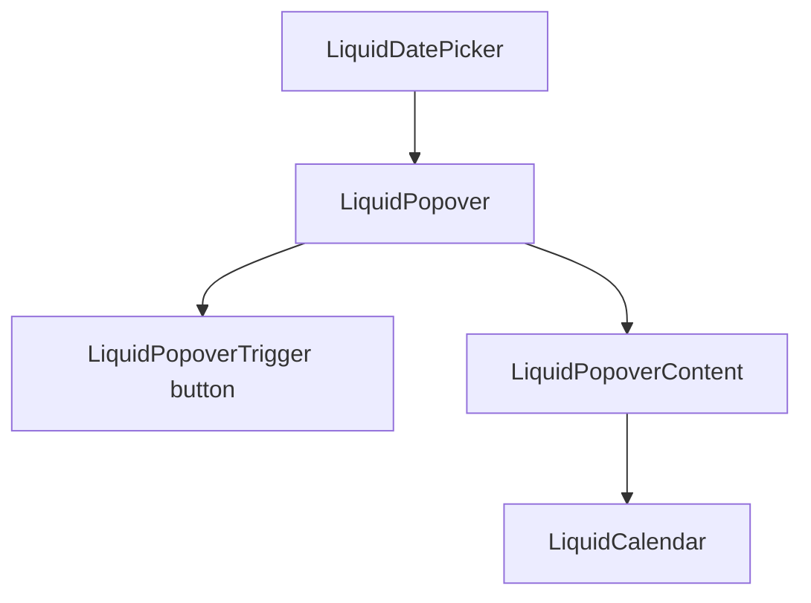

# LiquidDatePicker

`LiquidDatePicker` is the popover calendar picker for single dates and date
ranges.

## Status

- Inventory: `date-picker`, implemented
- Export: `LiquidDatePicker`
- Source: `src/components/LiquidDatePicker.tsx`
- Story: `stories/LiquidDatePicker.stories.tsx`
- Registry item: `registry/components/liquid-date-picker.json`
- npm package: not published to npm yet.

## Usage

```tsx
import { LiquidDatePicker } from "@clean99/liquid-glass";

export function ReleaseDate() {
  return <LiquidDatePicker aria-label="Choose release date" onValueChange={setReleaseDate} />;
}
```

Range mode:

```tsx
<LiquidDatePicker mode="range" onValueChange={setRange} value={{ from, to }} />
```

## Anatomy



## API

Single-date props are represented by `LiquidDatePickerSingleProps`; range props
are represented by `LiquidDatePickerRangeProps`.

| Prop            | Type                         | Default        | Notes                                            |
| --------------- | ---------------------------- | -------------- | ------------------------------------------------ |
| `mode`          | `"single" \| "range"`        | `single`       | Selects value shape and close behavior.          |
| `value`         | `Date` or `DateRange`        | none           | Controlled value.                                |
| `defaultValue`  | `Date` or `DateRange`        | none           | Initial uncontrolled value.                      |
| `onValueChange` | callback                     | none           | Called with selected single date or range.       |
| `placeholder`   | `string`                     | mode-specific  | Trigger copy before value selection.             |
| `locale`        | `string`                     | runtime locale | Formats trigger value.                           |
| `disabled`      | `boolean`                    | false          | Disables the trigger.                            |
| `calendarProps` | `LiquidCalendarProps` subset | none           | Passed to `LiquidCalendar`.                      |
| `popoverProps`  | popover content props        | none           | Customizes popover content surface and mounting. |

## Visual States

Storybook covers single selection, range selection, dark mode, and form usage.
The date-time profile in `docs/visual-state-coverage.json` expects default,
open, selected, range, keyboard, disabled, and mobile review states where
applicable.

## Accessibility

The trigger is a button with an accessible name. The popup content contains
`LiquidCalendar`, which owns grid, day, selected, and keyboard behavior.
Single-date selection closes the popover after selection. Range mode closes only
after both `from` and `to` exist.

## Registry

The generated registry item is `registry/components/liquid-date-picker.json`.
Registry consumer commands remain post-npm-publish paths until the package is
actually published.

## Verification

- `tests/components.test.tsx` checks single-date selection and range value
  rendering.
- `stories/LiquidDatePicker.stories.tsx` carries `parameters.visualState`.
- `registry/components/liquid-date-picker.json` is generated from inventory.
- `pnpm test:unit`
- `pnpm test:visual-docs`
- `pnpm test:registry`
