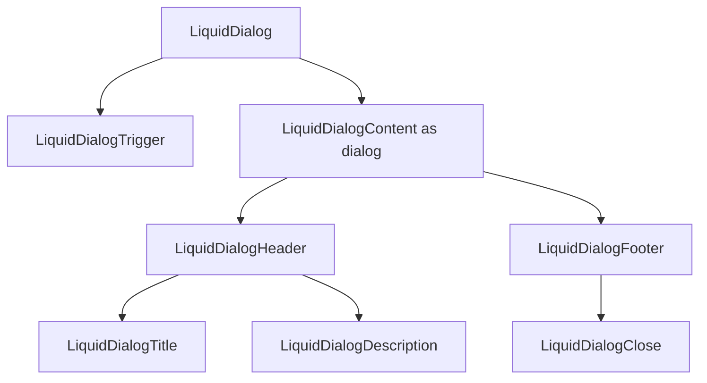

# LiquidDialog

`LiquidDialog` is the accessible overlay primitive for modal and non-modal
dialog content. It uses the native `dialog` element through `LiquidSurface`.

## Status

- Inventory: `dialog`, implemented
- Exports: `LiquidDialog`, `LiquidDialogTrigger`, `LiquidDialogContent`,
  `LiquidDialogHeader`, `LiquidDialogFooter`, `LiquidDialogTitle`,
  `LiquidDialogDescription`, `LiquidDialogClose`
- Source: `src/components/LiquidDialog.tsx`
- Story: `stories/LiquidDialog.stories.tsx`
- Registry item: `registry/components/liquid-dialog.json`
- npm package: not published to npm yet.

## Usage

```tsx
import {
  LiquidDialog,
  LiquidDialogClose,
  LiquidDialogContent,
  LiquidDialogDescription,
  LiquidDialogFooter,
  LiquidDialogHeader,
  LiquidDialogTitle,
  LiquidDialogTrigger
} from "@clean99/liquid-glass";

export function ShareDialog() {
  return (
    <LiquidDialog>
      <LiquidDialogTrigger>Open dialog</LiquidDialogTrigger>
      <LiquidDialogContent>
        <LiquidDialogHeader>
          <LiquidDialogTitle>Share article</LiquidDialogTitle>
          <LiquidDialogDescription>Copy a stable link.</LiquidDialogDescription>
        </LiquidDialogHeader>
        <LiquidDialogFooter>
          <LiquidDialogClose>Done</LiquidDialogClose>
        </LiquidDialogFooter>
      </LiquidDialogContent>
    </LiquidDialog>
  );
}
```

Controlled state:

```tsx
<LiquidDialog onOpenChange={setOpen} open={open}>
  ...
</LiquidDialog>
```

## Anatomy



## API

| Export                    | Purpose                                                                  |
| ------------------------- | ------------------------------------------------------------------------ |
| `LiquidDialog`            | Root state provider with `defaultOpen`, `open`, `onOpenChange`, `modal`. |
| `LiquidDialogTrigger`     | Button trigger with `aria-haspopup`, `aria-controls`, `aria-expanded`.   |
| `LiquidDialogContent`     | Portaled `dialog` surface with title and optional description wiring.    |
| `LiquidDialogTitle`       | Heading used for `aria-labelledby`; `as` can be `h2`, `h3`, or `h4`.     |
| `LiquidDialogDescription` | Paragraph used for `aria-describedby` when present.                      |
| `LiquidDialogClose`       | Button that requests close through dialog context.                       |

`LiquidDialogContent` supports `closeOnBackdropClick`, `container`,
`forceMount`, `intensity`, and `radius` in addition to inherited surface props.

## Visual States

Storybook covers light, dark, controlled open state, fallback mode, long content,
and blog-realistic content. The overlay profile expects closed, open, focus
trap, escape, outside click, and long-content review states.

## Accessibility

The content renders as a native `dialog`, sets `aria-modal` for modal usage, and
wires `aria-labelledby` to `LiquidDialogTitle`. Description wiring is enabled
only when `LiquidDialogDescription` is rendered. Native close and cancel events
call `onOpenChange(false)`.

## Verification

- `tests/components.test.tsx` checks open/close, accessible name and
  description, trigger state, native cancel handling, and alert-dialog reuse.
- `stories/LiquidDialog.stories.tsx` carries `parameters.visualState`.
- `registry/components/liquid-dialog.json` is generated from inventory.
- `pnpm test:unit`
- `pnpm test:e2e`
- `pnpm test:a11y`
- `pnpm test:visual-docs`
