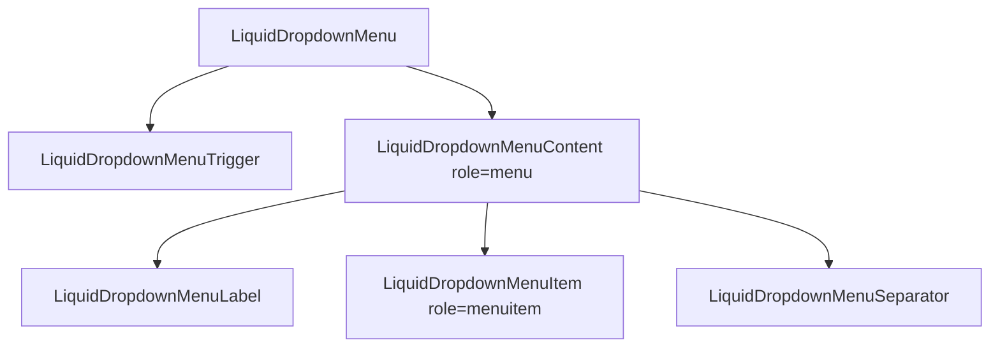

# LiquidDropdownMenu

`LiquidDropdownMenu` is the button-triggered menu primitive built on the shared
Liquid menu primitives.

## Status

- Inventory: `dropdown-menu`, implemented
- Exports: `LiquidDropdownMenu`, `LiquidDropdownMenuTrigger`,
  `LiquidDropdownMenuContent`, `LiquidDropdownMenuItem`,
  `LiquidDropdownMenuLabel`, `LiquidDropdownMenuSeparator`
- Source: `src/components/LiquidDropdownMenu.tsx`
- Shared primitives: `src/components/LiquidMenuPrimitives.tsx`
- Story: `stories/LiquidOverlay.stories.tsx`
- Registry item: `registry/components/liquid-dropdown-menu.json`
- npm package: not published to npm yet.

## Usage

```tsx
import {
  LiquidDropdownMenu,
  LiquidDropdownMenuContent,
  LiquidDropdownMenuItem,
  LiquidDropdownMenuLabel,
  LiquidDropdownMenuSeparator,
  LiquidDropdownMenuTrigger
} from "@clean99/liquid-glass";

export function ReleaseActions() {
  return (
    <LiquidDropdownMenu>
      <LiquidDropdownMenuTrigger>Actions</LiquidDropdownMenuTrigger>
      <LiquidDropdownMenuContent aria-label="Release actions">
        <LiquidDropdownMenuLabel>Release</LiquidDropdownMenuLabel>
        <LiquidDropdownMenuItem>Copy link</LiquidDropdownMenuItem>
        <LiquidDropdownMenuSeparator />
        <LiquidDropdownMenuItem disabled>Archive locked</LiquidDropdownMenuItem>
      </LiquidDropdownMenuContent>
    </LiquidDropdownMenu>
  );
}
```

## Anatomy



## API

The dropdown menu re-exports the shared menu primitive types:
`LiquidDropdownMenuProps`, `LiquidDropdownMenuTriggerProps`,
`LiquidDropdownMenuContentProps`, `LiquidDropdownMenuItemProps`,
`LiquidDropdownMenuLabelProps`, and `LiquidDropdownMenuSeparatorProps`.

| Export                        | Purpose                                                                        |
| ----------------------------- | ------------------------------------------------------------------------------ |
| `LiquidDropdownMenu`          | Root state with `defaultOpen`, `open`, `onOpenChange`.                         |
| `LiquidDropdownMenuTrigger`   | Button trigger with `aria-haspopup`, `aria-expanded`, and `aria-controls`.     |
| `LiquidDropdownMenuContent`   | Portaled `role="menu"` surface with side and align props.                      |
| `LiquidDropdownMenuItem`      | Button or anchor `role="menuitem"` with disabled and close-on-select behavior. |
| `LiquidDropdownMenuLabel`     | Non-interactive section label.                                                 |
| `LiquidDropdownMenuSeparator` | Horizontal separator.                                                          |

## Visual States

Storybook covers dropdown menu examples inside the overlay stories. The overlay
profile expects closed, open, focus movement, disabled item, escape close,
outside interaction, fallback, and dark/light review states.

## Accessibility

The trigger is a button with menu popup attributes. Content is a portaled
`role="menu"` surface. Items are `role="menuitem"`, disabled items use
`aria-disabled`, ArrowUp/ArrowDown/Home/End move focus across enabled items, and
Escape closes the menu and restores trigger focus.

## Registry

The generated registry item is `registry/components/liquid-dropdown-menu.json`.
Registry consumer commands remain post-npm-publish paths until the package is
actually published.

## Verification

- `tests/components.test.tsx` checks opening, menu role, disabled item skipping,
  and arrow-key focus movement.
- `stories/LiquidOverlay.stories.tsx` carries `parameters.visualState`.
- `registry/components/liquid-dropdown-menu.json` is generated from inventory.
- `pnpm test:unit`
- `pnpm test:visual-docs`
- `pnpm test:registry`
