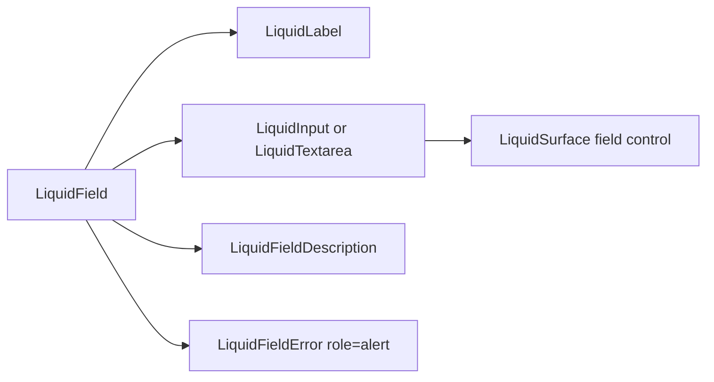

# LiquidField

`LiquidField` groups labels, descriptions, errors, inputs, and textareas without
breaking native form semantics.

## Status

- Inventory: `field`, `input`, `label`, and `textarea`, implemented
- Exports: `LiquidField`, `LiquidLabel`, `LiquidFieldDescription`,
  `LiquidFieldError`, `LiquidInput`, `LiquidTextarea`
- Source: `src/components/LiquidField.tsx`
- Story: `stories/LiquidField.stories.tsx`
- Registry items: `liquid-field`, `liquid-input`, `liquid-label`,
  `liquid-textarea`
- npm package: not published to npm yet.

## Usage

```tsx
import {
  LiquidField,
  LiquidFieldDescription,
  LiquidInput,
  LiquidLabel
} from "@clean99/liquid-glass";

export function EmailField() {
  return (
    <LiquidField>
      <LiquidLabel htmlFor="email">Email</LiquidLabel>
      <LiquidInput id="email" placeholder="koh@example.com" />
      <LiquidFieldDescription>Used for release notes.</LiquidFieldDescription>
    </LiquidField>
  );
}
```

Invalid state:

```tsx
<LiquidField invalid>
  <LiquidLabel htmlFor="slug">Slug</LiquidLabel>
  <LiquidInput aria-describedby="slug-error" id="slug" invalid />
  <LiquidFieldError id="slug-error">Slug is already used.</LiquidFieldError>
</LiquidField>
```

## Anatomy



## API

| Export                   | Purpose                                                                             |
| ------------------------ | ----------------------------------------------------------------------------------- |
| `LiquidField`            | Wrapper with `data-disabled` and `data-invalid` state attributes.                   |
| `LiquidLabel`            | Native `label`. Use `htmlFor` with input and textarea ids.                          |
| `LiquidFieldDescription` | Paragraph for helper text. Link with `aria-describedby` when needed.                |
| `LiquidFieldError`       | Error paragraph with default `role="alert"`.                                        |
| `LiquidInput`            | Native input inside a Liquid surface. Supports `startAdornment` and `endAdornment`. |
| `LiquidTextarea`         | Native textarea inside a Liquid surface.                                            |

`LiquidInput` and `LiquidTextarea` set `aria-invalid=true` when `invalid` is
true. Adornments are rendered with `aria-hidden=true`.

## Visual States

Storybook covers light, dark, fallback, solid, invalid, disabled, adornments,
select/OTP composition, textarea, long labels, and blog-realistic fields. The
form profile expects default, focus-visible, disabled, invalid, description, and
long-value states.

## Accessibility

Use native labels. Keep `id`, `htmlFor`, and `aria-describedby` explicit. Error
text is an alert by default, but the field does not automatically wire
description ids because applications often compose multiple descriptions.

## Verification

- `tests/components.test.tsx` checks label/input wiring, invalid state, disabled
  state, errors, and textarea rendering.
- `stories/LiquidField.stories.tsx` carries `parameters.visualState`.
- Registry items are generated from inventory.
- `pnpm test:unit`
- `pnpm test:visual-docs`
- `pnpm test:registry`
