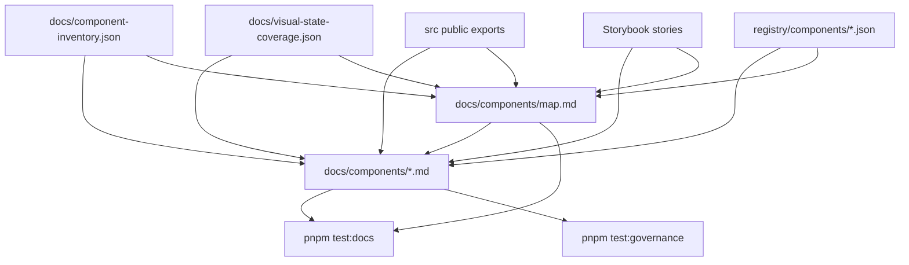

# Component Docs

These pages turn the component documentation contract into source-readable
component pages. They follow `docs/component-documentation.md`: status, install
honesty, usage, anatomy, API, visual states, accessibility, registry, and
verification evidence.

The docs are intentionally package-backed. They describe the public exports in
`src/index.ts`; they do not copy component code from shadcn/ui, Radix UI,
Chakra UI, HeroUI, or any other project.

For a shadcn-style directory of every implemented component, see
`docs/components/map.md`. That page is the discoverability bridge between the
generated inventory and the smaller set of full written component pages.

## Status

- npm package: not published to npm yet.
- Registry install: prepared, but live consumer commands wait for npm publish.
- Storybook Pages: workflow builds; public deploy waits for GitHub Pages source
  settings.
- Kube exact parity: not claimed until `pnpm test:kube-reference:exact` passes.

## Written Component Pages

| Component            | Page                               | Source                                  | Story                                  | Registry                                        |
| -------------------- | ---------------------------------- | --------------------------------------- | -------------------------------------- | ----------------------------------------------- |
| `LiquidProvider`     | `docs/components/provider.md`      | `src/providers/LiquidProvider.tsx`      | `stories/LiquidSurface.stories.tsx`    | Not a registry item                             |
| `LiquidSurface`      | `docs/components/surface.md`       | `src/components/LiquidSurface.tsx`      | `stories/LiquidSurface.stories.tsx`    | Not a registry item                             |
| `LiquidAccordion`    | `docs/components/accordion.md`     | `src/components/LiquidAccordion.tsx`    | `stories/LiquidAccordion.stories.tsx`  | `registry/components/liquid-accordion.json`     |
| `LiquidButton`       | `docs/components/button.md`        | `src/components/LiquidButton.tsx`       | `stories/LiquidButton.stories.tsx`     | `registry/components/liquid-button.json`        |
| `LiquidCard`         | `docs/components/card.md`          | `src/components/LiquidCard.tsx`         | `stories/LiquidCard.stories.tsx`       | `registry/components/liquid-card.json`          |
| `LiquidCheckbox`     | `docs/components/checkbox.md`      | `src/components/LiquidCheckbox.tsx`     | `stories/LiquidFoundation.stories.tsx` | `registry/components/liquid-checkbox.json`      |
| `LiquidCombobox`     | `docs/components/combobox.md`      | `src/components/LiquidCombobox.tsx`     | `stories/LiquidCommand.stories.tsx`    | `registry/components/liquid-combobox.json`      |
| `LiquidDatePicker`   | `docs/components/date-picker.md`   | `src/components/LiquidDatePicker.tsx`   | `stories/LiquidDatePicker.stories.tsx` | `registry/components/liquid-date-picker.json`   |
| `LiquidDialog`       | `docs/components/dialog.md`        | `src/components/LiquidDialog.tsx`       | `stories/LiquidDialog.stories.tsx`     | `registry/components/liquid-dialog.json`        |
| `LiquidDropdownMenu` | `docs/components/dropdown-menu.md` | `src/components/LiquidDropdownMenu.tsx` | `stories/LiquidOverlay.stories.tsx`    | `registry/components/liquid-dropdown-menu.json` |
| `LiquidField`        | `docs/components/field.md`         | `src/components/LiquidField.tsx`        | `stories/LiquidField.stories.tsx`      | `registry/components/liquid-field.json`         |
| `LiquidSearchBox`    | `docs/components/searchbox.md`     | `src/components/LiquidSearchBox.tsx`    | `stories/LiquidSearchBox.stories.tsx`  | `registry/components/liquid-searchbox.json`     |
| `LiquidSelect`       | `docs/components/select.md`        | `src/components/LiquidSelect.tsx`       | `stories/LiquidField.stories.tsx`      | `registry/components/liquid-select.json`        |
| `LiquidSlider`       | `docs/components/slider.md`        | `src/components/LiquidSlider.tsx`       | `stories/LiquidSlider.stories.tsx`     | `registry/components/liquid-slider.json`        |
| `LiquidSidebar`      | `docs/components/sidebar.md`       | `src/components/LiquidSidebar.tsx`      | `stories/LiquidSidebar.stories.tsx`    | `registry/components/liquid-sidebar.json`       |
| `LiquidSwitch`       | `docs/components/switch.md`        | `src/components/LiquidSwitch.tsx`       | `stories/LiquidSwitch.stories.tsx`     | `registry/components/liquid-switch.json`        |
| `LiquidTabs`         | `docs/components/tabs.md`          | `src/components/LiquidTabs.tsx`         | `stories/LiquidTabs.stories.tsx`       | `registry/components/liquid-tabs.json`          |

## Full Directory

`docs/components/map.md` lists all 60 implemented public components with their
source file, Storybook evidence, visual profile, registry item, and written page
status. It follows the same role as the shadcn/ui component directory: a user
can scan the whole component surface from one place without guessing which
Storybook file or registry item owns a component. The written page set now
covers the provider and surface base, the first layout/action/form/overlay
pages, and high-frequency disclosure, form, control, navigation, overlay, and
Kube reference controls.

## Documentation Flow



## Add The Next Page

1. Start from `docs/component-documentation.md`.
2. Use `docs/component-inventory.json` for status, source, story, and category.
3. Use `docs/visual-state-coverage.json` for the state profile.
4. Link the generated registry item only when one exists.
5. Add or update validation in `scripts/validate-docs.mjs`.
6. Run the standard gate before review.

```sh
pnpm format
pnpm lint
pnpm typecheck
pnpm test:docs
pnpm test:release-readiness
pnpm test:unit
```
