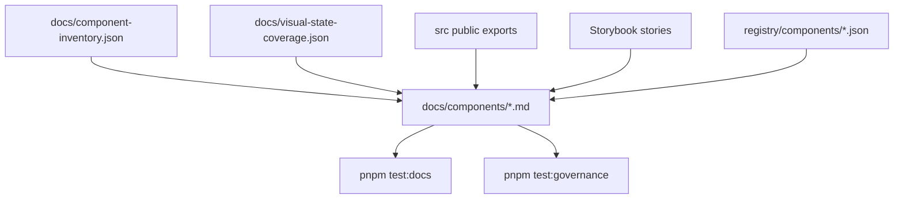

# Component Docs

These pages turn the component documentation contract into source-readable
component pages. They follow `docs/component-documentation.md`: status, install
honesty, usage, anatomy, API, visual states, accessibility, registry, and
verification evidence.

The docs are intentionally package-backed. They describe the public exports in
`src/index.ts`; they do not copy component code from shadcn/ui, Radix UI,
Chakra UI, HeroUI, or any other project.

## Status

- npm package: not published to npm yet.
- Registry install: prepared, but live consumer commands wait for npm publish.
- Storybook Pages: workflow builds; public deploy waits for GitHub Pages source
  settings.
- Kube exact parity: not claimed until `pnpm test:kube-reference:exact` passes.

## First Component Pages

| Component        | Page                          | Source                             | Story                               | Registry                                 |
| ---------------- | ----------------------------- | ---------------------------------- | ----------------------------------- | ---------------------------------------- |
| `LiquidProvider` | `docs/components/provider.md` | `src/providers/LiquidProvider.tsx` | `stories/LiquidSurface.stories.tsx` | Not a registry item                      |
| `LiquidSurface`  | `docs/components/surface.md`  | `src/components/LiquidSurface.tsx` | `stories/LiquidSurface.stories.tsx` | Not a registry item                      |
| `LiquidButton`   | `docs/components/button.md`   | `src/components/LiquidButton.tsx`  | `stories/LiquidButton.stories.tsx`  | `registry/components/liquid-button.json` |
| `LiquidCard`     | `docs/components/card.md`     | `src/components/LiquidCard.tsx`    | `stories/LiquidCard.stories.tsx`    | `registry/components/liquid-card.json`   |
| `LiquidField`    | `docs/components/field.md`    | `src/components/LiquidField.tsx`   | `stories/LiquidField.stories.tsx`   | `registry/components/liquid-field.json`  |
| `LiquidDialog`   | `docs/components/dialog.md`   | `src/components/LiquidDialog.tsx`  | `stories/LiquidDialog.stories.tsx`  | `registry/components/liquid-dialog.json` |

## Documentation Flow



## Add The Next Page

1. Start from `docs/component-documentation.md`.
2. Use `docs/component-inventory.json` for status, source, story, and category.
3. Use `docs/visual-state-coverage.json` for the state profile.
4. Link the generated registry item only when one exists.
5. Add or update validation in `scripts/validate-docs.mjs`.
6. Run the standard gate before review.

```sh
pnpm format
pnpm lint
pnpm typecheck
pnpm test:docs
pnpm test:release-readiness
pnpm test:unit
```
