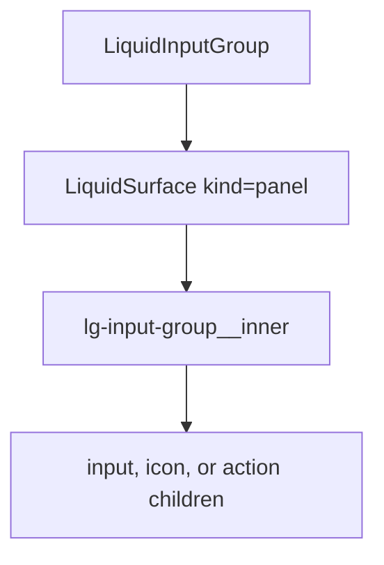

# LiquidInputGroup

`LiquidInputGroup` is the shared field surface for compound controls, such as
an icon, input, and inline action living in one Liquid panel.

## Status

- Inventory: `input-group`, implemented
- Export: `LiquidInputGroup`
- Source: `src/components/LiquidInputGroup.tsx`
- Story: `stories/LiquidFoundation.stories.tsx`
- Registry item: `registry/components/liquid-input-group.json`
- npm package: not published to npm yet.

## Usage

```tsx
import { LiquidInput, LiquidInputGroup, LiquidLabel } from "@clean99/liquid-glass";

export function ChannelSearch() {
  return (
    <div>
      <LiquidLabel htmlFor="channel">Release channel</LiquidLabel>
      <LiquidInputGroup>
        <span aria-hidden="true">#</span>
        <LiquidInput id="channel" placeholder="Search channels" />
      </LiquidInputGroup>
    </div>
  );
}
```

## Anatomy



## API

`LiquidInputGroupProps` extends `HTMLAttributes<HTMLDivElement>`.

| Prop           | Type                      | Default | Notes                                   |
| -------------- | ------------------------- | ------- | --------------------------------------- |
| `disabled`     | `boolean`                 | -       | Sets `data-disabled` on the surface.    |
| `invalid`      | `boolean`                 | -       | Sets `data-invalid` on the surface.     |
| `surfaceProps` | `LiquidSurfaceProps` omit | -       | Customizes the wrapping Liquid surface. |

## Visual States

The form profile covers grouped input, prefix/suffix content, invalid,
disabled, dark, fallback, and mobile width pressure.

## Accessibility

The group does not label its children automatically. Keep the nested input,
select, or button accessible with native labels and names.

## Registry

The generated registry item is `registry/components/liquid-input-group.json`.
Registry consumer commands remain post-npm-publish paths until the package is
actually published.

## Verification

- `tests/components.test.tsx` covers foundation and form primitives.
- `stories/LiquidFoundation.stories.tsx` carries `parameters.visualState`.
- `registry/components/liquid-input-group.json` is generated from inventory.
- `pnpm test:unit`
- `pnpm test:visual-docs`
- `pnpm test:registry`
