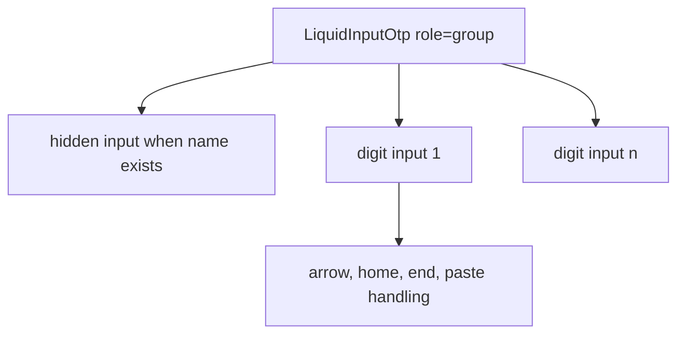

# LiquidInputOtp

`LiquidInputOtp` is the one-time-code input group. It renders one text input
per digit plus an optional hidden input for form submission.

## Status

- Inventory: `input-otp`, implemented
- Export: `LiquidInputOtp`
- Source: `src/components/LiquidInputOtp.tsx`
- Story: `stories/LiquidField.stories.tsx`
- Registry item: `registry/components/liquid-input-otp.json`
- npm package: not published to npm yet.

## Usage

```tsx
import { LiquidInputOtp, LiquidLabel } from "@clean99/liquid-glass";

export function VerificationCode() {
  return (
    <div>
      <LiquidLabel id="verification-label">Verification code</LiquidLabel>
      <LiquidInputOtp aria-labelledby="verification-label" name="verification-code" />
    </div>
  );
}
```

## Anatomy



## API

`LiquidInputOtpProps` extends `HTMLAttributes<HTMLDivElement>` without native
`defaultValue` and `onChange`.

| Prop            | Type              | Default         | Notes                                   |
| --------------- | ----------------- | --------------- | --------------------------------------- |
| `length`        | `number`          | `6`             | Normalized to at least one field.       |
| `value`         | `string`          | -               | Controlled value.                       |
| `defaultValue`  | `string`          | `""`            | Uncontrolled initial value.             |
| `onValueChange` | `(value) => void` | -               | Fires after value changes.              |
| `name`          | `string`          | -               | Adds a hidden input for forms.          |
| `inputMode`     | native input mode | `numeric`       | Passed to each digit input.             |
| `autoComplete`  | `string`          | `one-time-code` | Applied to the first input.             |
| `invalid`       | `boolean`         | `false`         | Sets `aria-invalid` and `data-invalid`. |

## Visual States

The form profile covers empty, filled, paste, keyboard focus, invalid,
disabled, light, dark, and fallback review states.

## Accessibility

Provide `aria-label` or `aria-labelledby` for the group. Each digit input gets
an ordinal label derived from the group label. Use `name` when the OTP value
must submit through a native form.

## Registry

The generated registry item is `registry/components/liquid-input-otp.json`.
Registry consumer commands remain post-npm-publish paths until the package is
actually published.

## Verification

- `tests/components.test.tsx` covers OTP form primitives.
- `stories/LiquidField.stories.tsx` carries `parameters.visualState`.
- `registry/components/liquid-input-otp.json` is generated from inventory.
- `pnpm test:unit`
- `pnpm test:visual-docs`
- `pnpm test:registry`
