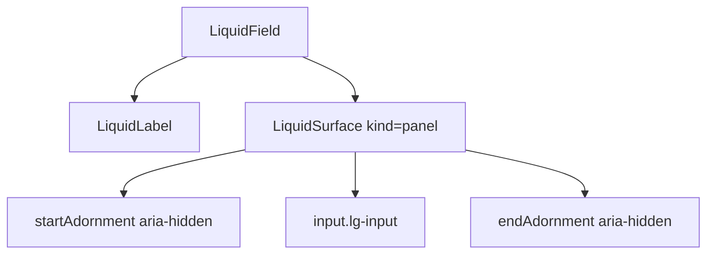

# LiquidInput

`LiquidInput` is the native text input wrapped in a Liquid field surface. It
keeps browser input behavior intact while putting adornments and invalid state
on the material shell.

## Status

- Inventory: `input`, implemented
- Export: `LiquidInput`
- Source: `src/components/LiquidField.tsx`
- Story: `stories/LiquidField.stories.tsx`
- Registry item: `registry/components/liquid-input.json`
- npm package: not published to npm yet.

## Usage

```tsx
import { LiquidField, LiquidInput, LiquidLabel } from "@clean99/liquid-glass";

export function EmailInput() {
  return (
    <LiquidField>
      <LiquidLabel htmlFor="email">Email</LiquidLabel>
      <LiquidInput id="email" placeholder="team@example.com" type="email" />
    </LiquidField>
  );
}
```

## Anatomy



## API

`LiquidInputProps` extends native input attributes without `children`.

| Prop             | Type                      | Default | Notes                                   |
| ---------------- | ------------------------- | ------- | --------------------------------------- |
| `type`           | native input `type`       | `text`  | Passed to the input element.            |
| `invalid`        | `boolean`                 | `false` | Sets `aria-invalid` and `data-invalid`. |
| `startAdornment` | `ReactNode`               | -       | Decorative slot with `aria-hidden`.     |
| `endAdornment`   | `ReactNode`               | -       | Decorative slot with `aria-hidden`.     |
| `surfaceProps`   | `LiquidInputSurfaceProps` | -       | Passed to the wrapping surface.         |

## Visual States

The form profile covers default, focus-visible, invalid, disabled, adornments,
long value pressure, light, dark, and fallback review states.

## Accessibility

Use a real `LiquidLabel` with `htmlFor` and a matching input `id`. When helper
or error text is present, wire it with `aria-describedby`. Adornments are hidden
from assistive technology, so do not put the only label there.

## Registry

The generated registry item is `registry/components/liquid-input.json`.
Registry consumer commands remain post-npm-publish paths until the package is
actually published.

## Verification

- `tests/components.test.tsx` covers field, input, invalid, and disabled state.
- `stories/LiquidField.stories.tsx` carries `parameters.visualState`.
- `registry/components/liquid-input.json` is generated from inventory.
- `pnpm test:unit`
- `pnpm test:visual-docs`
- `pnpm test:registry`
