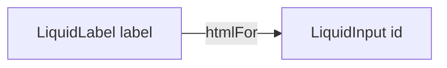

# LiquidLabel

`LiquidLabel` is the native label primitive for Liquid form controls. It adds
the field label class while preserving browser label behavior.

## Status

- Inventory: `label`, implemented
- Export: `LiquidLabel`
- Source: `src/components/LiquidField.tsx`
- Story: `stories/LiquidField.stories.tsx`
- Registry item: `registry/components/liquid-label.json`
- npm package: not published to npm yet.

## Usage

```tsx
import { LiquidInput, LiquidLabel } from "@clean99/liquid-glass";

export function NamedInput() {
  return (
    <div>
      <LiquidLabel htmlFor="project-name">Project name</LiquidLabel>
      <LiquidInput id="project-name" />
    </div>
  );
}
```

## Anatomy



## API

`LiquidLabelProps` is `LabelHTMLAttributes<HTMLLabelElement>`.

| Prop        | Type     | Default | Notes                                   |
| ----------- | -------- | ------- | --------------------------------------- |
| `htmlFor`   | `string` | -       | Binds the label to a form control `id`. |
| `className` | `string` | -       | Merged with `lg-field__label`.          |

## Visual States

The form profile covers normal label, disabled field context, invalid field
context, long labels, light, dark, fallback, and mobile wrapping.

## Accessibility

Use `htmlFor` with controls that expose an `id`. For grouped controls such as
`LiquidInputOtp`, use the label `id` with `aria-labelledby`.

## Registry

The generated registry item is `registry/components/liquid-label.json`.
Registry consumer commands remain post-npm-publish paths until the package is
actually published.

## Verification

- `tests/components.test.tsx` covers label/input wiring.
- `stories/LiquidField.stories.tsx` carries `parameters.visualState`.
- `registry/components/liquid-label.json` is generated from inventory.
- `pnpm test:unit`
- `pnpm test:visual-docs`
- `pnpm test:registry`
