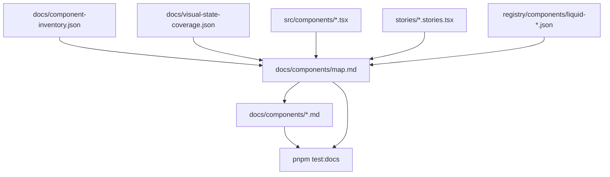

# Component Map

This page is the shadcn-style component directory for `@clean99/liquid-glass`.
It gives every implemented public component one discoverable row. The source of
truth is `docs/component-inventory.json`; visual evidence is tracked in
`docs/visual-state-coverage.json`; registry files are generated under
`registry/components/`.

Do not treat "Storybook + inventory" as finished written docs. That phrase is
kept here as the previous backlog state: a component may be implemented,
exported, covered by Storybook metadata, covered by component tests, and have a
generated registry item, but it is not fully documented until it has the page
shape from `docs/component-documentation.md`. Every implemented row below now
has that written page.

## Status

- Implemented public components: 60.
- Full written component pages: all 60 implemented public components, plus Provider and Surface foundation pages.
- npm package: not published to npm yet.
- shadcn-style registry: generated and testable, but live install commands wait
  for npm publish.
- Storybook Pages: workflow builds; public site waits for GitHub Pages settings.
- Kube exact parity: not claimed until `pnpm test:kube-reference:exact` passes.

## Coverage Flow

## Category Count

| Category     | Count |
| ------------ | ----: |
| `command`    |     1 |
| `control`    |    10 |
| `data`       |     3 |
| `date-time`  |     2 |
| `disclosure` |     2 |
| `display`    |     3 |
| `feedback`   |     7 |
| `form`       |     8 |
| `layout`     |     5 |
| `media`      |     2 |
| `navigation` |     6 |
| `overlay`    |     9 |
| `typography` |     1 |
| `utility`    |     1 |

## Implemented Component Directory

| Export                   | Slug              | Category     | Visual profile | Source                                      | Story                                        | Registry                                          | Written page                         |
| ------------------------ | ----------------- | ------------ | -------------- | ------------------------------------------- | -------------------------------------------- | ------------------------------------------------- | ------------------------------------ |
| `LiquidAccordion`        | `accordion`       | `disclosure` | `disclosure`   | `src/components/LiquidAccordion.tsx`        | `stories/LiquidAccordion.stories.tsx`        | `registry/components/liquid-accordion.json`       | `docs/components/accordion.md`       |
| `LiquidAlert`            | `alert`           | `feedback`   | `feedback`     | `src/components/LiquidAlert.tsx`            | `stories/LiquidFoundation.stories.tsx`       | `registry/components/liquid-alert.json`           | `docs/components/alert.md`           |
| `LiquidAlertDialog`      | `alert-dialog`    | `overlay`    | `overlay`      | `src/components/LiquidAlertDialog.tsx`      | `stories/LiquidOverlay.stories.tsx`          | `registry/components/liquid-alert-dialog.json`    | `docs/components/alert-dialog.md`    |
| `LiquidAspectRatio`      | `aspect-ratio`    | `layout`     | `layout`       | `src/components/LiquidAspectRatio.tsx`      | `stories/LiquidFoundation.stories.tsx`       | `registry/components/liquid-aspect-ratio.json`    | `docs/components/aspect-ratio.md`    |
| `LiquidAvatar`           | `avatar`          | `media`      | `media`        | `src/components/LiquidAvatar.tsx`           | `stories/LiquidFoundation.stories.tsx`       | `registry/components/liquid-avatar.json`          | `docs/components/avatar.md`          |
| `LiquidBadge`            | `badge`           | `display`    | `display`      | `src/components/LiquidBadge.tsx`            | `stories/LiquidFoundation.stories.tsx`       | `registry/components/liquid-badge.json`           | `docs/components/badge.md`           |
| `LiquidBreadcrumb`       | `breadcrumb`      | `navigation` | `navigation`   | `src/components/LiquidBreadcrumb.tsx`       | `stories/LiquidFoundation.stories.tsx`       | `registry/components/liquid-breadcrumb.json`      | `docs/components/breadcrumb.md`      |
| `LiquidButton`           | `button`          | `control`    | `control`      | `src/components/LiquidButton.tsx`           | `stories/LiquidButton.stories.tsx`           | `registry/components/liquid-button.json`          | `docs/components/button.md`          |
| `LiquidButtonGroup`      | `button-group`    | `control`    | `control`      | `src/components/LiquidButtonGroup.tsx`      | `stories/LiquidFoundation.stories.tsx`       | `registry/components/liquid-button-group.json`    | `docs/components/button-group.md`    |
| `LiquidCalendar`         | `calendar`        | `date-time`  | `date-time`    | `src/components/LiquidCalendar.tsx`         | `stories/LiquidCalendar.stories.tsx`         | `registry/components/liquid-calendar.json`        | `docs/components/calendar.md`        |
| `LiquidCard`             | `card`            | `layout`     | `layout`       | `src/components/LiquidCard.tsx`             | `stories/LiquidCard.stories.tsx`             | `registry/components/liquid-card.json`            | `docs/components/card.md`            |
| `LiquidCarousel`         | `carousel`        | `media`      | `media`        | `src/components/LiquidCarousel.tsx`         | `stories/LiquidCarousel.stories.tsx`         | `registry/components/liquid-carousel.json`        | `docs/components/carousel.md`        |
| `LiquidChart`            | `chart`           | `data`       | `data`         | `src/components/LiquidChart.tsx`            | `stories/LiquidChart.stories.tsx`            | `registry/components/liquid-chart.json`           | `docs/components/chart.md`           |
| `LiquidCheckbox`         | `checkbox`        | `control`    | `control`      | `src/components/LiquidCheckbox.tsx`         | `stories/LiquidFoundation.stories.tsx`       | `registry/components/liquid-checkbox.json`        | `docs/components/checkbox.md`        |
| `LiquidCollapsible`      | `collapsible`     | `disclosure` | `disclosure`   | `src/components/LiquidCollapsible.tsx`      | `stories/LiquidOverlay.stories.tsx`          | `registry/components/liquid-collapsible.json`     | `docs/components/collapsible.md`     |
| `LiquidCombobox`         | `combobox`        | `control`    | `control`      | `src/components/LiquidCombobox.tsx`         | `stories/LiquidCommand.stories.tsx`          | `registry/components/liquid-combobox.json`        | `docs/components/combobox.md`        |
| `LiquidCommand`          | `command`         | `command`    | `command`      | `src/components/LiquidCommand.tsx`          | `stories/LiquidCommand.stories.tsx`          | `registry/components/liquid-command.json`         | `docs/components/command.md`         |
| `LiquidContextMenu`      | `context-menu`    | `overlay`    | `overlay`      | `src/components/LiquidContextMenu.tsx`      | `stories/LiquidOverlay.stories.tsx`          | `registry/components/liquid-context-menu.json`    | `docs/components/context-menu.md`    |
| `LiquidDataTable`        | `data-table`      | `data`       | `data`         | `src/components/LiquidDataTable.tsx`        | `stories/LiquidDataTable.stories.tsx`        | `registry/components/liquid-data-table.json`      | `docs/components/data-table.md`      |
| `LiquidDatePicker`       | `date-picker`     | `date-time`  | `date-time`    | `src/components/LiquidDatePicker.tsx`       | `stories/LiquidDatePicker.stories.tsx`       | `registry/components/liquid-date-picker.json`     | `docs/components/date-picker.md`     |
| `LiquidDialog`           | `dialog`          | `overlay`    | `overlay`      | `src/components/LiquidDialog.tsx`           | `stories/LiquidDialog.stories.tsx`           | `registry/components/liquid-dialog.json`          | `docs/components/dialog.md`          |
| `LiquidDirection`        | `direction`       | `utility`    | `utility`      | `src/components/LiquidDirection.tsx`        | `stories/LiquidFoundation.stories.tsx`       | `registry/components/liquid-direction.json`       | `docs/components/direction.md`       |
| `LiquidDrawer`           | `drawer`          | `overlay`    | `overlay`      | `src/components/LiquidDrawer.tsx`           | `stories/LiquidOverlay.stories.tsx`          | `registry/components/liquid-drawer.json`          | `docs/components/drawer.md`          |
| `LiquidDropdownMenu`     | `dropdown-menu`   | `overlay`    | `overlay`      | `src/components/LiquidDropdownMenu.tsx`     | `stories/LiquidOverlay.stories.tsx`          | `registry/components/liquid-dropdown-menu.json`   | `docs/components/dropdown-menu.md`   |
| `LiquidEmpty`            | `empty`           | `feedback`   | `feedback`     | `src/components/LiquidEmpty.tsx`            | `stories/LiquidFoundation.stories.tsx`       | `registry/components/liquid-empty.json`           | `docs/components/empty.md`           |
| `LiquidField`            | `field`           | `form`       | `form`         | `src/components/LiquidField.tsx`            | `stories/LiquidField.stories.tsx`            | `registry/components/liquid-field.json`           | `docs/components/field.md`           |
| `LiquidHoverCard`        | `hover-card`      | `overlay`    | `overlay`      | `src/components/LiquidHoverCard.tsx`        | `stories/LiquidOverlay.stories.tsx`          | `registry/components/liquid-hover-card.json`      | `docs/components/hover-card.md`      |
| `LiquidInput`            | `input`           | `form`       | `form`         | `src/components/LiquidField.tsx`            | `stories/LiquidField.stories.tsx`            | `registry/components/liquid-input.json`           | `docs/components/input.md`           |
| `LiquidInputGroup`       | `input-group`     | `form`       | `form`         | `src/components/LiquidInputGroup.tsx`       | `stories/LiquidFoundation.stories.tsx`       | `registry/components/liquid-input-group.json`     | `docs/components/input-group.md`     |
| `LiquidInputOtp`         | `input-otp`       | `form`       | `form`         | `src/components/LiquidInputOtp.tsx`         | `stories/LiquidField.stories.tsx`            | `registry/components/liquid-input-otp.json`       | `docs/components/input-otp.md`       |
| `LiquidItem`             | `item`            | `display`    | `display`      | `src/components/LiquidItem.tsx`             | `stories/LiquidFoundation.stories.tsx`       | `registry/components/liquid-item.json`            | `docs/components/item.md`            |
| `LiquidKbd`              | `kbd`             | `display`    | `display`      | `src/components/LiquidKbd.tsx`              | `stories/LiquidFoundation.stories.tsx`       | `registry/components/liquid-kbd.json`             | `docs/components/kbd.md`             |
| `LiquidLabel`            | `label`           | `form`       | `form`         | `src/components/LiquidField.tsx`            | `stories/LiquidField.stories.tsx`            | `registry/components/liquid-label.json`           | `docs/components/label.md`           |
| `LiquidMenubar`          | `menubar`         | `navigation` | `navigation`   | `src/components/LiquidMenubar.tsx`          | `stories/LiquidOverlay.stories.tsx`          | `registry/components/liquid-menubar.json`         | `docs/components/menubar.md`         |
| `LiquidNativeSelect`     | `native-select`   | `form`       | `form`         | `src/components/LiquidNativeSelect.tsx`     | `stories/LiquidFoundation.stories.tsx`       | `registry/components/liquid-native-select.json`   | `docs/components/native-select.md`   |
| `LiquidNav`              | `navigation-menu` | `navigation` | `navigation`   | `src/components/LiquidNav.tsx`              | `stories/LiquidNav.stories.tsx`              | `registry/components/liquid-navigation-menu.json` | `docs/components/navigation-menu.md` |
| `LiquidPagination`       | `pagination`      | `navigation` | `navigation`   | `src/components/LiquidPagination.tsx`       | `stories/LiquidFoundation.stories.tsx`       | `registry/components/liquid-pagination.json`      | `docs/components/pagination.md`      |
| `LiquidPopover`          | `popover`         | `overlay`    | `overlay`      | `src/components/LiquidPopover.tsx`          | `stories/LiquidOverlay.stories.tsx`          | `registry/components/liquid-popover.json`         | `docs/components/popover.md`         |
| `LiquidProgress`         | `progress`        | `feedback`   | `feedback`     | `src/components/LiquidProgress.tsx`         | `stories/LiquidFoundation.stories.tsx`       | `registry/components/liquid-progress.json`        | `docs/components/progress.md`        |
| `LiquidRadioGroup`       | `radio-group`     | `control`    | `control`      | `src/components/LiquidRadioGroup.tsx`       | `stories/LiquidFoundation.stories.tsx`       | `registry/components/liquid-radio-group.json`     | `docs/components/radio-group.md`     |
| `LiquidResizable`        | `resizable`       | `layout`     | `layout`       | `src/components/LiquidResizable.tsx`        | `stories/LiquidResizable.stories.tsx`        | `registry/components/liquid-resizable.json`       | `docs/components/resizable.md`       |
| `LiquidScrollArea`       | `scroll-area`     | `layout`     | `layout`       | `src/components/LiquidScrollArea.tsx`       | `stories/LiquidFoundation.stories.tsx`       | `registry/components/liquid-scroll-area.json`     | `docs/components/scroll-area.md`     |
| `LiquidSearchBox`        | `searchbox`       | `form`       | `form`         | `src/components/LiquidSearchBox.tsx`        | `stories/LiquidSearchBox.stories.tsx`        | `registry/components/liquid-searchbox.json`       | `docs/components/searchbox.md`       |
| `LiquidSelect`           | `select`          | `control`    | `control`      | `src/components/LiquidSelect.tsx`           | `stories/LiquidField.stories.tsx`            | `registry/components/liquid-select.json`          | `docs/components/select.md`          |
| `LiquidSeparator`        | `separator`       | `layout`     | `layout`       | `src/components/LiquidSeparator.tsx`        | `stories/LiquidFoundation.stories.tsx`       | `registry/components/liquid-separator.json`       | `docs/components/separator.md`       |
| `LiquidSheet`            | `sheet`           | `overlay`    | `overlay`      | `src/components/LiquidSheet.tsx`            | `stories/LiquidOverlay.stories.tsx`          | `registry/components/liquid-sheet.json`           | `docs/components/sheet.md`           |
| `LiquidSidebar`          | `sidebar`         | `navigation` | `navigation`   | `src/components/LiquidSidebar.tsx`          | `stories/LiquidSidebar.stories.tsx`          | `registry/components/liquid-sidebar.json`         | `docs/components/sidebar.md`         |
| `LiquidSkeleton`         | `skeleton`        | `feedback`   | `feedback`     | `src/components/LiquidSkeleton.tsx`         | `stories/LiquidFoundation.stories.tsx`       | `registry/components/liquid-skeleton.json`        | `docs/components/skeleton.md`        |
| `LiquidSpinner`          | `spinner`         | `feedback`   | `feedback`     | `src/components/LiquidSpinner.tsx`          | `stories/LiquidFoundation.stories.tsx`       | `registry/components/liquid-spinner.json`         | `docs/components/spinner.md`         |
| `LiquidSlider`           | `slider`          | `control`    | `control`      | `src/components/LiquidSlider.tsx`           | `stories/LiquidSlider.stories.tsx`           | `registry/components/liquid-slider.json`          | `docs/components/slider.md`          |
| `LiquidToaster`          | `sonner`          | `feedback`   | `feedback`     | `src/components/LiquidToast.tsx`            | `stories/LiquidToast.stories.tsx`            | `registry/components/liquid-sonner.json`          | `docs/components/sonner.md`          |
| `LiquidSwitch`           | `switch`          | `control`    | `control`      | `src/components/LiquidSwitch.tsx`           | `stories/LiquidSwitch.stories.tsx`           | `registry/components/liquid-switch.json`          | `docs/components/switch.md`          |
| `LiquidTable`            | `table`           | `data`       | `data`         | `src/components/LiquidTable.tsx`            | `stories/LiquidFoundation.stories.tsx`       | `registry/components/liquid-table.json`           | `docs/components/table.md`           |
| `LiquidTabs`             | `tabs`            | `navigation` | `navigation`   | `src/components/LiquidTabs.tsx`             | `stories/LiquidTabs.stories.tsx`             | `registry/components/liquid-tabs.json`            | `docs/components/tabs.md`            |
| `LiquidTextarea`         | `textarea`        | `form`       | `form`         | `src/components/LiquidField.tsx`            | `stories/LiquidField.stories.tsx`            | `registry/components/liquid-textarea.json`        | `docs/components/textarea.md`        |
| `LiquidToast`            | `toast`           | `feedback`   | `feedback`     | `src/components/LiquidToast.tsx`            | `stories/LiquidToast.stories.tsx`            | `registry/components/liquid-toast.json`           | `docs/components/toast.md`           |
| `LiquidToggle`           | `toggle`          | `control`    | `control`      | `src/components/LiquidToggle.tsx`           | `stories/LiquidToggle.stories.tsx`           | `registry/components/liquid-toggle.json`          | `docs/components/toggle.md`          |
| `LiquidSegmentedControl` | `toggle-group`    | `control`    | `control`      | `src/components/LiquidSegmentedControl.tsx` | `stories/LiquidSegmentedControl.stories.tsx` | `registry/components/liquid-toggle-group.json`    | `docs/components/toggle-group.md`    |
| `LiquidTooltip`          | `tooltip`         | `overlay`    | `overlay`      | `src/components/LiquidTooltip.tsx`          | `stories/LiquidOverlay.stories.tsx`          | `registry/components/liquid-tooltip.json`         | `docs/components/tooltip.md`         |
| `LiquidTypography`       | `typography`      | `typography` | `typography`   | `src/components/LiquidTypography.tsx`       | `stories/LiquidFoundation.stories.tsx`       | `registry/components/liquid-typography.json`      | `docs/components/typography.md`      |

## Written Page Backlog

No implemented public component remains at the old Storybook + inventory-only
documentation level. Future inventory additions must add the component page in
the same change, or `pnpm test:docs` should fail.

Each written page must follow `docs/component-documentation.md` and keep the
same honesty rules: no live npm install claims before publish, no exact Kube
claim before the exact gate passes, and no copied third-party source or prose.
