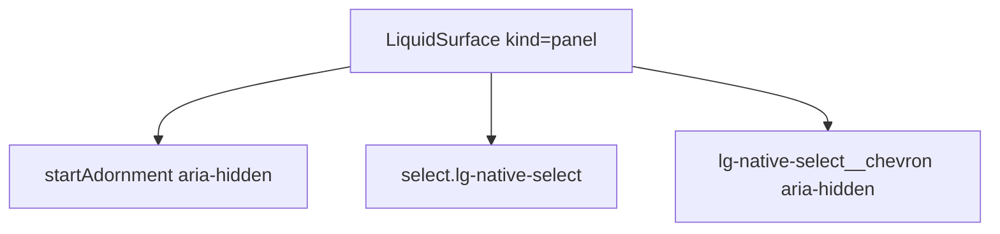

# LiquidNativeSelect

`LiquidNativeSelect` is the native `select` field wrapped in a Liquid surface.
It is the low-complexity path when browser select behavior is preferred over a
custom combobox.

## Status

- Inventory: `native-select`, implemented
- Export: `LiquidNativeSelect`
- Source: `src/components/LiquidNativeSelect.tsx`
- Story: `stories/LiquidFoundation.stories.tsx`
- Registry item: `registry/components/liquid-native-select.json`
- npm package: not published to npm yet.

## Usage

```tsx
import { LiquidLabel, LiquidNativeSelect } from "@clean99/liquid-glass";

export function ReleaseModeSelect() {
  return (
    <div>
      <LiquidLabel htmlFor="release-mode">Release mode</LiquidLabel>
      <LiquidNativeSelect defaultValue="stable" id="release-mode">
        <option value="stable">Stable</option>
        <option value="beta">Beta</option>
      </LiquidNativeSelect>
    </div>
  );
}
```

## Anatomy



## API

`LiquidNativeSelectProps` extends `SelectHTMLAttributes<HTMLSelectElement>`.

| Prop             | Type                      | Default | Notes                                   |
| ---------------- | ------------------------- | ------- | --------------------------------------- |
| `invalid`        | `boolean`                 | `false` | Sets `aria-invalid` and `data-invalid`. |
| `startAdornment` | `ReactNode`               | -       | Decorative slot before the select.      |
| `endAdornment`   | `ReactNode`               | `⌄`     | Decorative chevron slot.                |
| `surfaceProps`   | `LiquidSurfaceProps` omit | -       | Customizes the wrapping surface.        |

## Visual States

The form profile covers default, openable native select, invalid, disabled,
adorned, dark, fallback, high-contrast, and mobile review states.

## Accessibility

Use a real label with `htmlFor`. The chevron and adornments are hidden from
assistive technology, so the native select text must carry the meaning.

## Registry

The generated registry item is `registry/components/liquid-native-select.json`.
Registry consumer commands remain post-npm-publish paths until the package is
actually published.

## Verification

- `tests/components.test.tsx` covers select and native form primitives.
- `stories/LiquidFoundation.stories.tsx` carries `parameters.visualState`.
- `registry/components/liquid-native-select.json` is generated from inventory.
- `pnpm test:unit`
- `pnpm test:visual-docs`
- `pnpm test:registry`
