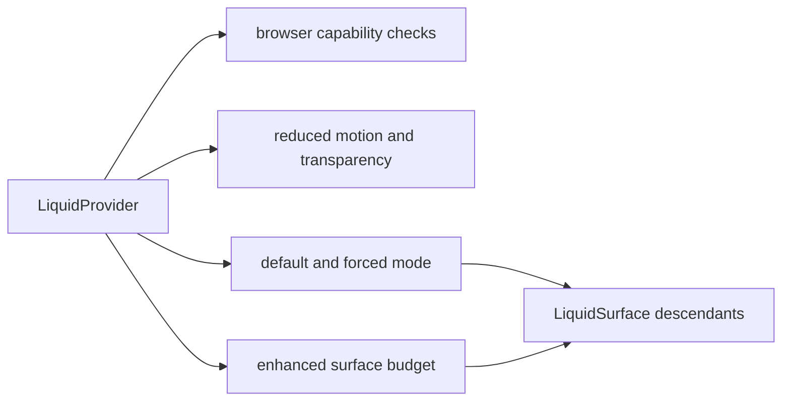

# LiquidProvider

`LiquidProvider` owns the default material mode, mobile policy, user preference
policy, and enhanced-surface budget for all descendant Liquid Glass surfaces.

## Status

- Export: `LiquidProvider`
- Source: `src/providers/LiquidProvider.tsx`
- Type source: `src/types.ts`
- Registry item: none; this is a package provider, not a shadcn-style component
  shim.
- npm package: not published to npm yet.

## Usage

```tsx
"use client";

import { LiquidButton, LiquidProvider } from "@clean99/liquid-glass";
import "@clean99/liquid-glass/styles.css";

export function App() {
  return (
    <LiquidProvider defaultMode="auto" maxEnhancedSurfaces={6}>
      <LiquidButton>Open docs</LiquidButton>
    </LiquidProvider>
  );
}
```

## Anatomy



`LiquidProvider` delays browser capability reads until after mount. Server
rendering starts from safe fallback capability defaults.

## API

| Prop                         | Type         | Default | Notes                                                               |
| ---------------------------- | ------------ | ------- | ------------------------------------------------------------------- |
| `children`                   | `ReactNode`  | none    | Required descendant tree.                                           |
| `defaultMode`                | `LiquidMode` | `auto`  | Default mode for descendants without a local `mode`.                |
| `disableOnMobile`            | `boolean`    | `true`  | Keeps mobile-like devices on fallback/solid paths by default.       |
| `respectReducedMotion`       | `boolean`    | `true`  | Lets system reduced-motion preference block enhanced behavior.      |
| `respectReducedTransparency` | `boolean`    | `true`  | Lets reduced-transparency preference block enhanced behavior.       |
| `maxEnhancedSurfaces`        | `number`     | `8`     | Caps active enhanced surfaces before later surfaces fall back.      |
| `debug`                      | `boolean`    | `false` | Exposes debug intent through context; not a user-facing UI feature. |

`LiquidMode` is `auto`, `enhanced`, `fallback`, `solid`, or `off`.

## Accessibility

The provider does not render a DOM element. Its accessibility job is policy:
respect reduced motion, reduced transparency, mobile fallback, and enhanced
surface budget so readable content is not sacrificed for material effects.

## Verification

- `tests/components.test.tsx` checks fallback mode, localStorage-forced fallback,
  enhanced mode, and enhanced-surface caps.
- `tests/ssr.test.tsx` covers server-rendered provider usage.
- `pnpm test:unit`
- `pnpm test:e2e`
- `pnpm test:release-readiness`
