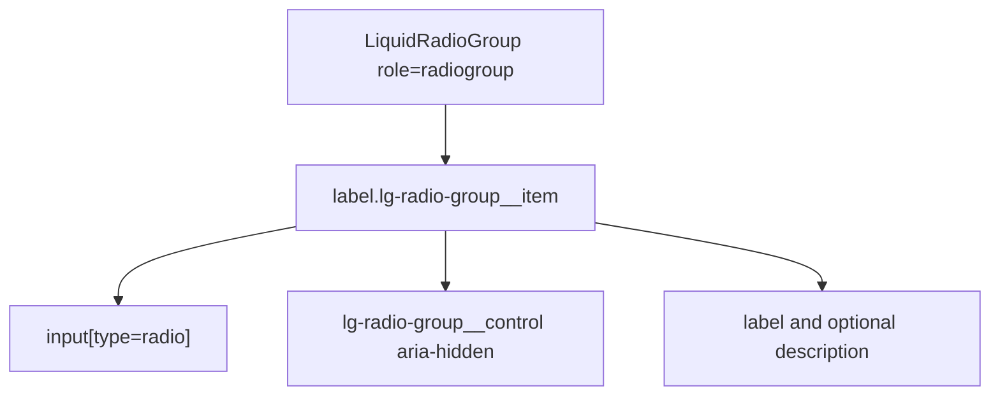

# LiquidRadioGroup

`LiquidRadioGroup` renders native radio inputs with Liquid visual controls. It
supports controlled and uncontrolled value state plus roving arrow-key movement.

## Status

- Inventory: `radio-group`, implemented
- Exports: `LiquidRadioGroup`, `LiquidRadioInput`
- Source: `src/components/LiquidRadioGroup.tsx`
- Story: `stories/LiquidFoundation.stories.tsx`
- Registry item: `registry/components/liquid-radio-group.json`
- npm package: not published to npm yet.

## Usage

```tsx
import { LiquidRadioGroup } from "@clean99/liquid-glass";

export function DensityChoice() {
  return (
    <LiquidRadioGroup
      aria-label="Density"
      defaultValue="comfortable"
      name="density"
      options={[
        { label: "Compact", value: "compact" },
        { label: "Comfortable", value: "comfortable" }
      ]}
    />
  );
}
```

## Anatomy



## API

`LiquidRadioGroupProps` extends `HTMLAttributes<HTMLDivElement>` without native
`defaultValue` and `onChange`.

| Prop            | Type                           | Default    | Notes                                |
| --------------- | ------------------------------ | ---------- | ------------------------------------ |
| `options`       | `LiquidRadioGroupOption[]`     | required   | Each option has `label` and `value`. |
| `value`         | `string`                       | -          | Controlled value.                    |
| `defaultValue`  | `string`                       | -          | Uncontrolled initial value.          |
| `onValueChange` | `(value) => void`              | -          | Fires when selection changes.        |
| `name`          | `string`                       | generated  | Shared native radio input name.      |
| `orientation`   | `"horizontal"` or `"vertical"` | `vertical` | Sets `aria-orientation`.             |

## Visual States

The control profile covers unchecked, checked, disabled option, description,
horizontal, vertical, keyboard focus, light, dark, and fallback states.

## Accessibility

The root uses `role="radiogroup"`. Provide `aria-label` or
`aria-labelledby`. Native inputs preserve form submission and browser checked
state.

## Registry

The generated registry item is `registry/components/liquid-radio-group.json`.
Registry consumer commands remain post-npm-publish paths until the package is
actually published.

## Verification

- `tests/components.test.tsx` covers foundation component rendering.
- `scripts/verify-liquid-behavior.mjs` includes a real browser focus audit.
- `stories/LiquidFoundation.stories.tsx` carries `parameters.visualState`.
- `registry/components/liquid-radio-group.json` is generated from inventory.
- `pnpm test:unit`
- `pnpm test:visual-docs`
- `pnpm test:registry`
