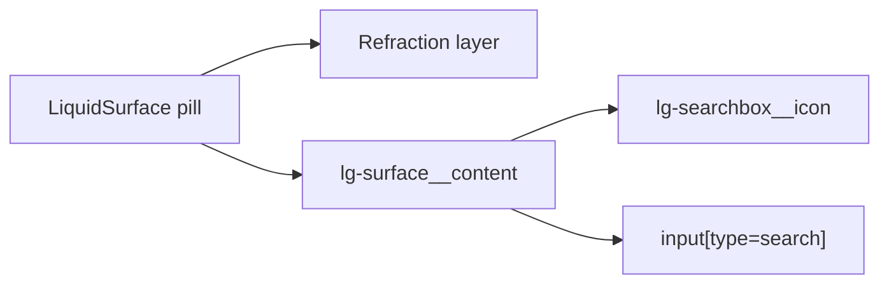

# LiquidSearchBox

`LiquidSearchBox` is the search input primitive tuned for the Kube reference
search field and for dense documentation or command surfaces.

## Status

- Inventory: `searchbox`, implemented
- Export: `LiquidSearchBox`
- Source: `src/components/LiquidSearchBox.tsx`
- Story: `stories/LiquidSearchBox.stories.tsx`
- Registry item: `registry/components/liquid-searchbox.json`
- npm package: not published to npm yet.

## Usage

```tsx
import { LiquidSearchBox } from "@clean99/liquid-glass";

export function SearchDocs() {
  return <LiquidSearchBox aria-label="Search documentation" />;
}
```

Custom placeholder and controlled value:

```tsx
<LiquidSearchBox
  aria-label="Search articles"
  onChange={(event) => setQuery(event.currentTarget.value)}
  placeholder="Search articles"
  value={query}
/>
```

## Anatomy



Foreground content stays in `lg-surface__content`; the Kube reference contract
asserts that the search icon and input do not move into the filtered glass
layer.

## API

`LiquidSearchBoxProps` extends native input props except `children`.

| Prop           | Type               | Default   | Notes                                                           |
| -------------- | ------------------ | --------- | --------------------------------------------------------------- |
| `type`         | input type         | `search`  | Keep `search` for normal usage.                                 |
| `placeholder`  | `string`           | `Search`  | Native placeholder.                                             |
| `icon`         | `ReactNode`        | magnifier | Replaces the default decorative icon.                           |
| `surfaceProps` | surface props      | none      | Customizes the pill surface and refraction parameters.          |
| input props    | native input props | inherited | Includes `value`, `defaultValue`, `onChange`, labels, and refs. |

## Visual States

Storybook covers the Kube reference frame, image background reference, focused
photo reference, dark mode, fallback mode, solid mode, and long mixed-language
placeholder text. The form profile in `docs/visual-state-coverage.json` expects
default, focus-visible, invalid, disabled, long-label, mobile, fallback, and
solid review states where applicable.

## Accessibility

The rendered control is a native input with `type="search"`, so it exposes the
searchbox role. Provide an accessible name with `aria-label`, a visible label,
or another native labelling path. The icon is decorative by default.

## Kube Reference Contract

`pnpm test:kube-reference` compares the public Kube searchbox reference to the
local Storybook story. For the image-background state, the comparison also
checks that:

- a glass layer exists and owns backdrop filtering;
- a content layer exists and is not filtered;
- the content layer has no text shadow;
- the source image provenance stays locked.

Exact 1:1 parity is still separate and is not claimed until
`pnpm test:kube-reference:exact` passes.

## Registry

The generated registry item is `registry/components/liquid-searchbox.json`.
Registry consumer commands remain post-npm-publish paths until the package is
actually published.

## Verification

- `tests/components.test.tsx` checks native search input rendering.
- `tests/refraction-physics.test.ts` checks the Kube searchbox image background
  contract and foreground layer rules.
- `stories/LiquidSearchBox.stories.tsx` carries `parameters.visualState`.
- `registry/components/liquid-searchbox.json` is generated from inventory.
- `pnpm test:unit`
- `pnpm test:kube-reference`
- `pnpm test:visual-docs`
- `pnpm test:registry`
