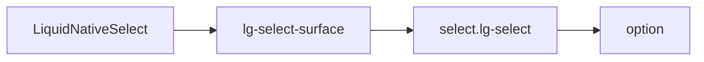

# LiquidSelect

`LiquidSelect` is the styled native select path. It delegates behavior to
`LiquidNativeSelect` and adds select-specific classes.

## Status

- Inventory: `select`, implemented
- Export: `LiquidSelect`
- Source: `src/components/LiquidSelect.tsx`
- Base source: `src/components/LiquidNativeSelect.tsx`
- Story: `stories/LiquidField.stories.tsx`
- Registry item: `registry/components/liquid-select.json`
- npm package: not published to npm yet.

## Usage

```tsx
import { LiquidSelect } from "@clean99/liquid-glass";

export function ReleaseMode() {
  return (
    <LiquidSelect aria-label="Release mode" defaultValue="fallback">
      <option value="enhanced">Enhanced</option>
      <option value="fallback">Fallback</option>
    </LiquidSelect>
  );
}
```

## Anatomy



The native select owns the combobox semantics, value, keyboard behavior, and
form participation. The Liquid surface only provides material styling.

## API

`LiquidSelectProps` is the same type as `LiquidNativeSelectProps`.

| Prop           | Type           | Default  | Notes                                |
| -------------- | -------------- | -------- | ------------------------------------ |
| `children`     | `option` nodes | required | Native select options.               |
| `value`        | select value   | none     | Controlled value.                    |
| `defaultValue` | select value   | none     | Initial uncontrolled value.          |
| `disabled`     | `boolean`      | false    | Native disabled state.               |
| `surfaceProps` | surface props  | none     | Customizes the select field surface. |

## Visual States

Storybook covers select examples in the field stories, including light, dark,
fallback, solid, invalid, disabled, adornment, and long mixed-text contexts. The
control profile in `docs/visual-state-coverage.json` expects default, hover,
focus-visible, disabled, invalid, selected, and fallback states where
applicable.

## Accessibility

Use native labelling: visible label, `aria-label`, or `aria-labelledby`.
Because this is a native `<select>`, browser keyboard, form, and mobile picker
behavior stay intact.

## Registry

The generated registry item is `registry/components/liquid-select.json`.
Registry consumer commands remain post-npm-publish paths until the package is
actually published.

## Verification

- `tests/components.test.tsx` checks native combobox semantics and
  `lg-select-surface` styling.
- `stories/LiquidField.stories.tsx` carries `parameters.visualState`.
- `registry/components/liquid-select.json` is generated from inventory.
- `pnpm test:unit`
- `pnpm test:visual-docs`
- `pnpm test:registry`
