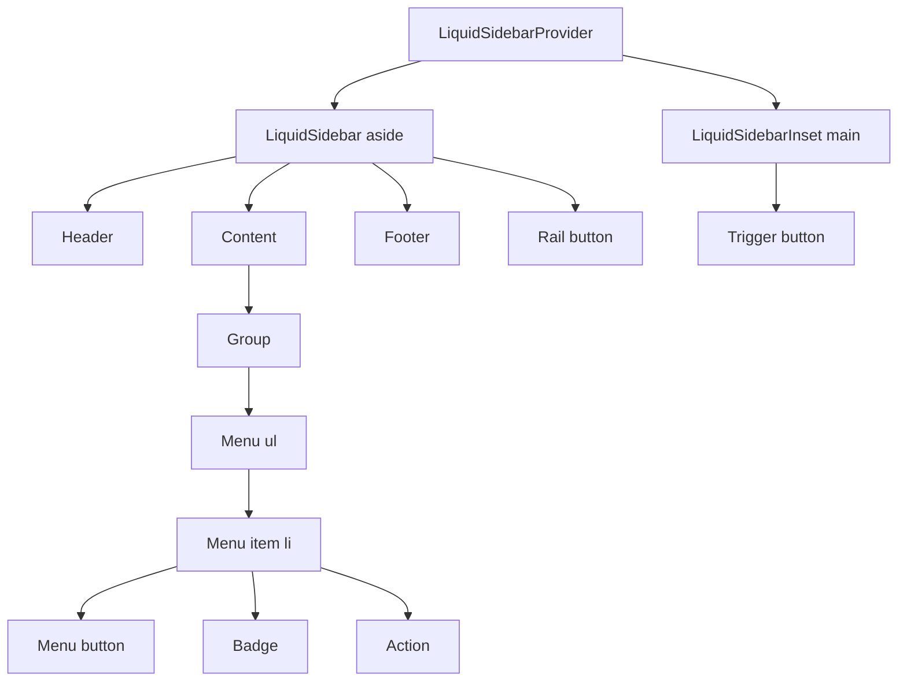

# LiquidSidebar

`LiquidSidebar` is the application navigation shell for collapsible sidebars,
icon rails, grouped menus, and inset page content.

## Status

- Inventory: `sidebar`, implemented
- Exports: `LiquidSidebarProvider`, `LiquidSidebar`, `LiquidSidebarInset`,
  `LiquidSidebarTrigger`, `LiquidSidebarRail`, `LiquidSidebarHeader`,
  `LiquidSidebarContent`, `LiquidSidebarFooter`, `LiquidSidebarGroup`,
  `LiquidSidebarGroupLabel`, `LiquidSidebarGroupContent`,
  `LiquidSidebarGroupAction`, `LiquidSidebarInput`, `LiquidSidebarSeparator`,
  `LiquidSidebarMenu`, `LiquidSidebarMenuItem`, `LiquidSidebarMenuButton`,
  `LiquidSidebarMenuAction`, `LiquidSidebarMenuBadge`, `useLiquidSidebar`
- Source: `src/components/LiquidSidebar.tsx`
- Story: `stories/LiquidSidebar.stories.tsx`
- Registry item: `registry/components/liquid-sidebar.json`
- npm package: not published to npm yet.

## Usage

```tsx
import {
  LiquidSidebar,
  LiquidSidebarContent,
  LiquidSidebarInset,
  LiquidSidebarMenu,
  LiquidSidebarMenuButton,
  LiquidSidebarMenuItem,
  LiquidSidebarProvider,
  LiquidSidebarTrigger
} from "@clean99/liquid-glass";

export function AppShell() {
  return (
    <LiquidSidebarProvider>
      <LiquidSidebar aria-label="Workspace navigation" id="workspace-nav">
        <LiquidSidebarContent>
          <LiquidSidebarMenu>
            <LiquidSidebarMenuItem>
              <LiquidSidebarMenuButton active as="a" href="/docs">
                Docs
              </LiquidSidebarMenuButton>
            </LiquidSidebarMenuItem>
          </LiquidSidebarMenu>
        </LiquidSidebarContent>
      </LiquidSidebar>
      <LiquidSidebarInset>
        <LiquidSidebarTrigger controls="workspace-nav">Toggle sidebar</LiquidSidebarTrigger>
      </LiquidSidebarInset>
    </LiquidSidebarProvider>
  );
}
```

## Anatomy



## API

| Export                    | Purpose                                                                               |
| ------------------------- | ------------------------------------------------------------------------------------- |
| `LiquidSidebarProvider`   | Owns controlled or uncontrolled open state and optional localStorage persistence.     |
| `LiquidSidebar`           | Renders an `aside` with `role="complementary"` by default and width state attributes. |
| `LiquidSidebarInset`      | Renders the main content region that follows sidebar state.                           |
| `LiquidSidebarTrigger`    | Button that toggles provider state and can point at sidebar id through `controls`.    |
| `LiquidSidebarRail`       | Button rail target for collapsed sidebars.                                            |
| `LiquidSidebarMenuButton` | Button or anchor item with `active`, `size`, and disabled handling.                   |
| `LiquidSidebarInput`      | Sidebar-search input built from `LiquidInput`.                                        |

`LiquidSidebar` supports `side`, `variant`, `collapsible`, `width`, and
`iconWidth`. `LiquidSidebarMenuButton` uses `aria-current="page"` when rendered
as an active anchor, and `aria-pressed` when rendered as an active button.

## Visual States

Storybook covers app shell, collapsed icon rail, and floating variants. The
navigation profile in `docs/visual-state-coverage.json` expects expanded,
collapsed, active item, action, badge, rail, trigger, mobile/fallback, and long
label review states where applicable.

## Accessibility

The sidebar is a complementary region unless a custom role is provided. Menus
use real `ul` and `li` structure. Toggle controls are native buttons. Active
anchor menu items use `aria-current="page"`; active button menu items use
`aria-pressed`.

## Registry

The generated registry item is `registry/components/liquid-sidebar.json`.
Registry consumer commands remain post-npm-publish paths until the package is
actually published.

## Verification

- `tests/components.test.tsx` checks collapsed state, complementary region,
  active link semantics, badges, rail, and trigger wiring.
- `stories/LiquidSidebar.stories.tsx` carries `parameters.visualState`.
- `registry/components/liquid-sidebar.json` is generated from inventory.
- `pnpm test:unit`
- `pnpm test:visual-docs`
- `pnpm test:registry`
