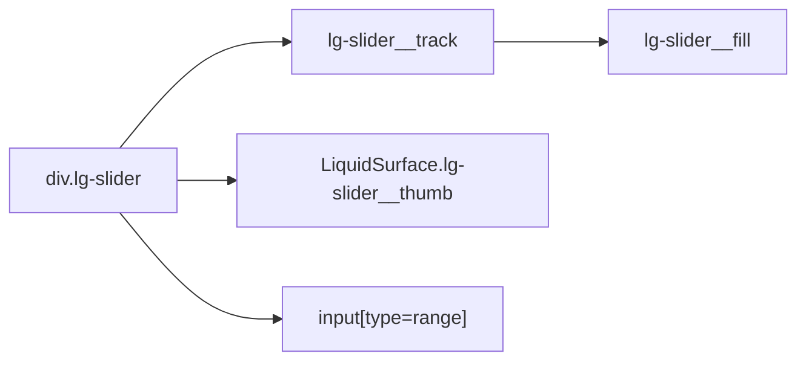

# LiquidSlider

`LiquidSlider` is the native range-input wrapper for continuous numeric values
with a Liquid Glass thumb and track.

## Status

- Inventory: `slider`, implemented
- Export: `LiquidSlider`
- Source: `src/components/LiquidSlider.tsx`
- Story: `stories/LiquidSlider.stories.tsx`
- Registry item: `registry/components/liquid-slider.json`
- npm package: not published to npm yet.

## Usage

```tsx
import { LiquidSlider } from "@clean99/liquid-glass";

export function RefractionLevel() {
  return <LiquidSlider aria-label="Refraction level" defaultValue={35} />;
}
```

Controlled value:

```tsx
<LiquidSlider
  aria-label="Blur"
  max={100}
  min={0}
  onChange={(event) => setValue(Number(event.currentTarget.value))}
  value={value}
/>
```

## Anatomy



The native range input owns semantics and value. The surface thumb is
decorative and marked `aria-hidden`.

## API

`LiquidSliderProps` extends native input props except `children` and `type`.

| Prop           | Type             | Default | Notes                                                  |
| -------------- | ---------------- | ------- | ------------------------------------------------------ |
| `defaultValue` | input value      | `10`    | Initial uncontrolled value.                            |
| `value`        | input value      | none    | Controlled value.                                      |
| `min`          | number or string | `0`     | Native range minimum.                                  |
| `max`          | number or string | `100`   | Native range maximum.                                  |
| `disabled`     | `boolean`        | false   | Disables the native input and marks the root disabled. |
| `surfaceProps` | surface props    | none    | Customizes the decorative thumb surface.               |

## Visual States

Storybook covers the Kube reference state and fallback mode. The control
profile in `docs/visual-state-coverage.json` expects default, hover,
focus-visible, pressed, disabled, and selected review states where applicable.

## Accessibility

The input is a native `input[type="range"]`, so it exposes the slider role and
browser keyboard behavior. Always provide an accessible name through
`aria-label`, a visible label, or native labelling. The decorative track and
thumb do not replace the native range input.

## Registry

The generated registry item is `registry/components/liquid-slider.json`.
Registry consumer commands remain post-npm-publish paths until the package is
actually published.

## Verification

- `tests/components.test.tsx` checks native range input semantics and value.
- `stories/LiquidSlider.stories.tsx` carries `parameters.visualState`.
- `pnpm test:kube-reference` compares the Kube slider reference.
- `registry/components/liquid-slider.json` is generated from inventory.
- `pnpm test:unit`
- `pnpm test:visual-docs`
- `pnpm test:registry`
