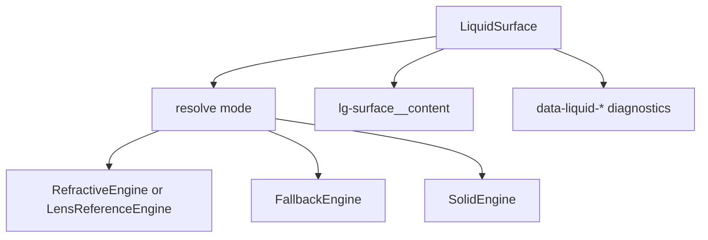

# LiquidSurface

`LiquidSurface` is the material boundary. Public controls compose it instead of
talking directly to the refraction engines.

## Status

- Export: `LiquidSurface`
- Source: `src/components/LiquidSurface.tsx`
- Story: `stories/LiquidSurface.stories.tsx`
- Registry item: none; consumers usually install composed components.
- npm package: not published to npm yet.

## Usage

```tsx
import { LiquidSurface } from "@clean99/liquid-glass";

export function Panel() {
  return (
    <LiquidSurface kind="panel" intensity="medium" radius="xl">
      Readable foreground content
    </LiquidSurface>
  );
}
```

## Anatomy



Foreground children are wrapped in `lg-surface__content` so readable content
stays outside the distorted refraction layer.

## API

| Prop                             | Type                                               | Default      | Notes                                                               |
| -------------------------------- | -------------------------------------------------- | ------------ | ------------------------------------------------------------------- |
| `as`                             | `ElementType`                                      | `div`        | Rendered element or component.                                      |
| `children`                       | `ReactNode`                                        | none         | Required visible content.                                           |
| `disabled`                       | `boolean`                                          | `false`      | Blocks click handlers; native disabled only for supported tags.     |
| `fallback`                       | `material`, `solid`, `gradient`                    | `material`   | Fallback engine style.                                              |
| `enhancedEngine`                 | `refractive`, `reference-lens`                     | `refractive` | Reference lens is for Kube-aligned stories.                         |
| `intensity`                      | `subtle`, `medium`, `strong`                       | `subtle`     | Material strength.                                                  |
| `interactive`                    | `boolean`                                          | `false`      | Adds interactive surface styling.                                   |
| `kind`                           | `nav`, `button`, `card`, `pill`, `toggle`, `panel` | `panel`      | Drives token and class variants.                                    |
| `mode`                           | `auto`, `enhanced`, `fallback`, `solid`, `off`     | `auto`       | Local mode request, still constrained by provider policy.           |
| `opticalBounds`                  | `layout`, `visual`                                 | `visual`     | Enhanced-mode bounds measurement strategy.                          |
| `radius`                         | number or `sm`, `md`, `lg`, `xl`, `pill`           | `lg`         | Material radius in tokens or pixels.                                |
| `refraction`                     | `Partial<RefractiveOptions>`                       | undefined    | Advanced optical tuning.                                            |
| `referenceFilterMaps`            | `LiquidLensReferenceFilterMaps`                    | undefined    | Kube reference diagnostics only.                                    |
| `allowOversizedRefractionRadius` | `boolean`                                          | `false`      | Allows radius larger than measured bounds.                          |
| `asChild`                        | `boolean`                                          | `false`      | Currently records `data-liquid-as-child`; it is not Slot semantics. |

## Accessibility

`LiquidSurface` does not invent semantics. Use native `button`, `a`, `dialog`,
`input`, `select`, or composed components where interaction is needed. Disabled
non-native surfaces receive `aria-disabled` and `tabIndex=-1`.

## Verification

- `tests/components.test.tsx` checks readable content wrapping, fallback mode,
  forced fallback, enhanced mode, and enhanced-surface caps.
- `tests/refraction-physics.test.ts` checks optics contracts.
- `pnpm test:unit`
- `pnpm test:storybook`
- `pnpm test:kube-reference:strict`
