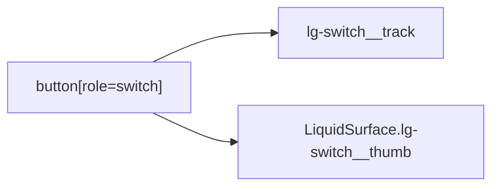

# LiquidSwitch

`LiquidSwitch` is a two-state control rendered as a native button with switch
semantics and a Liquid Glass thumb.

## Status

- Inventory: `switch`, implemented
- Export: `LiquidSwitch`
- Source: `src/components/LiquidSwitch.tsx`
- Story: `stories/LiquidSwitch.stories.tsx`
- Registry item: `registry/components/liquid-switch.json`
- npm package: not published to npm yet.

## Usage

```tsx
import { LiquidSwitch } from "@clean99/liquid-glass";

export function ImageBackgroundToggle() {
  return <LiquidSwitch aria-label="Use image background" defaultChecked={false} />;
}
```

Controlled state:

```tsx
<LiquidSwitch
  aria-label="Enable enhanced material"
  checked={enabled}
  onCheckedChange={setEnabled}
/>
```

## Anatomy



The root button owns `role="switch"`, `aria-checked`, `data-state`, disabled
state, and click behavior. The track and thumb are visual children.

## API

`LiquidSwitchProps` extends native button props except `children`, `onChange`,
and `role`.

| Prop              | Type          | Default  | Notes                                                |
| ----------------- | ------------- | -------- | ---------------------------------------------------- |
| `checked`         | `boolean`     | none     | Controlled state.                                    |
| `defaultChecked`  | `boolean`     | `false`  | Initial uncontrolled state.                          |
| `onCheckedChange` | callback      | none     | Called with the next checked state after activation. |
| `disabled`        | `boolean`     | false    | Prevents toggling and disables the root button.      |
| `type`            | `string`      | `button` | Native button type.                                  |
| `surfaceProps`    | surface props | none     | Customizes the decorative thumb surface.             |

## Visual States

Storybook covers the Kube reference state and fallback mode. The control
profile in `docs/visual-state-coverage.json` expects default, hover,
focus-visible, pressed, disabled, and selected review states where applicable.

## Accessibility

The control is a native button with `role="switch"` and `aria-checked`.
Keyboard activation follows native button behavior. Provide an accessible name;
the switch does not render visible label text by itself.

## Registry

The generated registry item is `registry/components/liquid-switch.json`.
Registry consumer commands remain post-npm-publish paths until the package is
actually published.

## Verification

- `tests/components.test.tsx` checks switch semantics and toggling.
- `stories/LiquidSwitch.stories.tsx` carries `parameters.visualState`.
- `pnpm test:kube-reference` compares the Kube switch reference.
- `registry/components/liquid-switch.json` is generated from inventory.
- `pnpm test:unit`
- `pnpm test:visual-docs`
- `pnpm test:registry`
