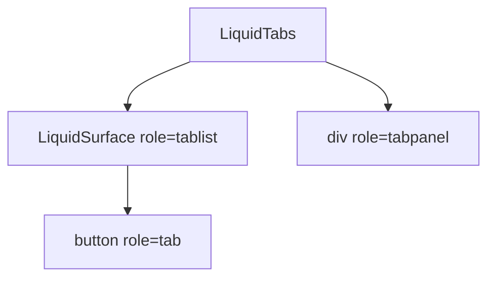

# LiquidTabs

`LiquidTabs` is the tabbed navigation primitive for switching related content
panels without leaving the current view.

## Status

- Inventory: `tabs`, implemented
- Export: `LiquidTabs`
- Source: `src/components/LiquidTabs.tsx`
- Story: `stories/LiquidTabs.stories.tsx`
- Registry item: `registry/components/liquid-tabs.json`
- npm package: not published to npm yet.

## Usage

```tsx
import { LiquidTabs } from "@clean99/liquid-glass";

const items = [
  { label: "Overview", value: "overview", content: "Overview panel" },
  { label: "API", value: "api", content: "API panel" }
];

export function Example() {
  return <LiquidTabs aria-label="Component sections" items={items} />;
}
```

Controlled state:

```tsx
<LiquidTabs
  aria-label="Documentation sections"
  items={items}
  onValueChange={setValue}
  value={value}
/>
```

Manual activation:

```tsx
<LiquidTabs activationMode="manual" aria-label="Manual sections" items={items} />
```

## Anatomy



## API

| Prop             | Type                         | Default            | Notes                                                                  |
| ---------------- | ---------------------------- | ------------------ | ---------------------------------------------------------------------- |
| `aria-label`     | `string`                     | required           | Accessible name for the tablist.                                       |
| `items`          | `LiquidTabsItem[]`           | required           | Each item owns `label`, `value`, content, and optional disabled state. |
| `value`          | `string`                     | none               | Controlled selected value.                                             |
| `defaultValue`   | `string`                     | first enabled item | Initial uncontrolled value.                                            |
| `onValueChange`  | callback                     | none               | Called when an enabled tab is activated.                               |
| `activationMode` | `"automatic" \| "manual"`    | `automatic`        | Manual mode requires Enter or Space to select.                         |
| `orientation`    | `"horizontal" \| "vertical"` | `horizontal`       | Changes arrow-key direction and ARIA orientation.                      |
| `surfaceProps`   | surface props                | none               | Customizes the tablist surface.                                        |

## Visual States

Storybook covers light, dark, fallback, solid, manual activation, vertical
orientation, disabled tabs, focus-visible state, long mixed-language labels,
dense blog-like content, and high-contrast representation. The navigation
profile in `docs/visual-state-coverage.json` expects default, hover,
focus-visible, selected, disabled, long-label, mobile, and orientation review
states where applicable.

## Accessibility

The tablist uses `role="tablist"` with `aria-label` and `aria-orientation`.
Each tab is a native button with `role="tab"`, `aria-selected`, and
`aria-controls`. Each panel uses `role="tabpanel"` and is labelled by its tab.
Arrow keys, Home, and End move focus. Automatic activation selects on arrow
movement; manual activation waits for Enter or Space.

## Registry

The generated registry item is `registry/components/liquid-tabs.json`.
Registry consumer commands remain post-npm-publish paths until the package is
actually published.

## Verification

- `tests/components.test.tsx` checks tab roles, panel labelling, disabled tabs,
  arrow-key selection, and manual activation.
- `stories/LiquidTabs.stories.tsx` carries `parameters.visualState`.
- `registry/components/liquid-tabs.json` is generated from inventory.
- `pnpm test:unit`
- `pnpm test:visual-docs`
- `pnpm test:registry`
