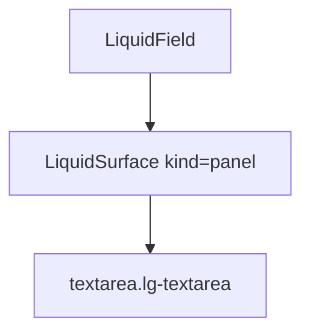

# LiquidTextarea

`LiquidTextarea` is the native multiline textarea wrapped in a Liquid field
surface. It preserves resize, value, selection, and form behavior.

## Status

- Inventory: `textarea`, implemented
- Export: `LiquidTextarea`
- Source: `src/components/LiquidField.tsx`
- Story: `stories/LiquidField.stories.tsx`
- Registry item: `registry/components/liquid-textarea.json`
- npm package: not published to npm yet.

## Usage

```tsx
import { LiquidField, LiquidLabel, LiquidTextarea } from "@clean99/liquid-glass";

export function ReleaseNote() {
  return (
    <LiquidField>
      <LiquidLabel htmlFor="note">Release note</LiquidLabel>
      <LiquidTextarea id="note" placeholder="Summarize the change." rows={4} />
    </LiquidField>
  );
}
```

## Anatomy



## API

`LiquidTextareaProps` extends native textarea attributes without `children`.

| Prop           | Type                      | Default | Notes                                   |
| -------------- | ------------------------- | ------- | --------------------------------------- |
| `invalid`      | `boolean`                 | `false` | Sets `aria-invalid` and `data-invalid`. |
| `surfaceProps` | `LiquidInputSurfaceProps` | -       | Passed to the wrapping surface.         |

## Visual States

The form profile covers default, focus-visible, invalid, disabled, multiline
content, long placeholder, light, dark, fallback, and mobile states.

## Accessibility

Use a native label with `htmlFor`. If helper text or validation text is shown,
connect it with `aria-describedby`; the component does not invent ids for the
application.

## Registry

The generated registry item is `registry/components/liquid-textarea.json`.
Registry consumer commands remain post-npm-publish paths until the package is
actually published.

## Verification

- `tests/components.test.tsx` covers textarea rendering.
- `stories/LiquidField.stories.tsx` carries `parameters.visualState`.
- `registry/components/liquid-textarea.json` is generated from inventory.
- `pnpm test:unit`
- `pnpm test:visual-docs`
- `pnpm test:registry`
