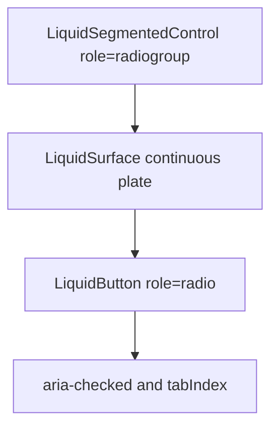

# LiquidSegmentedControl

`LiquidSegmentedControl` is the package implementation for the `toggle-group`
registry item. It presents a single-selected set of options on one continuous
Liquid plate.

## Status

- Inventory: `toggle-group`, implemented
- Export: `LiquidSegmentedControl`
- Source: `src/components/LiquidSegmentedControl.tsx`
- Story: `stories/LiquidSegmentedControl.stories.tsx`
- Registry item: `registry/components/liquid-toggle-group.json`
- npm package: not published to npm yet.

## Usage

```tsx
import { useState } from "react";
import { LiquidSegmentedControl } from "@clean99/liquid-glass";

export function DensityControl() {
  const [density, setDensity] = useState("comfortable");

  return (
    <LiquidSegmentedControl
      aria-label="Density"
      items={[
        { label: "Compact", value: "compact" },
        { label: "Comfortable", value: "comfortable" },
        { label: "Spacious", value: "spacious" }
      ]}
      onValueChange={setDensity}
      value={density}
    />
  );
}
```

## Anatomy



## API

`LiquidSegmentedControlProps` extends `LiquidSurfaceProps` without `as`,
`children`, and `kind`.

| Prop            | Type                           | Default  | Notes                                    |
| --------------- | ------------------------------ | -------- | ---------------------------------------- |
| `aria-label`    | `string`                       | required | Names the radiogroup.                    |
| `items`         | `LiquidSegmentedControlItem[]` | required | Items have `label`, `value`, `disabled`. |
| `value`         | `string`                       | required | Current selected item.                   |
| `onValueChange` | `(value) => void`              | -        | Fires on click or arrow-key movement.    |

## Visual States

The control profile covers selected, unselected, disabled item, keyboard
movement, continuous plate refraction, dark, fallback, and reduced motion.

## Accessibility

The root uses `role="radiogroup"` and each item uses `role="radio"`.
`aria-checked` tracks selection. Keep `aria-label` specific enough for the
setting being controlled.

## Registry

The generated registry item is `registry/components/liquid-toggle-group.json`.
Registry consumer commands remain post-npm-publish paths until the package is
actually published.

## Verification

- `tests/components.test.tsx` covers foundation component rendering.
- `scripts/verify-liquid-behavior.mjs` includes segmented control focus audit.
- `stories/LiquidSegmentedControl.stories.tsx` carries `parameters.visualState`.
- `registry/components/liquid-toggle-group.json` is generated from inventory.
- `pnpm test:unit`
- `pnpm test:visual-docs`
- `pnpm test:registry`
