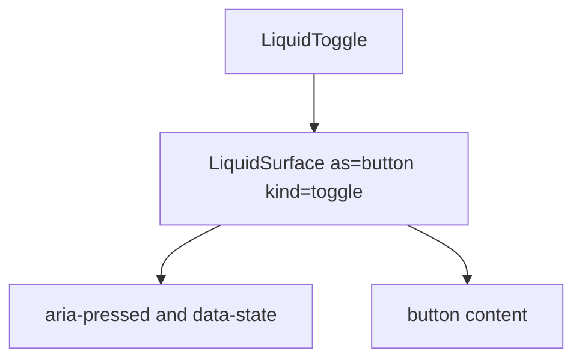

# LiquidToggle

`LiquidToggle` is the single pressed/unpressed control. It renders a button
surface with `aria-pressed` and controlled or uncontrolled state.

## Status

- Inventory: `toggle`, implemented
- Export: `LiquidToggle`
- Source: `src/components/LiquidToggle.tsx`
- Story: `stories/LiquidToggle.stories.tsx`
- Registry item: `registry/components/liquid-toggle.json`
- npm package: not published to npm yet.

## Usage

```tsx
import { useState } from "react";
import { LiquidToggle } from "@clean99/liquid-glass";

export function PreviewToggle() {
  const [pressed, setPressed] = useState(false);

  return (
    <LiquidToggle onPressedChange={setPressed} pressed={pressed}>
      Preview
    </LiquidToggle>
  );
}
```

## Anatomy



## API

`LiquidToggleProps` extends `LiquidSurfaceProps` without `as`,
`aria-pressed`, and `kind`.

| Prop              | Type                | Default | Notes                              |
| ----------------- | ------------------- | ------- | ---------------------------------- |
| `pressed`         | `boolean`           | -       | Controlled pressed state.          |
| `defaultPressed`  | `boolean`           | `false` | Uncontrolled initial state.        |
| `onPressedChange` | `(pressed) => void` | -       | Fires after user activation.       |
| `disabled`        | `boolean`           | -       | Prevents state changes and clicks. |

## Visual States

The control profile covers off, on, hover, active, focus-visible, disabled,
dark, fallback, reduced motion, and high contrast.

## Accessibility

The component renders a native button with `aria-pressed`. Use concise content
or an accessible label that names the toggled setting.

## Registry

The generated registry item is `registry/components/liquid-toggle.json`.
Registry consumer commands remain post-npm-publish paths until the package is
actually published.

## Verification

- `tests/components.test.tsx` covers foundation component rendering.
- `scripts/verify-liquid-behavior.mjs` includes a real browser focus audit.
- `stories/LiquidToggle.stories.tsx` carries `parameters.visualState`.
- `registry/components/liquid-toggle.json` is generated from inventory.
- `pnpm test:unit`
- `pnpm test:visual-docs`
- `pnpm test:registry`
