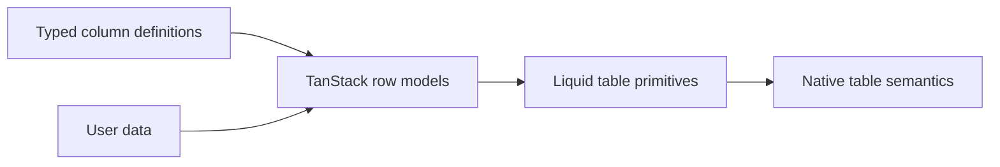

# LiquidDataTable Architecture

`LiquidDataTable` is the typed data-grid primitive for product pages and documentation examples.
It intentionally keeps glass effects outside the dense content layer.

## Engine Choice

The component uses `@tanstack/react-table` for row models, sorting, global filtering, and
pagination. The library does not reimplement table state management because that would create
edge cases around stable row ids, pagination resets, and accessible sort state.

## Rendering Model

`LiquidDataTable` composes the existing semantic table primitives:

- `LiquidTableContainer`
- `LiquidTable`
- `LiquidTableHeader`
- `LiquidTableBody`
- `LiquidTableRow`
- `LiquidTableHead`
- `LiquidTableCell`

Toolbar controls may use Liquid surfaces, but rows and cells remain normal readable content.
This keeps long text, numbers, code-like values, and Chinese/English mixed labels outside any
refraction layer.

## Accessibility

- Sortable headers expose `aria-sort`.
- Sort actions are native buttons.
- Filtering is a labeled search input.
- Pagination controls use disabled native button states.
- Empty state renders inside the table body with a correct `colSpan`.

## Performance

- No enhanced refraction is created per row or per cell.
- Sorting, filtering, and pagination are handled by TanStack memoized row models.
- Callers can provide `getRowId` to avoid unstable index-based row identity.

## Testing

Component tests cover:

- rendering with typed columns and data
- ascending sort state
- global filtering
- pagination state
- empty state without toolbar controls
