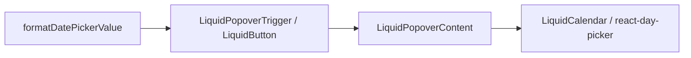

# Date Picker Architecture

`LiquidDatePicker` is a composition primitive, not a calendar engine.

## Structure

The split keeps the data model simple:

- `LiquidCalendar` owns grid semantics, date navigation, selected cells, and keyboard behavior.
- `LiquidPopover` owns open state, positioning, escape handling, and outside click handling.
- `LiquidDatePicker` owns selected-value display, controlled/uncontrolled value wiring, and closing policy.

## Date Semantics

The component treats selected dates as local calendar days. It does not normalize
user-facing dates through UTC because date pickers should not shift a selected
day when the application runs outside UTC.

`formatDatePickerValue` is exported so applications can use the same display
contract outside the trigger.

## Modes

`LiquidDatePicker` supports:

- `mode="single"` for one date.
- `mode="range"` for a `DateRange`.

Range selection closes only after both `from` and `to` are present. Single
selection closes immediately after a day is selected.

## Accessibility

The trigger is a native button through `LiquidPopoverTrigger`. It has:

- a readable accessible name via `aria-label`;
- `aria-expanded`;
- `aria-controls`;
- `aria-haspopup="dialog"`.

The calendar keeps `react-day-picker` grid semantics. The date-picker wrapper
does not replace those semantics with custom div-based date cells.

## Styling

The trigger uses the existing `LiquidButton` material. The popover uses the
existing `LiquidSurface` material. Date-picker-specific CSS only sizes the
trigger, draws the small calendar glyph, and removes extra padding around the
calendar inside the popover.

No repeating backgrounds or decorative stripe textures are used here, because
the Liquid Glass physics gates reject synthetic surface textures that can look
like optical crossing artifacts.
