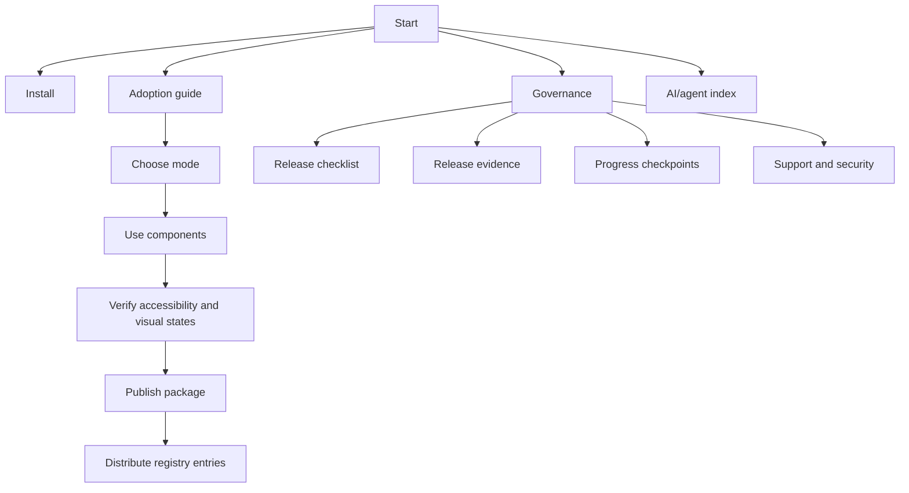

# Liquid Glass UI

Beautiful, accessible Liquid Glass components for React with real SVG/CSS
refraction and production-ready fallbacks.

This is the documentation entry point for `@clean99/liquid-glass`. It follows
the public UI library shape used by shadcn/ui, Radix UI, Chakra UI, and HeroUI:
short repository README, docs-style navigation, component inventory, registry
distribution notes, visual evidence, and release gates.

## Sections

This repository does not yet have a live public docs site, so this Markdown
index acts as the source-readable docs home. The structure mirrors a mainstream
UI library docs sidebar without pretending that Storybook Pages or npm publish
has already happened.

| Section         | Start here                       | What it answers                                              |
| --------------- | -------------------------------- | ------------------------------------------------------------ |
| Introduction    | `docs/index.md`                  | What the library is, current status, and where to go next.   |
| Installation    | `docs/installation.md`           | Package install path, CSS imports, peer dependencies.        |
| Components      | `docs/components/index.md`       | Written component pages and the full component directory.    |
| Docs navigation | `docs/site-navigation.md`        | Sidebar model for the future public Storybook Pages site.    |
| Theming         | `docs/design-principles.md`      | Liquid material rules, modes, tokens, and fallback behavior. |
| API             | `docs/api-overview.md`           | Provider, exports, component groups, and stable contracts.   |
| Registry        | `docs/shadcn-registry.md`        | shadcn-compatible package-backed registry distribution.      |
| Accessibility   | `docs/accessibility.md`          | Semantics, keyboard paths, axe gates, and release limits.    |
| Visual docs     | `docs/visual-documentation.md`   | Storybook, state coverage, screenshots, and Kube evidence.   |
| Testing         | `docs/testing.md`                | Local, CI, visual, a11y, registry, and release gates.        |
| Governance      | `docs/open-source-governance.md` | Benchmark against shadcn/ui, Radix UI, Chakra UI, HeroUI.    |
| Release         | `docs/open-source-release.md`    | npm, provenance, Pages, rollback, and release checklist.     |
| Changelog       | `CHANGELOG.md`                   | Version history after Changesets releases.                   |
| AI/agent index  | `llms.txt`                       | Machine-readable docs map and no-overclaim rules.            |
| Support         | `SUPPORT.md`, `SECURITY.md`      | Support routing and private security reporting.              |

## Start Here

1. Read the [adoption guide](adoption-guide.md) to decide whether this package
   is ready for your use case.
2. Follow [installation](installation.md) after npm publication, or use the
   repository-local validation path before publish.
3. Browse [component docs](components/index.md) and the
   [component map](components/map.md).
4. Use [docs navigation](site-navigation.md) to understand how the future
   Storybook Pages site should be organized.
5. Check [visual documentation](visual-documentation.md),
   [accessibility](accessibility.md), and [release evidence](release-evidence.md)
   before making public claims.

## Current Status

- npm: not published to npm yet.
- Storybook Pages: workflow exists; public deployment waits for GitHub Pages to
  be enabled with GitHub Actions as the source.
- Registry: shadcn-style Registry files exist, but consumer install commands are
  post-npm-publish paths.
- AI/agent index: `llms.txt` maps the docs, governance rules, release blockers,
  and no-overclaim constraints for assistants and documentation crawlers.
- Kube parity: strict reference gate is tracked separately from
  `pnpm test:kube-reference:exact`; exact 1:1 parity is not claimed yet.

## Documentation Map



| Section              | File                              | Purpose                                                                                                         |
| -------------------- | --------------------------------- | --------------------------------------------------------------------------------------------------------------- |
| Introduction         | `docs/index.md`                   | Public docs landing page and status.                                                                            |
| AI/agent context     | `llms.txt`                        | Machine-readable map for docs, governance, release blockers, and gates.                                         |
| Adoption             | `docs/adoption-guide.md`          | Who should adopt now, who should wait, and which proof is required.                                             |
| Installation         | `docs/installation.md`            | Package install, peer dependencies, CSS imports, and Next.js usage.                                             |
| Components           | `docs/component-inventory.md`     | Implemented and planned component inventory.                                                                    |
| Component map        | `docs/components/map.md`          | shadcn-style directory for all implemented public components.                                                   |
| Docs navigation      | `docs/site-navigation.md`         | Source-readable sidebar model for Storybook Pages and repo docs.                                                |
| Component docs       | `docs/component-documentation.md` | Per-component page standard for usage, anatomy, API, visual states, and evidence.                               |
| Component pages      | `docs/components/index.md`        | Package-backed pages for core surfaces, actions, controls, disclosure, navigation, and Kube reference controls. |
| API                  | `docs/api-overview.md`            | Provider, modes, component API groups, and export shape.                                                        |
| Accessibility        | `docs/accessibility.md`           | Native-first semantics, ARIA patterns, a11y gates, and release limits.                                          |
| Theming              | `docs/design-principles.md`       | Material rules, mode policy, tokens, and fallback behavior.                                                     |
| Browser Support      | `docs/browser-support.md`         | Enhanced, fallback, solid, and unsupported browser behavior.                                                    |
| Visual Documentation | `docs/visual-documentation.md`    | Storybook Pages coverage, visual states, and screenshot evidence contract.                                      |
| Testing              | `docs/testing.md`                 | Local gates, CI gates, Storybook, accessibility, and Kube reference checks.                                     |
| Registry             | `docs/shadcn-registry.md`         | shadcn-compatible registry files and install path after npm publish.                                            |
| Governance           | `docs/open-source-governance.md`  | Benchmark against shadcn/ui, Radix UI, Chakra UI, and HeroUI.                                                   |
| Maintainers          | `docs/maintainer-runbook.md`      | Triage, CI failure, Pages, release, security, registry, and rollback procedures.                                |
| Progress checkpoints | `docs/progress-checkpoints.md`    | 30 minute launch-progress rubric, benchmark loop, visual documentation gaps, and continuation rule.             |
| Release evidence     | `docs/release-evidence.md`        | Visual proof map for local gates, remote settings, Pages, npm, and Kube exact.                                  |
| Release              | `docs/open-source-release.md`     | npm, provenance, Pages, rollback, and release readiness checklist.                                              |
| Roadmap              | `ROADMAP.md`                      | Staged project plan.                                                                                            |

## Component Navigation

| Group                  | Components                                                                                                                               |
| ---------------------- | ---------------------------------------------------------------------------------------------------------------------------------------- |
| Foundations            | Provider, surface, fallback surface, button, card, typography, badge, separator.                                                         |
| Forms                  | Field, label, input, textarea, input group, input OTP, checkbox, switch, slider, select, native select, combobox, date picker, calendar. |
| Navigation             | Nav, link, breadcrumb, command, menubar, navigation menu, pagination, tabs, sidebar.                                                     |
| Overlays               | Dialog, alert dialog, drawer, sheet, popover, hover card, tooltip, dropdown menu, context menu.                                          |
| Data display           | Table, data table, chart, aspect ratio, avatar, item, kbd, empty, skeleton.                                                              |
| Feedback               | Alert, progress, spinner, toast, sonner.                                                                                                 |
| Layout and interaction | Accordion, collapsible, carousel, resizable panels, scroll area, toggle, toggle group, button group.                                     |
| Liquid reference       | Lens, search box, switch, slider, and music player bar reference states.                                                                 |

Use `docs/component-documentation.md` when adding or reviewing per-component
pages. It keeps component status, install honesty, anatomy, API, visual states,
accessibility notes, registry entries, and verification commands in one
repeatable shape. `docs/components/map.md` lists every implemented public
component, while the written pages under `docs/components/` now cover the
provider, surface, button, button group, card, field, dialog, accordion, alert,
alert dialog, avatar, badge, breadcrumb, calendar, checkbox, combobox, date
picker, dropdown menu, input, input group, input OTP, label, native select,
radio group, searchbox, select, sidebar, slider, switch, tabs, textarea, toggle,
and toggle group paths.

## Visual Documentation

Visual documentation is not decorative. Each public component needs clear
evidence for:

- light and dark themes;
- reduced motion;
- high contrast;
- mobile viewport behavior;
- fallback and solid modes;
- Kube reference states for lens, search box, switch, and slider work.

The source of truth is `docs/visual-state-coverage.json`, validated by
`pnpm test:visual-docs`.

## Accessibility

Accessibility is documented separately in `docs/accessibility.md`. The contract
requires native semantics first, APG-style ARIA patterns for composite widgets,
visible focus, readable foreground content outside the displacement layer,
reduced motion, reduced transparency, high contrast, and mobile fallback paths.
`pnpm test:a11y`, `pnpm test:e2e`, `pnpm test:visual-docs`, component tests, and
Storybook metadata provide the current evidence. This is not a WCAG
certification claim.

## Quality Gates

Run the standard development gate before review:

```sh
pnpm format
pnpm lint
pnpm typecheck
pnpm test:docs
pnpm test:release-readiness
pnpm test:unit
```

Run the release-oriented gates before claiming public readiness:

```sh
pnpm test:governance
pnpm test:registry
pnpm test:shadcn-parity
pnpm test:a11y
pnpm test:e2e
pnpm test:storybook
pnpm test:kube-reference:strict
pnpm verify
```

`pnpm test:kube-reference:exact` is the final exact-parity target and is not the
same as the strict release-candidate gate.

## Public Launch Checklist

- GitHub Pages is enabled with GitHub Actions as the source.
- Storybook Pages deploy has succeeded.
- `NPM_TOKEN` and provenance settings are configured for release.
- `pnpm verify` passes on `main`.
- `pnpm test:kube-reference:strict` passes on `main`.
- npm package is published before documenting shadcn registry install as a live
  consumer path.
- Exact Kube parity is only claimed after `pnpm test:kube-reference:exact`
  passes.
