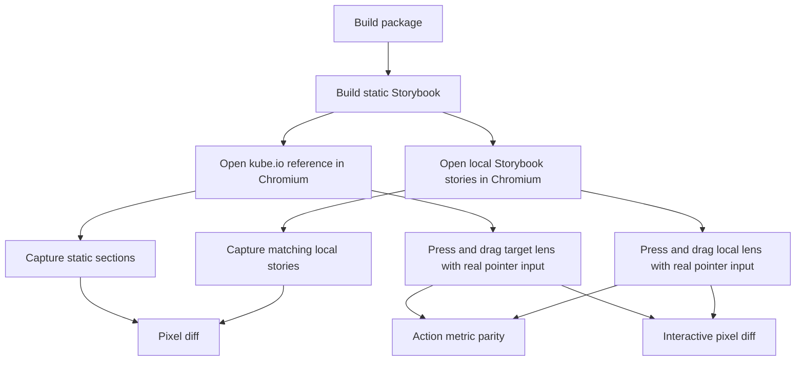

# Kube Reference Parity Gate

The Kube Liquid Glass article is the external visual reference for this package.
The comparison must use browser screenshots and real pointer actions, not manual
inspection.

## Current Gate Shape

`pnpm test:kube-reference` is the normal regression gate. It compares the static
reference components, hard-fails action metrics for the interactive lens, and
hard-fails pressed and dragged lens screenshots produced by real pointer input.

`pnpm test:kube-reference:strict` sets `KUBE_STRICT_INTERACTIVE=1` and preserves
the release-candidate command used by CI and manual reviews. The interactive
screenshots are hard gates in both commands.

## Latest Measurement

Measured locally on 2026-06-13 against `https://kube.io/blog/liquid-glass-css-svg/`.

| Reference                | Diff ratio | Threshold | Mode |
| ------------------------ | ---------: | --------: | ---- |
| magnifying-glass         |     0.2000 |    0.3000 | gate |
| magnifying-glass-pressed |     0.4163 |    0.4200 | gate |
| magnifying-glass-dragged |     0.4224 |    0.4500 | gate |
| searchbox                |     0.0167 |    0.0300 | gate |
| switch                   |     0.0142 |    0.0300 | gate |
| slider                   |     0.0149 |    0.0300 | gate |

This measurement includes these verified geometry fixes:

- the draggable story uses the Kube CSS coordinate `top: 19.5px`; the visual
  top becomes roughly `34.5px` only after the reference `scaleY(0.8)` transform,
- the magnification pass uses a full rectangular center-pull displacement map;
  the bevel-only capsule field is reserved for the second displacement pass,
- the specular pass uses a narrow gray rim instead of a broad white highlight.
- the bevel displacement pass uses a `25px` edge falloff, not the full capsule
  radius.
- the water-drop shadow belongs to the lens surface itself; applying it
  as an outer handle `drop-shadow()` makes the material read like plastic and
  regresses the pressed/dragged screenshot rows.
- all magnifying-glass states now write a filter-contract artifact. The live
  Kube target keeps the same two-pass displacement scales during idle, pressed,
  and dragged captures, so pointer parity must be solved through geometry,
  background phase, and material response instead of fake active filter boosts.
- the draggable optical body is a single `LiquidLens` surface. Splitting pointer
  handling onto an outer wrapper and backdrop-filter onto an inner lens made the
  transformed geometry diverge from active filter sampling and regressed the
  pressed/dragged screenshots.

This proves three things:

- The static searchbox, switch, and slider stories are already within the current
  screenshot budget.
- The static magnifying glass passes a loose gate, but it is still visually far
  from pixel parity.
- The pressed and dragged water-drop states now pass the current hard gate, but
  the thresholds are still loose while the fixture moves toward tighter pixel
  parity. They must not be described as 100% complete.

## Remaining Gap

The reference lens changes the visible material during interaction:

- the DOM body scales into a local water-drop shape,
- the material highlight follows the active capsule.

The local implementation now checks action metrics and interactive pixels by
default, but the screenshot diff is still far from true pixel parity. A correct
fix should keep changing the optical model or material rendering, not relax
thresholds.

## Next Work

1. Tighten the magnifying glass fixture so static diff can move below 0.10.
2. Tighten the pressed and dragged thresholds now that they are hard gates.
3. Reduce the threshold toward real parity after the fixture and material match.
4. Keep action metrics and pixels separate. A component can move correctly while
   still looking wrong.
