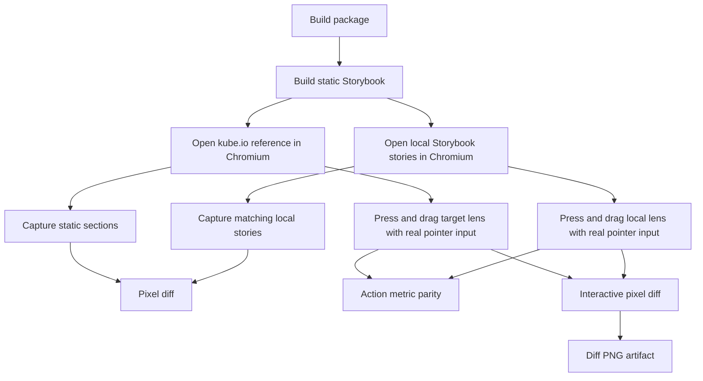

# Kube Reference Parity Gate

The Kube Liquid Glass article is the external visual reference for this package.
The comparison must use browser screenshots and real pointer actions, not manual
inspection.

## Current Gate Shape

`pnpm test:kube-reference` is the normal regression gate. It compares the static
reference components, hard-fails action metrics for the interactive lens, and
hard-fails pressed and dragged lens screenshots produced by real pointer input.

`pnpm test:kube-reference:strict` sets `KUBE_STRICT_INTERACTIVE=1` and preserves
the release-candidate command used by CI and manual reviews. The interactive
screenshots are hard gates in both commands.

`pnpm test:kube-reference:exact` is the final acceptance target. It sets
`KUBE_EXACT_PARITY=1`, `KUBE_STRICT_INTERACTIVE=1`, `KUBE_MAX_DIFF_RATIO=0`, and
`KUBE_PIXEL_DELTA_THRESHOLD=0`, then runs the same browser comparison against the
public Kube page. This command is intentionally not part of `ci` or `verify`
while the current implementation still fails exact pixel parity. It exists so
the project has a real 1:1 target instead of silently redefining success around
loose thresholds.

Each row writes target, candidate, and diff PNG artifacts under
`test-results/kube-reference/`. The diff image is generated from the same crop
used for the metric, so it is useful for diagnosing phase, material, and edge
errors without changing the gate. For pressed and dragged lens rows, the script
captures a page clip from the post-action visual bounding box instead of relying
on `element.screenshot()`, because the Kube page and local Storybook do not use
the same DOM transform structure. `kube-reference-results.json` records the
target screenshot size, candidate screenshot size, effective compare region,
diff threshold, action clip, action metrics, and a non-gating best phase offset.
The phase offset scans a small candidate-image translation window and records
which sampled offset best aligns the local crop with the Kube crop. Those fields
are required for lens work: without them a pressed-state regression can be
mistaken for a material problem when the real issue is a capture-size,
background-phase, or crop mismatch.

## Latest Measurement

Measured locally on 2026-06-13 against `https://kube.io/blog/liquid-glass-css-svg/`.

| Reference                | Diff ratio | Best phase | Phase diff | Threshold | Mode |
| ------------------------ | ---------: | ---------- | ---------: | --------: | ---- |
| magnifying-glass         |     0.2007 | `0,-1`     |     0.1908 |    0.2400 | gate |
| magnifying-glass-pressed |     0.3507 | `-2,0`     |     0.3438 |    0.3600 | gate |
| magnifying-glass-dragged |     0.3957 | `-1,1`     |     0.3857 |    0.4050 | gate |
| searchbox                |     0.0180 | `0,0`      |     0.0169 |    0.0200 | gate |
| switch                   |     0.0136 | `0,0`      |     0.0132 |    0.0200 | gate |
| slider                   |     0.0163 | `0,0`      |     0.0135 |    0.0200 | gate |

This measurement includes these verified geometry fixes:

- the draggable story uses the Kube CSS coordinate `top: 19.5px`; the visual
  top becomes roughly `34.5px` only after the reference `scaleY(0.8)` transform,
- the magnification pass uses a full rectangular center-pull displacement map;
  the bevel-only capsule field is reserved for the second displacement pass,
- the specular pass uses a narrow gray rim instead of a broad white highlight.
- the specular map uses a directional rim light, so the brightest points follow
  the Kube reference's upper-right and lower-left edge response instead of
  drawing an even plastic ring around the whole capsule.
- the bevel displacement pass uses a `25px` edge falloff, not the full capsule
  radius.
- the water-drop shadow belongs to the lens surface itself; applying it
  as an outer handle `drop-shadow()` makes the material read like plastic and
  regresses the pressed/dragged screenshot rows.
- all magnifying-glass states now write a filter-contract artifact. The live
  Kube target keeps the same two-pass displacement scales during idle, pressed,
  and dragged captures, so pointer parity must be solved through geometry,
  background phase, and material response instead of fake active filter boosts.
- the draggable optical body is a single `LiquidLens` surface. Splitting pointer
  handling onto an outer wrapper and backdrop-filter onto an inner lens made the
  transformed geometry diverge from active filter sampling and regressed the
  pressed/dragged screenshots.
- the interactive Storybook board applies an `-8px, -2px` content phase offset
  while keeping the Kube lens CSS coordinate unchanged. This moves the
  high-contrast text field under the active lens without faking the lens motion
  metrics. A larger vertical shift regressed pressed and dragged screenshots, so
  the current offset is intentionally small.
- pressed and dragged screenshots are captured from the post-action visual
  bounding box clip. This removed a false mismatch from `element.screenshot()`
  using different target and candidate transform boxes.
- the comparison now records a non-gating best phase offset. Searchbox, switch,
  and slider align at `0,0`; the lens interaction rows improve only modestly
  after tiny offsets, so the remaining gap is material and optical response, not
  just a bad screenshot crop.

This proves five things:

- The static searchbox, switch, and slider stories are already within the current
  screenshot budget, so their thresholds are ratcheted down to `0.0200`.
- The static magnifying glass passes a loose gate, but it is still visually far
  from pixel parity. Its threshold is ratcheted from `0.3000` to `0.2400`, which
  is still not the final target.
- The pressed and dragged water-drop states now pass the current hard gate, but
  the thresholds are still loose while the fixture moves toward tighter pixel
  parity. Pressed is now gated at `0.3600`; dragged remains gated at `0.4050`.
  They must not be described as 100% complete.
- The latest specular change improved the pressed screenshot but did not improve
  every lens state. That is acceptable only because the generated specular map
  is closer to the reference rim-light physics; it is still not enough for exact
  component parity.
- The final acceptance command is `pnpm test:kube-reference:exact`. Until that
  command passes, Kube parity remains incomplete regardless of the current
  release-candidate gate.

## Remaining Gap

The reference lens changes the visible material during interaction:

- the DOM body scales into a local water-drop shape,
- the material highlight follows the active capsule.

The local implementation now checks action metrics and interactive pixels by
default, but the screenshot diff is still far from true pixel parity. A correct
fix should keep changing the optical model or material rendering, not relax
thresholds.

## Next Work

1. Tighten the magnifying glass fixture so static diff can move below 0.10.
2. Tighten the pressed and dragged thresholds now that they are hard gates.
3. Reduce the threshold toward real parity after the fixture and material match.
4. Promote `pnpm test:kube-reference:exact` into `verify` only after it passes
   reliably on Chromium CI.
5. Keep action metrics and pixels separate. A component can move correctly while
   still looking wrong.
