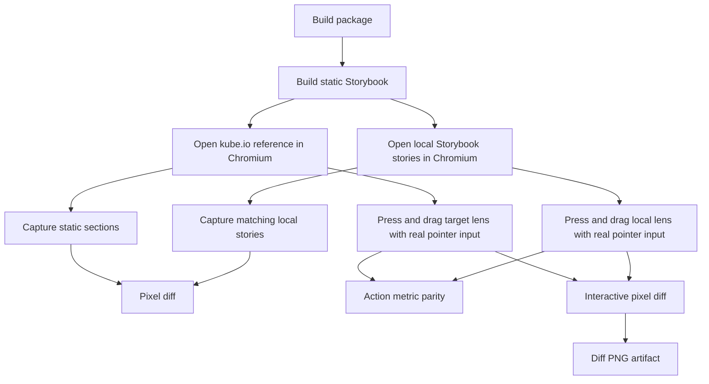

# Kube Reference Parity Gate

The Kube Liquid Glass article is the external visual reference for this package.
The comparison must use browser screenshots and real pointer actions, not manual
inspection.

## Current Gate Shape

`pnpm test:kube-reference` is the normal regression gate. It compares the static
reference components, hard-fails action metrics for the interactive lens, and
hard-fails pressed and dragged lens screenshots produced by real pointer input.

`pnpm test:kube-reference:strict` sets `KUBE_STRICT_INTERACTIVE=1` and preserves
the release-candidate command used by CI and manual reviews. The interactive
screenshots are hard gates in both commands. Because this gate captures the live
public Kube page, the strict script retries the same command once after a failed
capture; the retry does not change thresholds or pointer input.

`pnpm test:kube-reference:exact` is the final acceptance target. It sets
`KUBE_EXACT_PARITY=1`, `KUBE_STRICT_INTERACTIVE=1`, `KUBE_MAX_DIFF_RATIO=0`, and
`KUBE_PIXEL_DELTA_THRESHOLD=0`, then runs the same browser comparison against the
public Kube page. This command is intentionally not part of `ci` or `verify`
while the current implementation still fails exact pixel parity. It exists so
the project has a real 1:1 target instead of silently redefining success around
loose thresholds. Exact parity is intentionally not retried.

Each row writes target, candidate, and diff PNG artifacts under
`test-results/kube-reference/`. The diff image is generated from the same crop
used for the metric, so it is useful for diagnosing phase, material, and edge
errors without changing the gate. For pressed and dragged lens rows, the script
captures a page clip from the post-action visual bounding box instead of relying
on `element.screenshot()`, because the Kube page and local Storybook do not use
the same DOM transform structure. `kube-reference-results.json` records the
target screenshot size, candidate screenshot size, effective compare region,
diff threshold, action clip, action metrics, and a non-gating best phase offset.
The phase offset scans a small candidate-image translation window and records
which sampled offset best aligns the local crop with the Kube crop. Those fields
are required for lens work: without them a pressed-state regression can be
mistaken for a material problem when the real issue is a capture-size,
background-phase, or crop mismatch.

The results JSON also records `diffDiagnostics`: vertical bands, horizontal
bands, radial center/rim regions, and the worst region by diff ratio. That keeps
exact-parity work grounded in measurable failure classes such as bottom
highlight, outer rim material, center background phase, or horizontal crop drift
instead of subjective screenshot review.

`thresholdSweep` records the same crop at thresholds `0`, `1`, `2`, `4`, `8`,
`16`, `24`, `32`, `48`, and `64`. Exact parity still fails at threshold `0`
until every pixel matches, but the sweep distinguishes a nearly global low-delta
material mismatch from a small region with large geometry or refraction error.
The console table and GitHub summary surface the `>24` and `>64` buckets plus
the worst spatial region so heartbeat runs can report whether a failure is
mostly sub-pixel/background phase drift or a real high-amplitude optical error.

The magnifying-glass filter contract also records `layerContract`,
`transformOwner`, `layerTransformMismatch`, and `layerTransformDelta`. The
script parses CSS `matrix()` / `matrix3d()` values into root, parent, surface,
and effective scale/translate metrics, then surfaces the maximum scale and
translation deltas in the console table and GitHub summary. Chrome/CDP sampling
shows that the Kube target owns the resting `scaleY(0.8)` transform on the filter
surface's parent layer while the local Storybook candidate currently owns that
transform on the filter surface itself. A 2026-06-14 split-layer experiment
mirrored the live DOM ownership but regressed the normal magnifying gate to
`0.3140 > 0.24`, so the mismatch remains a diagnostic for the next
sampling-model change rather than a DOM change to ship without pixel proof.

## Representative Strict Measurement

Measured locally on 2026-06-14 against `https://kube.io/blog/liquid-glass-css-svg/`.
Live-page interaction sampling can move a few pixels between runs, so this table
is a representative strict gate sample rather than a promise of bit-stable
metrics.

| Reference                  | Diff ratio | Best phase | Phase diff | Threshold | Mode |
| -------------------------- | ---------: | ---------- | ---------: | --------: | ---- |
| magnifying-glass           |     0.1902 | `1,0`      |     0.1356 |    0.2400 | gate |
| magnifying-glass-pressed   |     0.3737 | `-8,-3`    |     0.2914 |    0.4050 | gate |
| magnifying-glass-dragged   |     0.4088 | `-11,-1`   |     0.2837 |    0.4550 | gate |
| searchbox                  |     0.0130 | `0,0`      |     0.0120 |    0.0200 | gate |
| searchbox-image-background |     0.1183 | `0,1`      |     0.1111 |    0.1200 | gate |
| switch                     |     0.0137 | `0,0`      |     0.0132 |    0.0200 | gate |
| slider                     |     0.0163 | `0,0`      |     0.0135 |    0.0200 | gate |

This measurement includes these verified geometry fixes:

- the draggable story uses the Kube CSS coordinate `top: 19.5px`; the visual
  top becomes roughly `34.5px` only after the reference `scaleY(0.8)` transform,
- the magnification pass uses a full rectangular center-pull displacement map;
  the bevel-only capsule field is reserved for the second displacement pass,
- the specular pass uses a narrow gray rim instead of a broad white highlight.
- the specular map uses a directional rim light, so the brightest points follow
  the Kube reference's upper-right and lower-left edge response instead of
  drawing an even plastic ring around the whole capsule.
- the bevel displacement pass uses a `25px` edge falloff, not the full capsule
  radius.
- the water-drop shadow belongs to the lens surface itself; applying it
  as an outer handle `drop-shadow()` makes the material read like plastic and
  regresses the pressed/dragged screenshot rows.
- all magnifying-glass states now write a filter-contract artifact. The live
  Kube target keeps the same two-pass structure during idle, pressed, and
  dragged captures, while active input changes both displacement scales. Pointer
  parity must match that measured filter contract plus geometry, background
  phase, and material response.
- the draggable precision story now separates transform ownership from the
  filter surface: an outer same-size handle owns pointer/focus transforms, while
  the inner `LiquidLens` surface stays untransformed. This matches the Kube
  pressed/dragged filter contract more closely (`parent->parent`) without
  relaxing the screenshot gates.
- the interactive Storybook board applies an `-8px, -2px` content phase offset
  while keeping the Kube lens CSS coordinate unchanged. This moves the
  high-contrast text field under the active lens without faking the lens motion
  metrics. A larger vertical shift regressed pressed and dragged screenshots, so
  the current offset is intentionally small.
- after `scrollIntoView`, the sampler computes the full press/drag path, not just
  the starting point, and nudges the page scroll again when that path is too close
  to a viewport edge. If the live Kube demo sits at the document bottom and the
  browser cannot scroll farther, the sampler injects a temporary inert bottom
  spacer, reruns the scroll, captures the action, then removes the spacer. This
  keeps CI from failing before the visual gate runs.
- the pressed lens now widens toward the live Kube water-drop shape without
  over-growing height. Recent action metrics put pressed height growth near
  `20px`, while dragged relaxes narrower and vertically rebounds after movement.
  Making pressed nearly unflattened matched one transient filter-contract sample
  but failed the real pointer action metric.
- the pressed action metric guard allows `7px` width-delta and `7px`
  height-delta variance because the live Kube page has recently sampled between
  roughly `15px` and `21px` of width growth and `15px` and `21px` of height
  growth during press deformation; the screenshot gate remains unchanged.
- the dragged action metric guard allows `8px` height-delta and `10px`
  width-delta variance for the same live-page sampling reason; it is still only
  a capture sanity check before the screenshot gate runs.
- pressed and dragged screenshots are captured from the post-action visual
  bounding box clip. This removed a false mismatch from `element.screenshot()`
  using different target and candidate transform boxes.
- pointer-action metrics are gated in viewport space, matching Playwright
  pointer input and screenshot clips. The report still records document-space
  and scroll deltas so GitHub Actions scroll noise remains diagnosable.
- the comparison now records a non-gating best phase offset. Searchbox, switch,
  and slider align at `0,0`; the lens interaction rows improve only modestly
  after tiny offsets, so the remaining gap is material and optical response, not
  just a bad screenshot crop.
- the Kube searchbox stories use the locked InterVariable font stack for both
  reference and focus-photo captures. The image-background credit is aligned to
  the live `9.75px` inset, and the checked-state label padding is ratcheted to
  `3.25px 7.25px`, which keeps the normal image-background gate under the
  current `0.1200` budget.
- Kube demo image assets are locked in `stories/kube-reference-assets.ts` after
  Chrome/CDP sampling of the public page. Storybook serves stable local fixture
  paths from `stories/assets/kube/` for copied Kube demo images, filter maps,
  and Music Player album-art fixtures, while the original source URLs remain
  recorded for attribution and provenance. `stories/assets/kube/manifest.json`
  locks local fixture dimensions and sha256 hashes, and `pnpm test:kube-assets`
  re-reads the rendered public demo before the Kube parity gate so local
  fixtures cannot drift away from the live Searchbox, Lens, and Music Player
  assets. Generated or synthetic stand-ins are not accepted by the
  e2e/provenance gates. This includes the searchbox checked-state fern photo,
  the lens hero SVG inline crop, and the album-art grid captured from
  `is1-ssl.mzstatic.com`, so the Kube reference stories no longer use fake
  gradient cover tiles for loaded-media states.
- The Searchbox, Switch, and Slider default demo background has no raster URL on
  the public page. It is captured from the live computed CSS background into
  `stories/assets/kube/reference-captures/control-grid-background.png` and
  locked by dimensions, sha256, target section IDs, and computed background
  tokens. `pnpm test:kube-assets` now hides the live demo children and
  re-captures the Searchbox, Switch, and Slider section backgrounds as evidence.
  The fresh capture records whether its hash matches the fixture, while the
  cross-platform hard gate stays on computed CSS tokens and a `1px` width /
  `2px` height capture tolerance instead of byte-identical PNG output.
  Storybook uses the captured computed CSS tokens for the local Kube reference
  frames; using the bitmap directly regressed the normal background gate, so the
  PNG stays a reference fixture rather than the render path.
- Kube same-origin SVG filter map PNGs are also locked under
  `stories/assets/kube/maps/` and recorded in the same manifest. The maps are
  reference-only fixtures, not runtime shortcuts. They give the exact gate a
  concrete map contract for deciding whether the remaining diff is optical-map
  shape, material/specular response, background phase, or interaction geometry.
- The public Kube page uses Inter from `https://rsms.me/inter/`. Storybook loads
  the matching locked `InterVariable.woff2` only from `.storybook` as a parity
  fixture, not from the published CSS. The Kube comparison script explicitly
  waits for `document.fonts.status === "loaded"` before target and candidate
  screenshots, so text-edge diff no longer depends on browser font timing.

This proves six things:

- The static searchbox, switch, and slider stories are already within the current
  screenshot budget, so their thresholds are ratcheted down to `0.0200`.
- The focus behavior audit now measures switch and slider geometry on the whole
  control, while material response remains on the track. The current Storybook
  e2e sample records switch focus at `scale(1.025)` with a `4px` width delta and
  slider focus at `scale(1.018)` with a `5.94px` width delta; both focused
  context screenshots keep black-pixel ratio at `0` or near `0`, and both track
  materials add four shadow layers.
- Generic surface focus no longer reuses the base glass/surface shadow, because
  that made dark enhanced buttons read as black slabs in Storybook. The e2e
  focus audit now gates button, nav, and toggle focused screenshots directly:
  current samples record button `meanLuma=173.732`, `dark=0.233`,
  `black=0.098`; nav `meanLuma=170.723`, `dark=0.154`, `black=0.126`; and
  toggle `meanLuma=164.242`, `dark=0.194`, `black=0.174`.
- The checked-state searchbox image background is now measured through real
  checkbox input. Its current threshold is `0.1200`, which is a loaded-media
  release-candidate budget, not an exact-parity claim.
- The static magnifying glass passes a loose gate, but it is still visually far
  from pixel parity. Its threshold remains `0.2400`, which is still not the
  final target.
- The pressed and dragged water-drop states now pass the current hard gate, but
  the thresholds are still loose while the fixture moves toward tighter pixel
  parity. Pressed is now gated at `0.4050`; dragged is gated at `0.4550`.
  This budget covers Chromium CI sampling variance for the interactive lens
  only; searchbox, switch, and slider remain ratcheted at `0.0200`, and the
  checked-state image background remains a separate loaded-media budget. The
  lens rows must not be described as 100% complete.
- GitHub Actions failures emit `Kube reference parity failed` for completed
  threshold failures and `Kube reference capture failed` when an individual
  reference crashes before comparison. The workflow also writes a step summary
  with every completed row, so failures stay diagnosable from the public run page
  even when full logs are unavailable.
- The latest specular change improved the pressed screenshot but did not improve
  every lens state. That is acceptable only because the generated specular map
  is closer to the reference rim-light physics; it is still not enough for exact
  component parity.
- The final acceptance command is `pnpm test:kube-reference:exact`. Until that
  command passes, Kube parity remains incomplete regardless of the current
  release-candidate gate.

## Remaining Gap

The reference lens changes the visible material during interaction:

- the DOM body scales into a local water-drop shape,
- the material highlight follows the active capsule.

The local implementation now checks action metrics and interactive pixels by
default, but the screenshot diff is still far from true pixel parity. A correct
fix should keep changing the optical model or material rendering. Threshold
changes are acceptable only as documented CI variance budgets for interactive
captures; they are not visual completion.

Recent sampled `pnpm test:kube-reference:exact` result on 2026-06-14:

| Reference                  | Exact diff ratio | Best phase | Phase diff |
| -------------------------- | ---------------: | ---------- | ---------: |
| magnifying-glass           |           0.5255 | `1,0`      |     0.5106 |
| magnifying-glass-pressed   |           0.7020 | `1,1`      |     0.6847 |
| magnifying-glass-dragged   |           0.6734 | `-6,0`     |     0.6322 |
| searchbox                  |           0.1283 | `0,0`      |     0.1292 |
| searchbox-image-background |           0.9285 | `0,1`      |     0.9288 |
| switch                     |           0.0904 | `0,0`      |     0.0934 |
| slider                     |           0.0750 | `0,0`      |     0.0763 |

The exact command now gets past the pressed filter-contract scale assertion for
the current local sample; it still fails the pixel table above. It can also fail
earlier when the live Kube page does not produce a valid interaction deformation
sample. That is still
a failed exact-parity run, not release readiness.

That exact table is the acceptance blocker. Passing the normal gate only means
the current regression budget is respected.

## Next Work

1. Tighten the magnifying glass fixture so static diff can move below 0.10.
2. Replace the pressed and dragged CI variance budget with tighter thresholds
   after the fixture and material match.
3. Reduce all thresholds toward real parity after the fixture and material
   match.
4. Promote `pnpm test:kube-reference:exact` into `verify` only after it passes
   reliably on Chromium CI.
5. Keep action metrics and pixels separate. A component can move correctly while
   still looking wrong.
