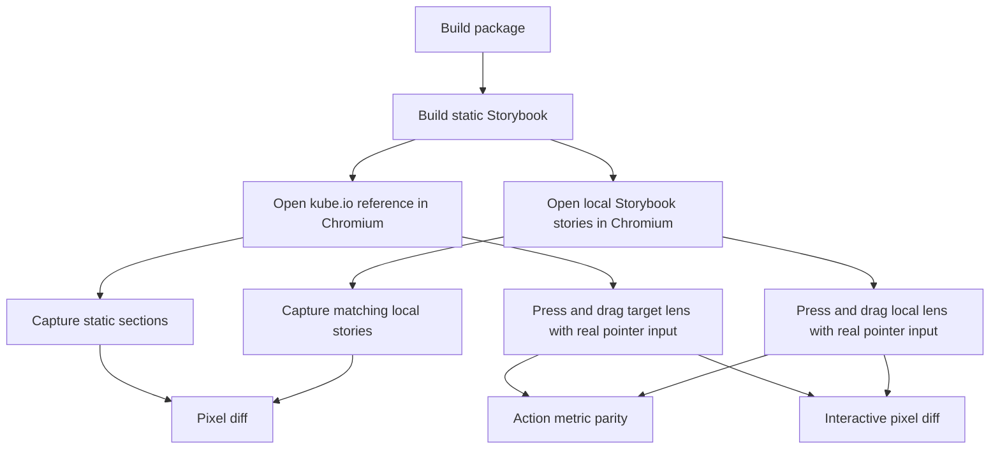

# Kube Reference Parity Gate

The Kube Liquid Glass article is the external visual reference for this package.
The comparison must use browser screenshots and real pointer actions, not manual
inspection.

## Current Gate Shape

`pnpm test:kube-reference` is the normal regression gate. It compares the static
reference components and hard-fails action metrics for the interactive lens.
Pressed and dragged lens screenshots are still report-only in this mode because
the current local material is not close enough to claim full interaction parity.

`pnpm test:kube-reference:strict` sets `KUBE_STRICT_INTERACTIVE=1`. In that mode,
pressed and dragged lens screenshots become hard gates. This command is the
release-candidate target for the Kube replica work.

## Latest Measurement

Measured locally on 2026-06-13 against `https://kube.io/blog/liquid-glass-css-svg/`.

| Reference                | Diff ratio | Threshold | Mode   |
| ------------------------ | ---------: | --------: | ------ |
| magnifying-glass         |     0.2417 |    0.3000 | gate   |
| magnifying-glass-pressed |     0.5803 |    0.4200 | report |
| magnifying-glass-dragged |     0.5832 |    0.4500 | report |
| searchbox                |     0.0167 |    0.0300 | gate   |
| switch                   |     0.0142 |    0.0300 | gate   |
| slider                   |     0.0149 |    0.0300 | gate   |

This measurement includes two verified geometry fixes:

- the draggable story uses the Kube CSS coordinate `top: 19.5px`; the visual
  top becomes roughly `34.5px` only after the reference `scaleY(0.8)` transform,
- the magnification pass uses a full rectangular center-pull displacement map;
  the bevel-only capsule field is reserved for the second displacement pass,
- the specular pass uses a narrow gray rim instead of a broad white highlight.

This proves three things:

- The static searchbox, switch, and slider stories are already within the current
  screenshot budget.
- The static magnifying glass passes a loose gate, but it is still visually far
  from pixel parity.
- The pressed and dragged water-drop states are not acceptable yet. They must not
  be described as complete.

## Why Strict Mode Fails Today

The reference lens changes both layers during interaction:

- the DOM body scales into a local water-drop shape,
- the SVG displacement pass increases,
- the magnification pass increases,
- the material highlight follows the active capsule.

The local implementation already checks action metrics, but the screenshot diff
shows the material is still wrong. A correct fix should change the optical model
or material rendering, not just relax thresholds.

## Next Work

1. Tighten the magnifying glass fixture so static diff can move below 0.10.
2. Replace the report-only pressed and dragged rows with strict gates once their
   diff ratio is below the configured threshold.
3. Reduce the threshold toward real parity after the fixture and material match.
4. Keep action metrics and pixels separate. A component can move correctly while
   still looking wrong.
